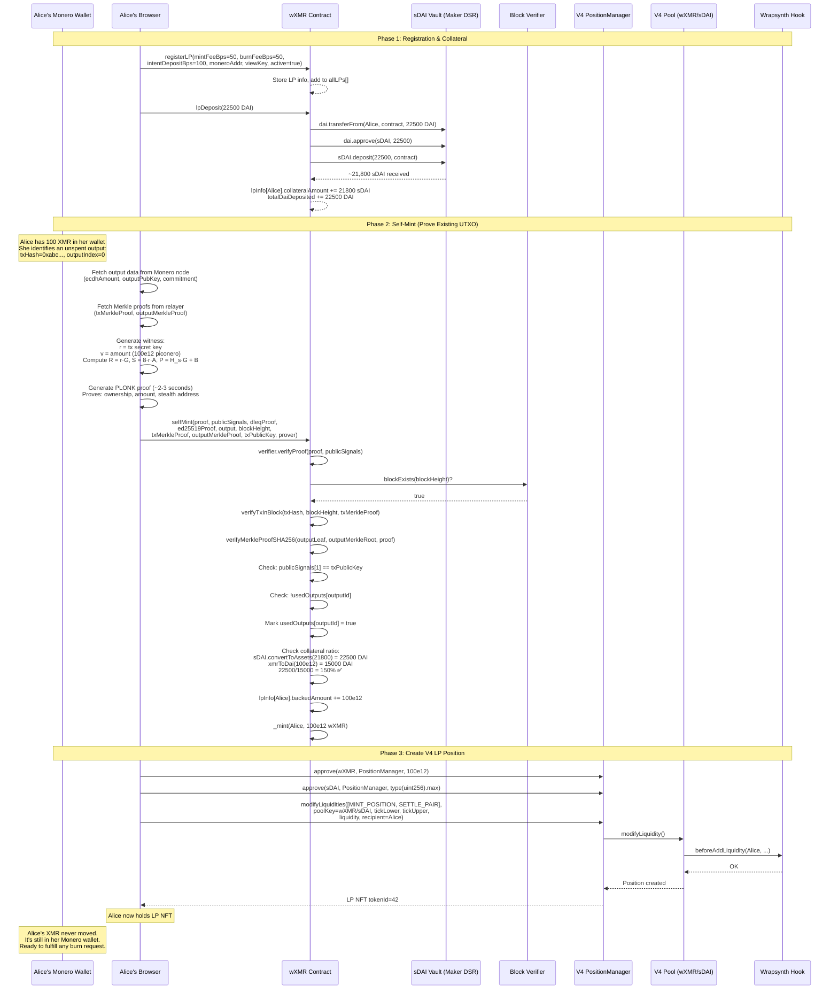
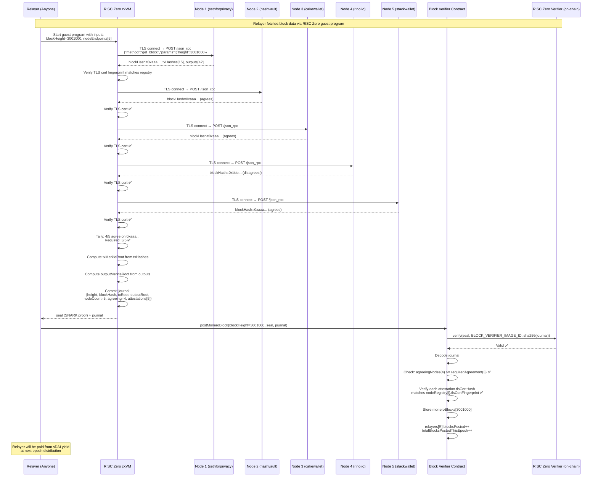
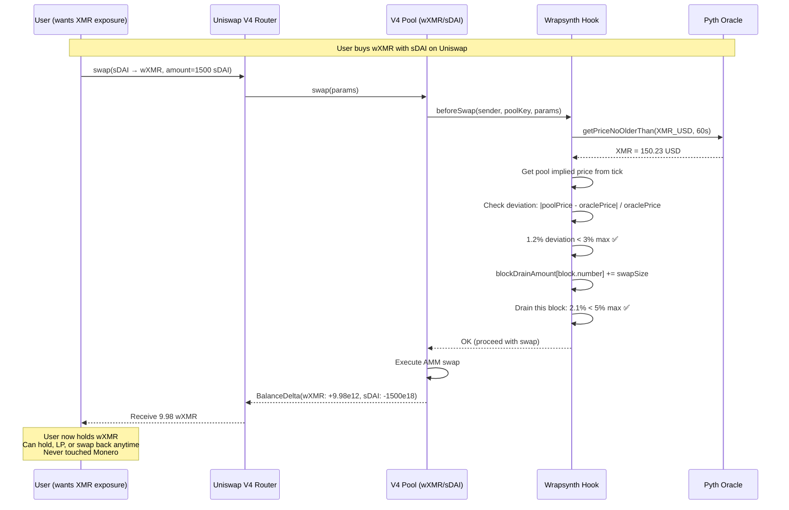
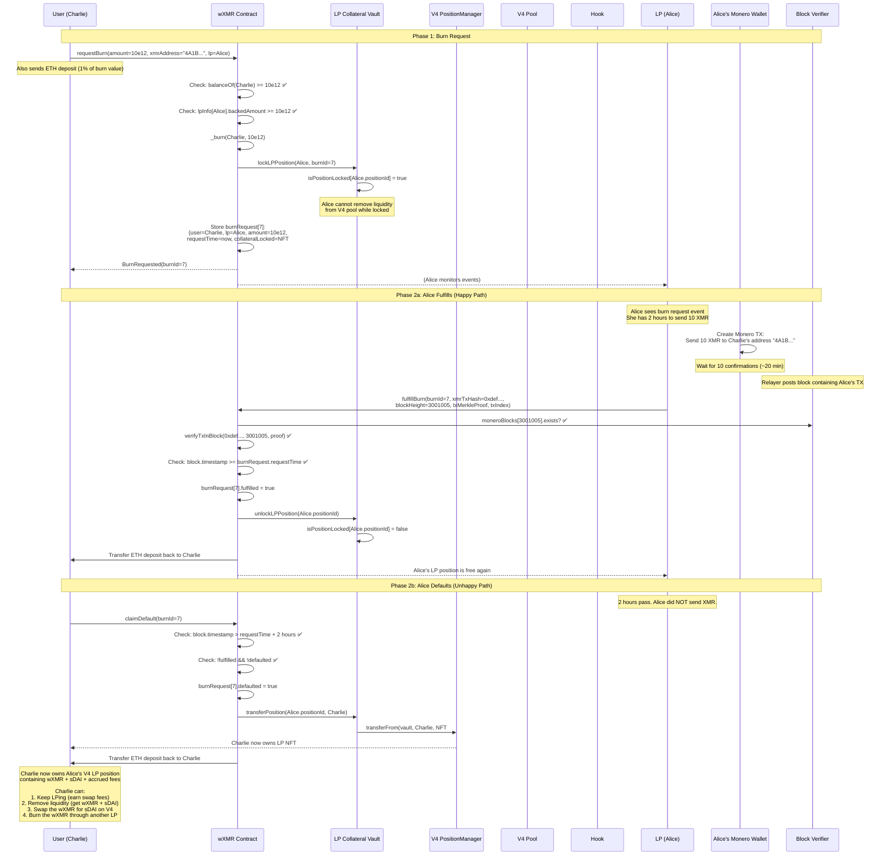
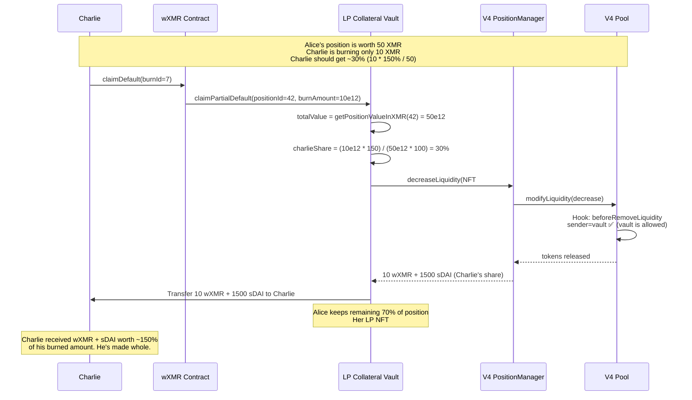
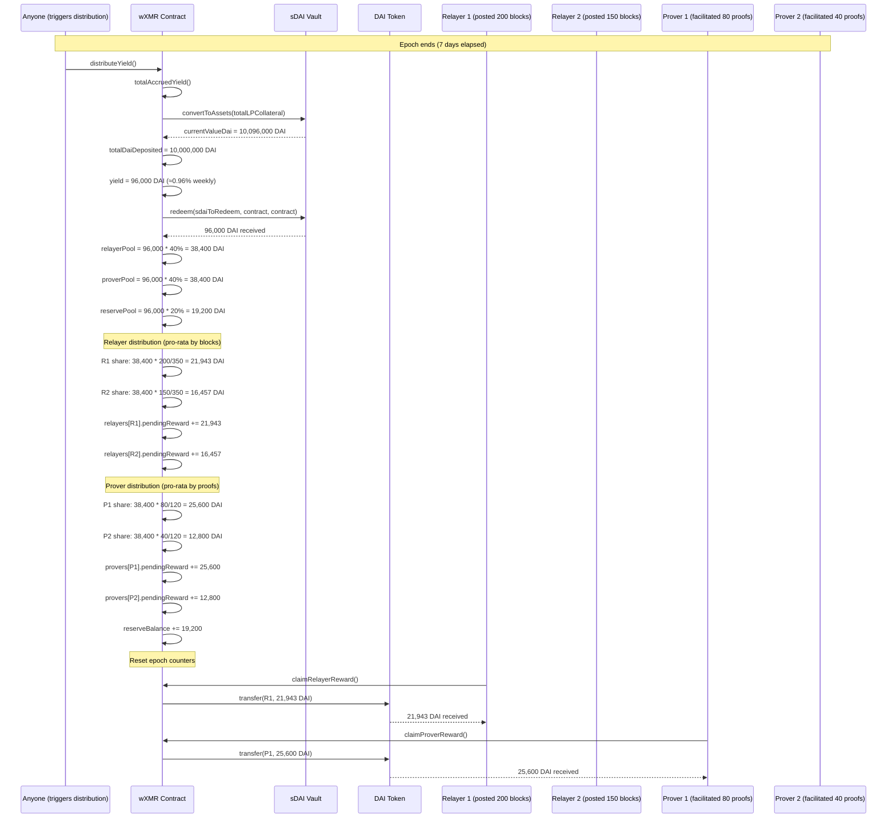
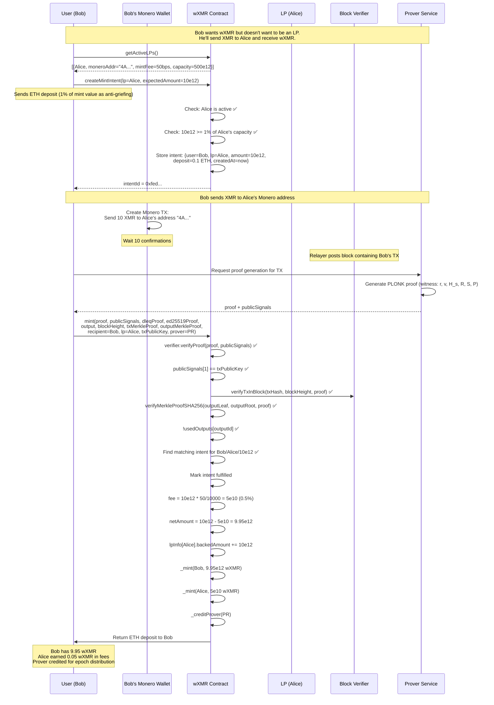
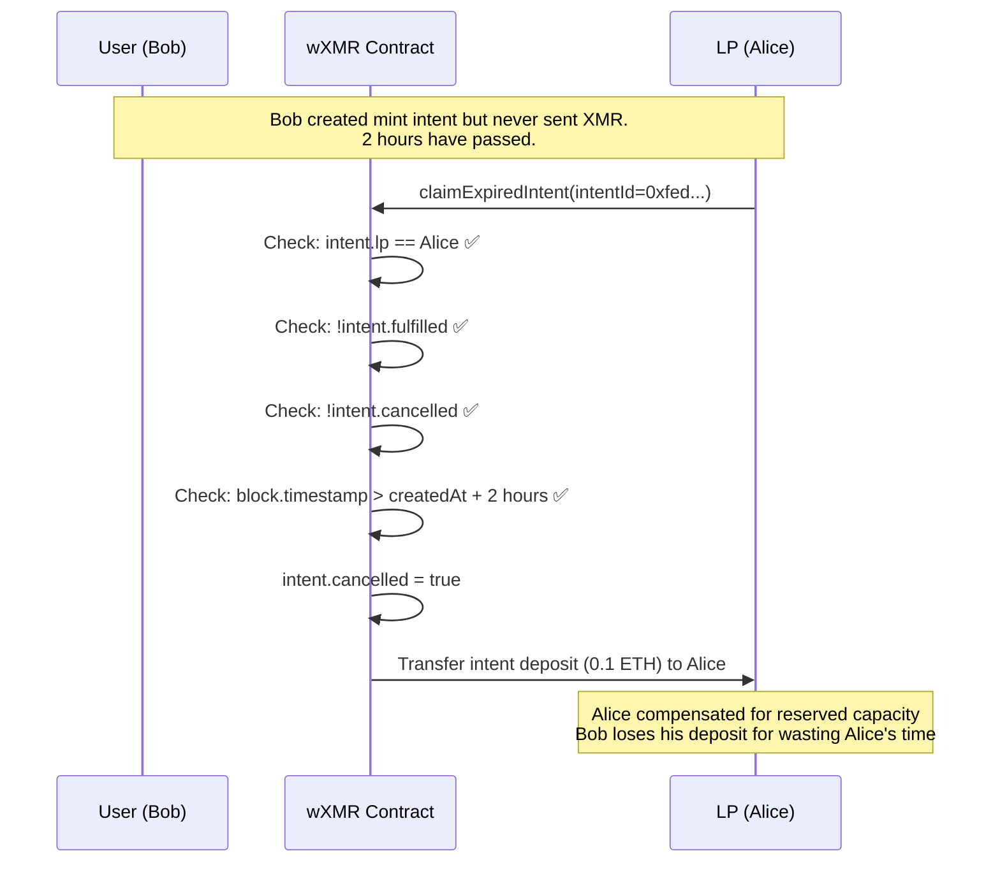
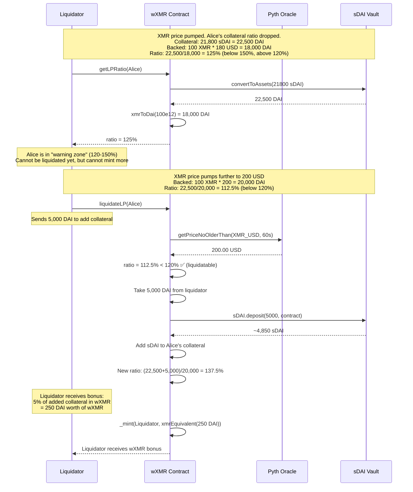
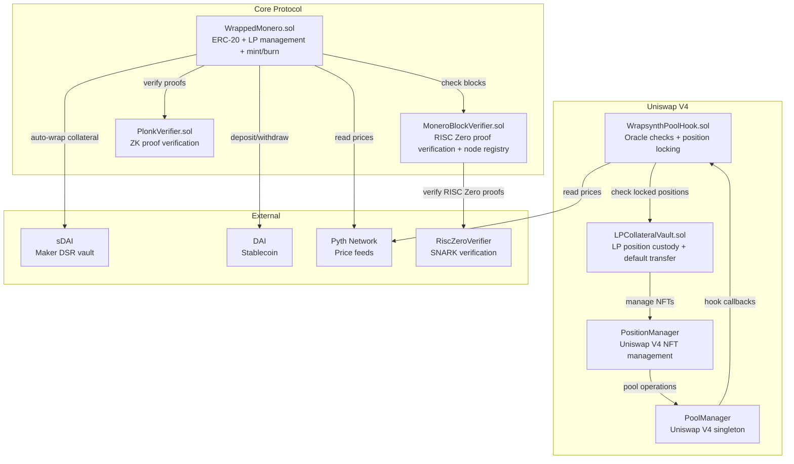

# Wrapsynth Bridge Specification v8.0

*LP-Collateralized Wrapped Monero with Uniswap V4 Composability*

**Architecture: Self-Minting LPs → sDAI Yield → Permissionless Relayers → V4 AMM Liquidity**

**Verification: PLONK Proofs + RISC Zero Multi-Node Consensus + Output Merkle Trees**

**Collateral: DAI → auto-wrapped sDAI (yield funds infrastructure)**

**Status: ✅ PLONK Proof Working | ✅ Output Merkle Tree | ✅ 137k Gas | ⚠️ Requires Security Audit**

---

## 1. Architecture & Principles

### 1.1 Core Design Tenets

1. **No Governance Token**: All infrastructure costs funded by sDAI yield from LP collateral. No DAO, no Snapshot, no emissions schedule.
2. **LP-Centric Model**: Each LP maintains their own collateral, sets their own fees, and backs their own wXMR. No shared pool risk.
3. **Self-Minting**: LPs are XMR holders who prove existing UTXOs they already own, mint wXMR, and LP both sides of a V4 pool.
4. **Permissionless Infrastructure**: Anyone can relay Monero blocks or generate ZK proofs. Paid from sDAI yield proportional to work performed.
5. **Two-Hour Enforcement Window**: Burns trigger a 2-hour window for the LP to send XMR. Default transfers the LP's Uniswap V4 position to the burner.
6. **Minimal Trust**: RISC Zero zkVM verifies TLS connections to 50%+ of registered Monero nodes. No single oracle, no trusted relayer.

### 1.2 System Layers

```
┌─────────────────────────────────────────────────────────────────┐
│                        Layer 3: AMM                              │
│   Uniswap V4 Pool (wXMR/sDAI) with custom Hook                 │
│   - Oracle-bounded swaps (max 3% deviation from Pyth)           │
│   - Circuit breaker (max 5% pool drain per block)               │
│   - beforeRemoveLiquidity blocks locked positions               │
│   - LP positions serve as collateral in burn vaults             │
└──────────────────────────────┬──────────────────────────────────┘
                               │
┌──────────────────────────────▼──────────────────────────────────┐
│                        Layer 2: Token                            │
│   wXMR (ERC-20, 12 decimals = piconero)                         │
│   - Self-mint: LP proves existing Monero UTXO                   │
│   - Burn: 2-hour window, LP sends XMR or loses V4 position     │
│   - LP collateral: DAI auto-wrapped to sDAI                     │
│   - sDAI yield split: 40% relayers, 40% provers, 20% reserve   │
└──────────────────────────────┬──────────────────────────────────┘
                               │
┌──────────────────────────────▼──────────────────────────────────┐
│                     Layer 1: Verification                        │
│   RISC Zero Multi-Node Consensus                                │
│   - On-chain registry of Monero node endpoints + TLS certs     │
│   - zkVM guest: connect to N nodes, verify TLS, compare blocks │
│   - Require 50%+ agreement on block hash                        │
│   - Permissionless: anyone can relay with valid proof           │
│   - Dual Merkle roots: txMerkleRoot + outputMerkleRoot          │
└──────────────────────────────┬──────────────────────────────────┘
                               │
┌──────────────────────────────▼──────────────────────────────────┐
│                    Layer 0: Cryptography                         │
│   PLONK Circuit (~1157 constraints)                              │
│   - Poseidon commitment binding all witness values              │
│   - Amount decryption (v XOR ecdhAmount)                        │
│   - Stealth address derivation (P = H_s·G + B)                 │
│   - Scalar range checks (r < L, H_s < L)                       │
│   - 64-bit amount range check (v < 2^64)                       │
│   - Ed25519 DLEQ verification                                   │
└─────────────────────────────────────────────────────────────────┘
```

### 1.3 Key Differences from v7.1

| | Feature | v7.1 | v8.0 | |
|---|---|---|
| | Oracle model | Quadratic-weighted N-of-M voting | RISC Zero multi-node consensus | |
| | Oracle bonding | 1,000 DAI bond per oracle | No bond — permissionless relaying | |
| | Block relay | Trusted oracle posts blocks | Anyone posts with RISC Zero proof | |
| | Trust assumption | 3+ honest oracles | 50%+ honest Monero nodes | |
| | Collateral model | LP posts collateral for user mints | LP self-mints against own XMR | |
| | AMM integration | None | Uniswap V4 with custom Hook | |
| | Collateral form | sDAI idle in vault | LP position NFT (wXMR + sDAI earning swap fees) | |
| | Yield usage | Oracle rewards + LP yield | 40/40/20 split to relayers/provers/reserve | |
| | Governance | Guardian pause + oracle voting | Node registry multisig only | |
| | Burn default | User gets sDAI collateral | User gets LP position NFT | |
| | Price oracle | Chainlink TWAP | Pyth Network + V4 pool price cross-check | |

---

## 2. Participant Roles

### 2.1 LP (Liquidity Provider / Self-Minter)

An LP is an XMR holder who wants yield. They are the core participant.

**What an LP provides:**
- XMR (already in their Monero wallet — never leaves)
- DAI (deposited as collateral, auto-wrapped to sDAI)

**What an LP receives:**
- wXMR (minted against their proven XMR holdings)
- Swap fees from V4 pool
- DSR yield on sDAI component
- Mint/burn fees from users who trade through them

**What an LP must do on burn:**
- Send XMR to burner's Monero address within 2 hours
- Or lose their V4 LP position to the burner

### 2.2 Relayer

Anyone who posts Monero block data on-chain with a valid RISC Zero proof.

**Requirements:** None. No bond, no registration beyond a simple sign-up.

**Revenue:** 40% of sDAI yield, distributed pro-rata by blocks posted per epoch.

### 2.3 Prover

Anyone who generates ZK proofs for mint transactions.

**Requirements:** GPU or CPU capable of running snarkjs/rapidsnark.

**Revenue:** 40% of sDAI yield, distributed pro-rata by proofs facilitated per epoch.

### 2.4 Casual User

Someone who wants XMR exposure or wants to swap wXMR ↔ sDAI.

**Primary path:** Swap on Uniswap V4. No Monero interaction needed.

**Alternative path:** Mint via LP (send XMR, receive wXMR) or burn via LP (send wXMR, receive XMR).

---

## 3. Complete Flow Diagrams

### 3.1 LP Bootstrap Flow (Alice Self-Mints)

This is the primary bootstrapping mechanism. Alice is an XMR holder with DAI.



### 3.2 Monero Block Relay Flow (Permissionless)



### 3.3 Casual User Swap Flow (No Monero Needed)



### 3.4 Burn Flow (User Redeems wXMR for XMR)



### 3.5 Partial Burn Default (Position Slicing)



### 3.6 Yield Distribution Flow



### 3.7 Mint Intent Flow (Non-LP User Mints Through LP)



### 3.8 LP Intent Expiry (Anti-Griefing)



### 3.9 Liquidation Flow



---

## 4. Zero-Knowledge Proof System

### 4.1 Circuit Architecture (~1157 constraints)

```
┌─────────────────────────────────────────────────────────────┐
│                    PLONK Circuit                             │
│                                                              │
│  Private Inputs (Witness):                                   │
│  ├── r          : tx secret key (256-bit scalar)            │
│  ├── v          : amount in piconero (64-bit)               │
│  ├── H_s        : scalar derived from shared secret         │
│  ├── R_x        : x-coordinate of R = r·G                  │
│  ├── S_x        : x-coordinate of S = 8·r·A                │
│  └── P          : stealth address point                     │
│                                                              │
│  Public Inputs:                                              │
│  ├── poseidonCommitment  : binding commitment               │
│  ├── R_x                 : tx public key (for matching)     │
│  ├── ecdhAmount          : encrypted amount from chain      │
│  ├── B_x, B_y            : LP spend public key              │
│  └── outputPubKey        : expected stealth address         │
│                                                              │
│  Constraints:                                                │
│  ├── Poseidon(r, v, H_s, R_x, S_x, P) == commitment       │
│  ├── v XOR ecdhAmount == decryptedAmount (amount check)     │
│  ├── P == H_s·G + B (stealth address derivation)           │
│  ├── r < L (scalar range: r < ed25519 group order)         │
│  ├── H_s < L (scalar range)                                │
│  └── v < 2^64 (amount range)                               │
│                                                              │
│  Total: ~1157 constraints                                    │
│  Proof time: 2-3s (browser WASM), 0.5-0.8s (native)        │
│  Verification gas: ~137k                                     │
└─────────────────────────────────────────────────────────────┘
```

### 4.2 Security Properties

| | Property | How Enforced | |
|---|---|
| | Output ownership | DLEQ proof: log_G(R) = log_A(rA) = r | |
| | Amount correctness | ecdhAmount committed in output Merkle tree, verified in circuit | |
| | Double-spend prevention | usedOutputs[hash(txHash, outputIndex)] mapping | |
| | Replay protection | txPublicKey matched against publicSignals[1] | |
| | Address binding | Stealth address P = H_s·G + B verified in circuit | |
| | Scalar validity | Range checks: r < L, H_s < L prevent curve attacks | |
| | Amount validity | 64-bit range check prevents overflow | |

### 4.3 Output Merkle Tree

```
Oracle posts per block:
├── txMerkleRoot: Merkle root of all TX hashes
│   └── Proves: "this transaction exists in this block"
│
└── outputMerkleRoot: Merkle root of all output data
    └── Proves: "this output has this ecdhAmount, pubKey, commitment"
    
Leaf = keccak256(txHash || outputIndex || ecdhAmount || outputPubKey || commitment)

User provides:
├── txMerkleProof (proves TX in block)
├── outputMerkleProof (proves output data authentic)
└── ZK proof (proves they can decrypt amount and own output)
```

---

## 5. RISC Zero Block Verification

### 5.1 Node Registry

The contract maintains a list of well-known Monero nodes with their TLS certificate fingerprints. A governance multisig (3-of-5) can add or remove nodes, rate-limited to 1 change per week.

```solidity
struct MoneroNode {
    string endpoint;            // "node.sethforprivacy.com:18089"
    bytes32 tlsCertFingerprint; // SHA-256 of TLS certificate
    bool active;
}
```

**Initial Node Set:**

| | Node | Endpoint | Operator | |
|---|---|---|
| | 1 | node.sethforprivacy.com:18089 | Seth For Privacy | |
| | 2 | nodes.hashvault.pro:18081 | HashVault | |
| | 3 | xmr-node.cakewallet.com:18081 | Cake Wallet | |
| | 4 | node.community.rino.io:18081 | RINO | |
| | 5 | xmr.stackwallet.com:18081 | Stack Wallet | |
| | 6 | node.supportxmr.com:18081 | SupportXMR | |
| | 7 | node.moneroworld.com:18089 | MoneroWorld | |

Required agreement: 4 of 7 (50% + 1)

### 5.2 RISC Zero Guest Program

```
Guest program (runs inside zkVM):
1. Receive inputs: blockHeight, nodeEndpoints[7]
2. For each node:
   a. Establish TLS connection (host facilitates TCP)
   b. Verify TLS certificate chain inside zkVM
   c. Record certificate fingerprint
   d. Send RPC: get_block(height=blockHeight)
   e. Parse response: blockHash, txHashes[], outputs[]
3. Tally: count nodes agreeing on same blockHash
4. Require: agreeing >= 4
5. From majority response:
   a. Compute txMerkleRoot from txHashes
   b. Compute outputMerkleRoot from outputs  
6. Commit to journal:
   {blockHeight, blockHash, txMerkleRoot, outputMerkleRoot,
    nodeCount, agreeingNodes, attestations[]}
```

### 5.3 On-Chain Verification

```solidity
function postMoneroBlock(
    uint256 blockHeight,
    bytes calldata seal,       // RISC Zero SNARK
    bytes calldata journal     // Public outputs
) external {
    // 1. Verify RISC Zero proof
    riscZeroVerifier.verify(seal, BLOCK_VERIFIER_IMAGE_ID, sha256(journal));
    
    // 2. Decode journal
    (height, blockHash, txRoot, outputRoot, nodeCount, agreeing, attestations) 
        = abi.decode(journal, ...);
    
    // 3. Check agreement threshold
    require(agreeing >= requiredAgreement);
    
    // 4. Verify TLS certs match registered nodes
    for each attestation:
        require(attestation.tlsCertHash == nodeRegistry[attestation.nodeId].tlsCertFingerprint);
    
    // 5. Store block
    moneroBlocks[blockHeight] = {blockHash, txRoot, outputRoot, timestamp, true};
}
```

### 5.4 Trust Analysis

| | Assumption | Required For | Failure Mode | |
|---|---|---|
| | RISC Zero zkVM is correct | Proof integrity | Entire system compromised | |
| | TLS is not broken | Node identity verification | Attacker impersonates nodes | |
| | 50%+ nodes are honest | Block data correctness | False blocks accepted | |
| | Node registry is honest | Correct node identities | Governance multisig attack | |

**Attack cost**: To post a false Monero block, an attacker must either compromise 4 of 7 well-known Monero community nodes simultaneously, or break TLS to impersonate them. Both are dramatically harder than bribing a single oracle.

---

## 6. Uniswap V4 Integration

### 6.1 Pool Architecture

```
Pool: wXMR / sDAI
├── Fee tier: Dynamic (set by hook based on volatility)
├── Hook: WrapsynthPoolHook
│   ├── beforeSwap: Oracle price check + circuit breaker
│   ├── beforeRemoveLiquidity: Block locked positions
│   └── beforeAddLiquidity: Verify source
└── Tick spacing: Determined by fee tier
```

### 6.2 Hook Permissions

```solidity
Hooks.Permissions({
    beforeInitialize: false,
    afterInitialize: false,
    beforeAddLiquidity: true,    // gate who can LP
    afterAddLiquidity: false,
    beforeRemoveLiquidity: true, // CRITICAL: block locked positions
    afterRemoveLiquidity: false,
    beforeSwap: true,            // oracle check + circuit breaker
    afterSwap: false,
    beforeDonate: false,
    afterDonate: false,
    beforeSwapReturnDelta: false,
    afterSwapReturnDelta: false,
    afterAddLiquidityReturnDelta: false,
    afterRemoveLiquidityReturnDelta: false
})
```

### 6.3 LP Position as Collateral

When a burn request is created against an LP whose collateral is a V4 position:

1. The Hook's`beforeRemoveLiquidity` blocks the LP from withdrawing
2. The position continues earning swap fees while locked
3. On fulfill: position unlocks
4. On default: position NFT transfers to the burner

**LP position is superior collateral because:**

| | Property | Idle sDAI | V4 LP Position | |
|---|---|---|
| | Earning yield | DSR only (~5%) | DSR + swap fees (variable) | |
| | Contains | Single asset | wXMR + sDAI (diversified) | |
| | On default | Burner gets sDAI | Burner gets LP NFT (both sides + fees) | |
| | Market impact | None | Deepens liquidity for entire protocol | |
| | IL risk | None | Present but hedges obligation (see below) | |

**Impermanent loss as a hedge:**

When XMR drops → LP position rebalances toward more sDAI → position retains USD value → LP's XMR obligation shrinks in USD → LP is better collateralized.

When XMR rises → LP position rebalances toward more wXMR → obligation grows but wXMR component grows too.

IL dampens the volatility of the collateral relative to the obligation. For a same-denomination obligation (wXMR collateral backing XMR obligation), IL is a feature.

### 6.4 Single-Sided LP Entry

LPs who self-mint only have wXMR (plus their sDAI collateral). They can enter the pool single-sided:

```
Current price: 1 XMR = 150 sDAI (tick = T_current)

Alice provides concentrated liquidity:
├── wXMR: from T_current to T_upper (sells wXMR as price rises)
├── sDAI: from T_lower to T_current (buys wXMR as price drops)
└── Both sides: full range (earns fees in both directions)

For maximum fee earning, Alice provides both sides.
She has both: wXMR from self-mint, sDAI from excess collateral.
```

---

## 7. Economic Model

### 7.1 Complete LP Balance Sheet

```
Alice's Assets:
├── XMR in Monero wallet       : 100 XMR (never moved)
├── V4 LP Position (NFT)       : 100 wXMR + 15,000 sDAI
│   ├── swap fees accruing     : ~0.05%/day (variable)
│   └── sDAI component earning : 5% APR (DSR)
└── Excess sDAI in protocol    : 7,500 sDAI (collateral buffer)

Alice's Liabilities:
├── Must send XMR on burn      : Up to 100 XMR (she has it)
└── 150% collateral requirement: Maintained by sDAI deposits

Alice's Revenue:
├── Swap fees                  : Variable (pool volume dependent)
├── DSR yield on sDAI          : 5% APR on sDAI component
├── Mint fees (0.5%)           : On any user minting through her
└── Burn fees (0.5%)           : On any user burning through her

Alice's Risk:
├── XMR price crash            : Must add more sDAI or get liquidated
├── Smart contract bug         : Audit mitigates
├── Monero wallet compromise   : Cannot fulfill burns → loses V4 position
└── Impermanent loss           : Dampened by same-denomination obligation
```

### 7.2 Infrastructure Revenue Model

```
Total collateral: 10,000,000 DAI in sDAI
DSR rate: 5% APR
Annual yield: 500,000 DAI

Distribution (weekly epochs):
├── Relayers (40%): 200,000 DAI/year
│   ├── Monero blocks/day: ~720
│   ├── Cost per relay TX: ~0.001 USD (L2 gas)
│   ├── Annual relay cost: ~263 USD
│   └── Revenue per relayer (10 relayers): ~20,000 DAI/year
│
├── Provers (40%): 200,000 DAI/year
│   ├── Proofs/day: ~100 (estimated)
│   ├── Cost per proof: ~0.10 USD (GPU)
│   ├── Annual proof cost: ~3,650 USD
│   └── Revenue per prover (5 provers): ~40,000 DAI/year
│
└── Reserve (20%): 100,000 DAI/year
    └── Covers: emergency response, bug bounties, insurance
```

### 7.3 Collateralization Tiers

| | Tier | Ratio | Status | Actions Available | |
|---|---|---|---|
| | Healthy | ≥ 150% | ✅ Normal | All operations, can withdraw excess | |
| | Warning | 120-150% | ⚠️ At risk | Cannot mint more, cannot withdraw | |
| | Liquidatable | < 120% | 🔴 Danger | Open to liquidation with 5% bonus | |
| | Default | LP misses burn | 🚨 Position seized | V4 LP NFT transferred to burner | |

### 7.4 Fee Structure

| | Fee | Amount | Recipient | Notes | |
|---|---|---|---|
| | Mint fee | LP-configurable (max 5%) | LP | Typical: 0.5% | |
| | Burn fee | LP-configurable (max 5%) | LP | Typical: 0.5% | |
| | Intent deposit | LP-configurable (max 10%) | LP on expiry, User on fulfillment | Anti-griefing | |
| | Swap fee | V4 pool fee tier | LP position holders | Continuous | |
| | DSR yield | ~5% APR | 40/40/20 split | Funds infrastructure | |
| | Liquidation bonus | 5% | Liquidator | Incentivizes health | |

---

## 8. Contracts Architecture

### 8.1 Contract Dependency Graph



### 8.2 Contract Sizes (Estimated)

| | Contract | LOC | Purpose | |
|---|---|---|
| | WrappedMonero.sol | ~1,200 | Core token + LP management + mint/burn | |
| | MoneroBlockVerifier.sol | ~400 | RISC Zero verification + node registry | |
| | WrapsynthPoolHook.sol | ~300 | V4 hook: oracle checks + position locking | |
| | LPCollateralVault.sol | ~350 | LP position custody + default transfers | |
| | PlonkVerifier.sol | ~800 | Auto-generated PLONK verifier | |
| | Ed25519.sol | ~200 | Ed25519 curve operations | |
| | Total | ~3,250 | |  |

---

## 9. Deployment Plan

### 9.1 Phase 1: Testnet (Current)

- **Network**: Base Sepolia
- **Status**: PLONK + DLEQ + Merkle trees working
- **Contract**:`0xA8C386AD6bf98599Cc19B6794F3077B3d9D5328f`
- **Gas**: 4.1M (DLEQ + PLONK combined)
- **Next**: Integrate RISC Zero block verifier

### 9.2 Phase 2: V4 Integration

- Deploy wXMR/sDAI pool on Unichain testnet
- Deploy WrapsynthPoolHook
- Deploy LPCollateralVault
- Test full LP bootstrap flow (self-mint → LP → earn fees)
- Test burn → default → position transfer flow

### 9.3 Phase 3: Mainnet Preparation

- [ ] Circuit formal verification (Ecne/Picus)
- [ ] Trail of Bits audit (contracts + circuits + RISC Zero guest)
- [ ] Ed25519 Solidity library audit
- [ ] RISC Zero guest program audit
- [ ] Node registry multisig setup (3-of-5)
- [ ] Initial node set TLS fingerprint collection
- [ ] Pyth price feed integration testing
- [ ] V4 hook deployment and testing

### 9.4 Phase 4: Mainnet Launch

- **Network**: Gnosis Chain (primary) or Unichain
- Deploy all contracts
- Seed initial node registry (7 nodes)
- First LP self-mints, creates V4 pool
- Open to public relayers and provers
- Monitor yield distribution

---

## 10. Security Analysis

### 10.1 Attack Cost Matrix

| | Attack | Requirements | Cost | Mitigation | |
|---|---|---|---|
| | False Monero block | Compromise 4/7 TLS nodes | Extremely high | RISC Zero + TLS cert pinning | |
| | Price manipulation | Sustained Pyth + V4 pool manipulation | Arbitrage losses | 3% deviation cap in hook | |
| | Flash loan liquidation | Flash loan + stale price | Blocked | Pyth freshness check (60s max) | |
| | LP rug (burn default) | LP ignores burn request | LP loses V4 position | 150% overcollateralization | |
| | Double-spend | Reuse Monero output | Blocked | usedOutputs mapping | |
| | Fake proof | Invalid ZK proof | Blocked | On-chain PLONK verification | |
| | Griefing (mint intent spam) | Create intents, never send XMR | Deposit cost | Intent deposit forfeited to LP | |
| | Node registry attack | Compromise 3/5 multisig | Social engineering | Rate limit: 1 change/week | |

### 10.2 Trust Assumptions (Ordered by Criticality)

| | # | Assumption | Impact if Broken | Probability | |
|---|---|---|---|
| | 1 | PLONK circuit is correct | False mints possible | Low (auditable) | |
| | 2 | RISC Zero zkVM is correct | False blocks accepted | Very low (audited by RISC Zero) | |
| | 3 | TLS is not broken | Node impersonation | Negligible | |
| | 4 | 50%+ of registered nodes are honest | False blocks accepted | Very low (diverse operators) | |
| | 5 | Ed25519 implementation is correct | False ownership proofs | Low (well-studied) | |
| | 6 | Pyth oracle is accurate | Incorrect collateral ratios | Low (many data sources) | |
| | 7 | sDAI/Maker DSR is solvent | Collateral value loss | Very low | |

---

## 11. Gas Costs

### 11.1 Estimated Gas by Function

| | Function | Gas (L2) | L1 Data | Est. Cost | |
|---|---|---|---|
| | registerLP | 180k | 2.5kb | ~0.01 USD | |
| | lpDeposit (DAI → sDAI) | 250k | 3.0kb | ~0.02 USD | |
| | selfMint | 800k | 10kb | ~0.05 USD | |
| | mint (with intent) | 920k | 12kb | ~0.06 USD | |
| | createMintIntent | 120k | 1.5kb | ~0.01 USD | |
| | requestBurn | 200k | 2.5kb | ~0.02 USD | |
| | fulfillBurn | 300k | 4.0kb | ~0.02 USD | |
| | claimDefault | 250k | 2.0kb | ~0.02 USD | |
| | postMoneroBlock (RISC Zero) | 350k | 5.0kb | ~0.03 USD | |
| | distributeYield | 400k | 3.0kb | ~0.03 USD | |
| | V4 swap (with hook) | 200k | 2.5kb | ~0.02 USD | |

### 11.2 Proving Times

| | Environment | Time | Memory | Notes | |
|---|---|---|---|
| | Browser (WASM) | 2.0-2.8s | ~1.0 GB | snarkjs optimized | |
| | Browser (WebGPU) | 1.4-2.0s | ~600 MB | Chrome 120+ | |
| | Native (rapidsnark) | 0.5-0.8s | ~500 MB | 8-core CPU | |
| | RISC Zero (block relay) | 30-120s | ~2 GB | Depends on block size | |

---

## 12. Appendix: Key Constants

```solidity
uint256 constant SAFE_RATIO = 150;               // 150% collateral
uint256 constant LIQUIDATION_THRESHOLD = 120;     // 120% liquidation
uint256 constant PICONERO_PER_XMR = 1e12;         // wXMR decimals
uint256 constant MAX_PRICE_AGE = 60;              // Pyth freshness (seconds)
uint256 constant BURN_TIMEOUT = 2 hours;          // LP must send XMR
uint256 constant MINT_INTENT_TIMEOUT = 2 hours;   // User must complete mint
uint256 constant MAX_FEE_BPS = 500;               // Max 5% fee
uint256 constant MIN_MINT_BPS = 100;              // Min 1% of LP capacity
uint256 constant EPOCH_DURATION = 7 days;         // Yield distribution period
uint256 constant MAX_DEVIATION_BPS = 300;         // V4 hook: 3% oracle deviation
uint256 constant MAX_DRAIN_PER_BLOCK = 500;       // V4 hook: 5% circuit breaker
uint256 constant RELAYER_SHARE_BPS = 4000;        // 40% yield to relayers
uint256 constant PROVER_SHARE_BPS = 4000;         // 40% yield to provers
uint256 constant RESERVE_SHARE_BPS = 2000;        // 20% yield to reserve
```

---

## 13. License & Disclaimer

**License:** MIT (Circom), GPL-3.0 (Solidity)

This is experimental cryptographic software. Security audits required before mainnet deployment. No governance token exists or is planned.

---

*Document Version: 8.0.0*
*Last Updated: February 2026*
*Authors: FUNGERBIL Team*

**v8.0 Changes from v7.1:**
- Replaced oracle consensus with RISC Zero multi-node verification
- Added LP self-minting as primary bootstrapping mechanism
- Added Uniswap V4 integration with custom Hook
- LP position NFT as collateral (replaces idle sDAI)
- sDAI yield funds permissionless relayers and provers (40/40/20 split)
- Removed governance token requirement
- Removed oracle bonding/slashing (replaced by RISC Zero proofs)
- Added burn default → LP position transfer to burner
- Added partial position slicing for partial defaults
- Added anti-griefing mint intent system
- Added V4 hook: oracle-bounded swaps + circuit breaker + position locking
- Comprehensive sequence diagrams for all flows