# wsXMR Liquidity Router - Sequence Diagrams

This document provides chain-agnostic sequence diagrams for the wsXMR Liquidity Router and VaultManager system. The diagrams illustrate the core flows for liquidity provision, atomic swaps, and position management.

## Table of Contents

1. [Pool Initialization](#pool-initialization)
2. [LP Vault Setup](#lp-vault-setup)
3. [Liquidity Allocation Flow](#liquidity-allocation-flow)
4. [Mutual Approval System](#mutual-approval-system)
5. [Position Creation](#position-creation)
6. [Position Closure](#position-closure)
7. [Fee Collection](#fee-collection)
8. [Mint Flow (XMR → wsXMR)](#mint-flow-xmr--wsxmr)
9. [Burn Flow (wsXMR → XMR)](#burn-flow-wsxmr--xmr)
10. [Liquidation Flow](#liquidation-flow)
11. [Buy-and-Burn Mechanism](#buy-and-burn-mechanism)

---

## Pool Initialization

Before any liquidity positions can be created, the Uniswap V3 pool must be initialized with an oracle-derived price.

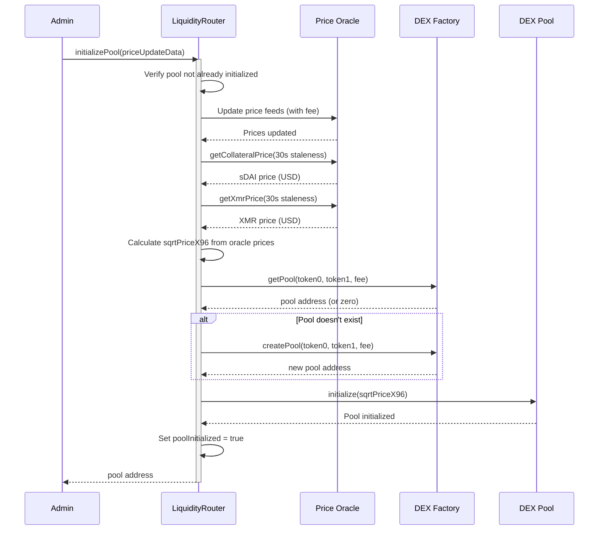
```mermaid
sequenceDiagram
    participant Admin
    participant Router as LiquidityRouter
    participant Oracle as Price Oracle
    participant Factory as DEX Factory
    participant Pool as DEX Pool

    Admin->>Router: initializePool(priceUpdateData)
    activate Router
    
    Router->>Router: Verify pool not already initialized
    Router->>Oracle: Update price feeds (with fee)
    Oracle-->>Router: Prices updated
    
    Router->>Oracle: getCollateralPrice(30s staleness)
    Oracle-->>Router: sDAI price (USD)
    
    Router->>Oracle: getXmrPrice(30s staleness)
    Oracle-->>Router: XMR price (USD)
    
    Router->>Router: Calculate sqrtPriceX96 from oracle prices
    
    Router->>Factory: getPool(token0, token1, fee)
    Factory-->>Router: pool address (or zero)
    
    alt Pool doesn't exist
        Router->>Factory: createPool(token0, token1, fee)
        Factory-->>Router: new pool address
    end
    
    Router->>Pool: initialize(sqrtPriceX96)
    Pool-->>Router: Pool initialized
    
    Router->>Router: Set poolInitialized = true
    Router-->>Admin: pool address
    
    deactivate Router
```

---

## LP Vault Setup

LPs must create a vault and deposit collateral before participating in the system.

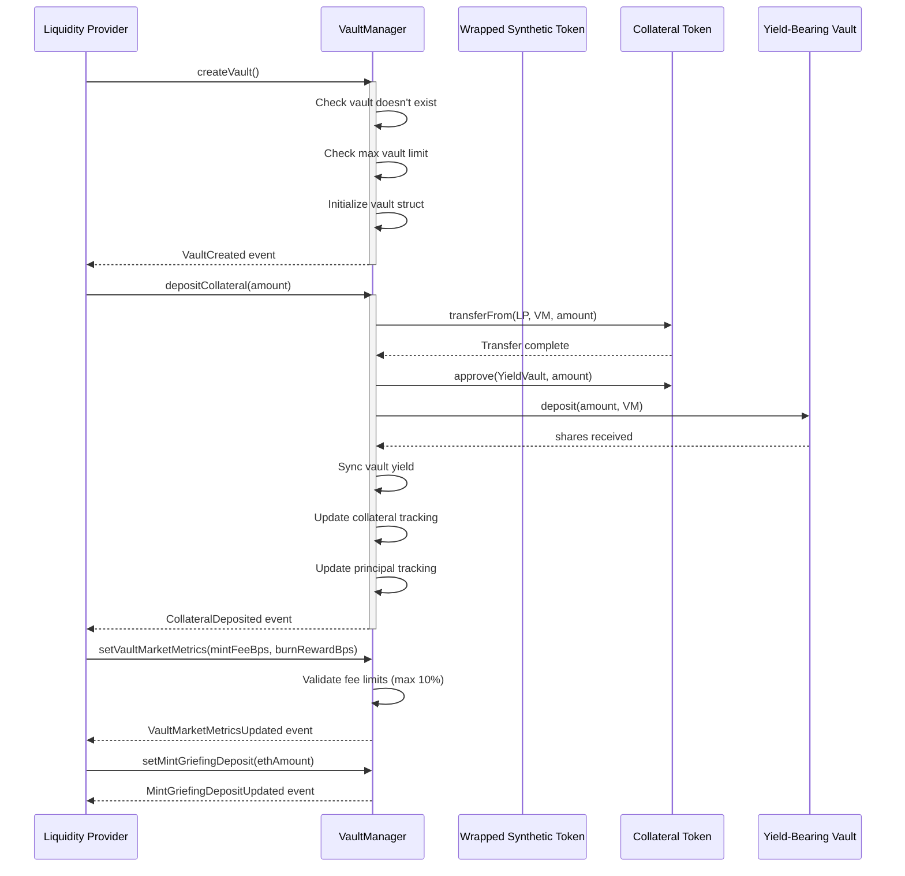
```mermaid
sequenceDiagram
    participant LP as Liquidity Provider
    participant VM as VaultManager
    participant Token as Wrapped Synthetic Token
    participant Collateral as Collateral Token
    participant YieldVault as Yield-Bearing Vault

    LP->>VM: createVault()
    activate VM
    VM->>VM: Check vault doesn't exist
    VM->>VM: Check max vault limit
    VM->>VM: Initialize vault struct
    VM-->>LP: VaultCreated event
    deactivate VM

    LP->>VM: depositCollateral(amount)
    activate VM
    VM->>Collateral: transferFrom(LP, VM, amount)
    Collateral-->>VM: Transfer complete
    
    VM->>Collateral: approve(YieldVault, amount)
    VM->>YieldVault: deposit(amount, VM)
    YieldVault-->>VM: shares received
    
    VM->>VM: Sync vault yield
    VM->>VM: Update collateral tracking
    VM->>VM: Update principal tracking
    VM-->>LP: CollateralDeposited event
    deactivate VM

    LP->>VM: setVaultMarketMetrics(mintFeeBps, burnRewardBps)
    VM->>VM: Validate fee limits (max 10%)
    VM-->>LP: VaultMarketMetricsUpdated event

    LP->>VM: setMintGriefingDeposit(ethAmount)
    VM-->>LP: MintGriefingDepositUpdated event
```

---

## Liquidity Allocation Flow

LPs allocate collateral from their vault to the Liquidity Router for AMM positions.

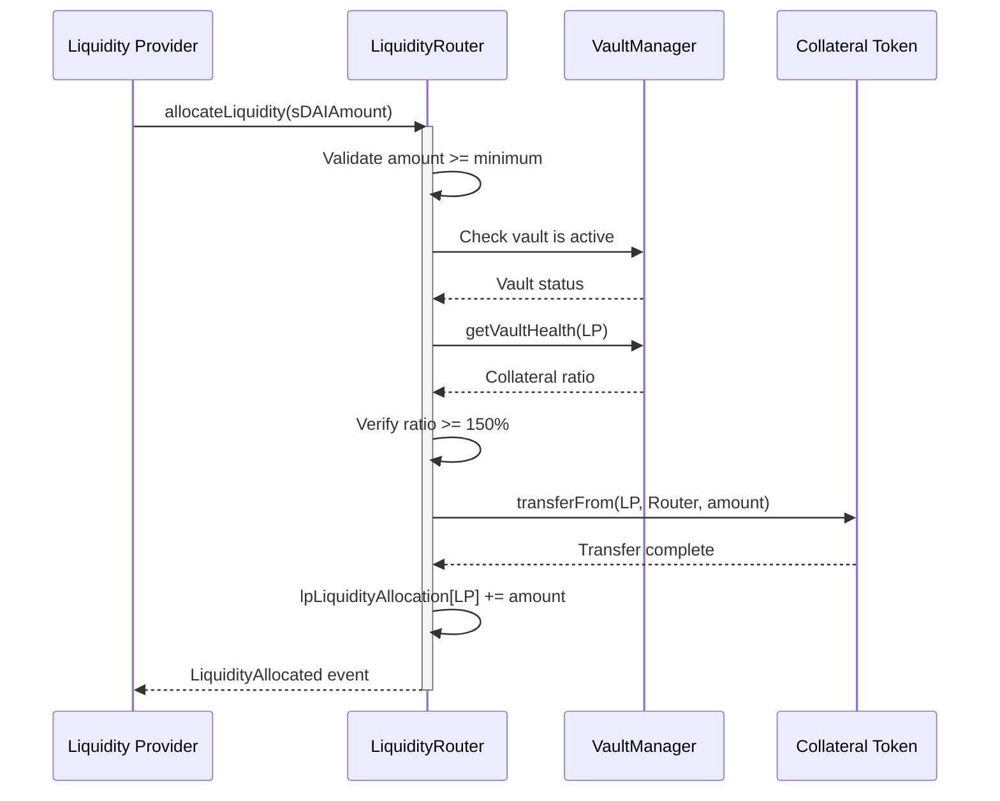
```mermaid
sequenceDiagram
    participant LP as Liquidity Provider
    participant Router as LiquidityRouter
    participant VM as VaultManager
    participant Collateral as Collateral Token

    LP->>Router: allocateLiquidity(sDAIAmount)
    activate Router
    
    Router->>Router: Validate amount >= minimum
    Router->>VM: Check vault is active
    VM-->>Router: Vault status
    
    Router->>VM: getVaultHealth(LP)
    VM-->>Router: Collateral ratio
    Router->>Router: Verify ratio >= 150%
    
    Router->>Collateral: transferFrom(LP, Router, amount)
    Collateral-->>Router: Transfer complete
    
    Router->>Router: lpLiquidityAllocation[LP] += amount
    Router-->>LP: LiquidityAllocated event
    deactivate Router
```

---

## Mutual Approval System

Both LPs and Users must approve each other before positions can be created.

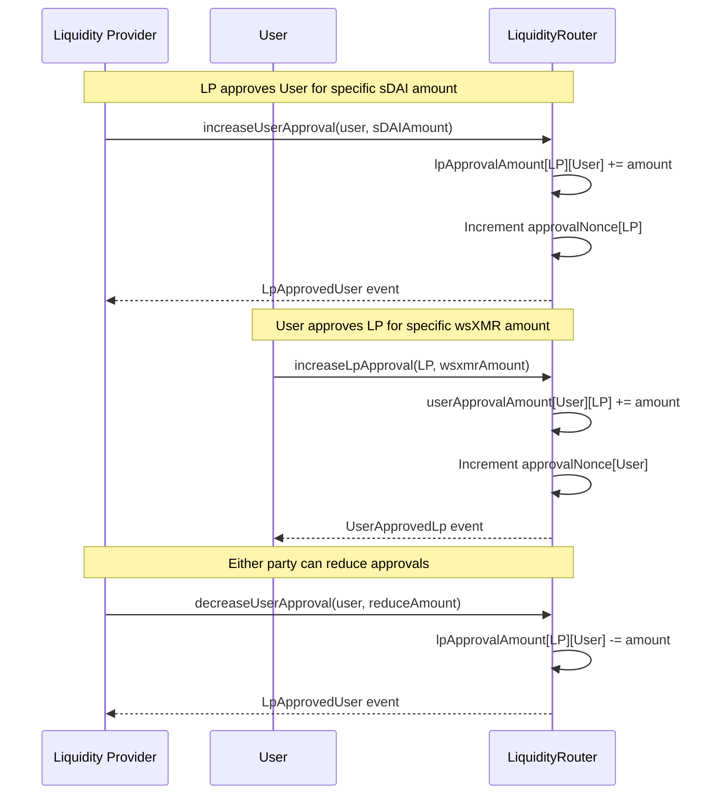
```mermaid
sequenceDiagram
    participant LP as Liquidity Provider
    participant User
    participant Router as LiquidityRouter

    Note over LP,Router: LP approves User for specific sDAI amount
    LP->>Router: increaseUserApproval(user, sDAIAmount)
    Router->>Router: lpApprovalAmount[LP][User] += amount
    Router->>Router: Increment approvalNonce[LP]
    Router-->>LP: LpApprovedUser event

    Note over User,Router: User approves LP for specific wsXMR amount
    User->>Router: increaseLpApproval(LP, wsxmrAmount)
    Router->>Router: userApprovalAmount[User][LP] += amount
    Router->>Router: Increment approvalNonce[User]
    Router-->>User: UserApprovedLp event

    Note over LP,Router: Either party can reduce approvals
    LP->>Router: decreaseUserApproval(user, reduceAmount)
    Router->>Router: lpApprovalAmount[LP][User] -= amount
    Router-->>LP: LpApprovedUser event
```

---

## Position Creation

Creating a matched liquidity position on the DEX.

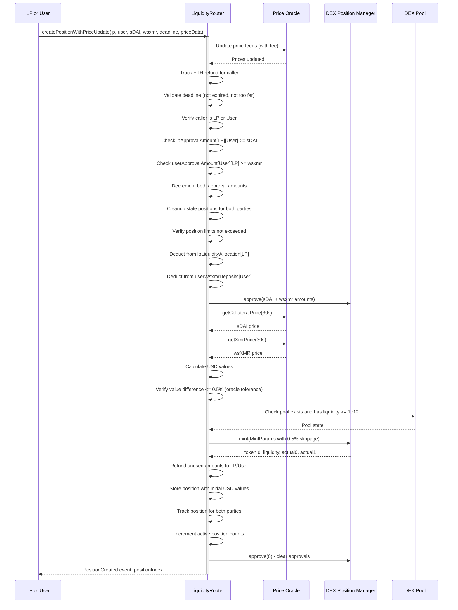
```mermaid
sequenceDiagram
    participant Caller as LP or User
    participant Router as LiquidityRouter
    participant Oracle as Price Oracle
    participant DEX as DEX Position Manager
    participant Pool as DEX Pool

    Caller->>Router: createPositionWithPriceUpdate(lp, user, sDAI, wsxmr, deadline, priceData)
    activate Router
    
    Router->>Oracle: Update price feeds (with fee)
    Oracle-->>Router: Prices updated
    Router->>Router: Track ETH refund for caller
    
    Router->>Router: Validate deadline (not expired, not too far)
    Router->>Router: Verify caller is LP or User
    
    Router->>Router: Check lpApprovalAmount[LP][User] >= sDAI
    Router->>Router: Check userApprovalAmount[User][LP] >= wsxmr
    Router->>Router: Decrement both approval amounts
    
    Router->>Router: Cleanup stale positions for both parties
    Router->>Router: Verify position limits not exceeded
    
    Router->>Router: Deduct from lpLiquidityAllocation[LP]
    Router->>Router: Deduct from userWsxmrDeposits[User]
    
    Router->>DEX: approve(sDAI + wsxmr amounts)
    
    Router->>Oracle: getCollateralPrice(30s)
    Oracle-->>Router: sDAI price
    Router->>Oracle: getXmrPrice(30s)
    Oracle-->>Router: wsXMR price
    
    Router->>Router: Calculate USD values
    Router->>Router: Verify value difference <= 0.5% (oracle tolerance)
    
    Router->>Pool: Check pool exists and has liquidity >= 1e12
    Pool-->>Router: Pool state
    
    Router->>DEX: mint(MintParams with 0.5% slippage)
    DEX-->>Router: tokenId, liquidity, actual0, actual1
    
    Router->>Router: Refund unused amounts to LP/User
    Router->>Router: Store position with initial USD values
    Router->>Router: Track position for both parties
    Router->>Router: Increment active position counts
    
    Router->>DEX: approve(0) - clear approvals
    Router-->>Caller: PositionCreated event, positionIndex
    deactivate Router
```

---

## Position Closure

Closing a position and distributing assets back to LP and User.

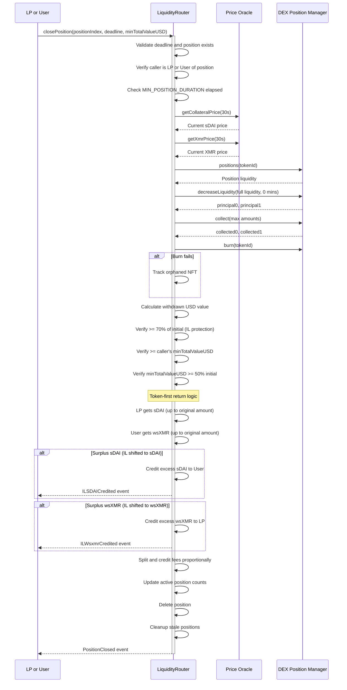
```mermaid
sequenceDiagram
    participant Caller as LP or User
    participant Router as LiquidityRouter
    participant Oracle as Price Oracle
    participant DEX as DEX Position Manager

    Caller->>Router: closePosition(positionIndex, deadline, minTotalValueUSD)
    activate Router
    
    Router->>Router: Validate deadline and position exists
    Router->>Router: Verify caller is LP or User of position
    Router->>Router: Check MIN_POSITION_DURATION elapsed
    
    Router->>Oracle: getCollateralPrice(30s)
    Oracle-->>Router: Current sDAI price
    Router->>Oracle: getXmrPrice(30s)
    Oracle-->>Router: Current XMR price
    
    Router->>DEX: positions(tokenId)
    DEX-->>Router: Position liquidity
    
    Router->>DEX: decreaseLiquidity(full liquidity, 0 mins)
    DEX-->>Router: principal0, principal1
    
    Router->>DEX: collect(max amounts)
    DEX-->>Router: collected0, collected1
    
    Router->>DEX: burn(tokenId)
    alt Burn fails
        Router->>Router: Track orphaned NFT
    end
    
    Router->>Router: Calculate withdrawn USD value
    Router->>Router: Verify >= 70% of initial (IL protection)
    Router->>Router: Verify >= caller's minTotalValueUSD
    Router->>Router: Verify minTotalValueUSD >= 50% initial
    
    Note over Router: Token-first return logic
    Router->>Router: LP gets sDAI (up to original amount)
    Router->>Router: User gets wsXMR (up to original amount)
    
    alt Surplus sDAI (IL shifted to sDAI)
        Router->>Router: Credit excess sDAI to User
        Router-->>Caller: ILSDAICredited event
    end
    
    alt Surplus wsXMR (IL shifted to wsXMR)
        Router->>Router: Credit excess wsXMR to LP
        Router-->>Caller: ILWsxmrCredited event
    end
    
    Router->>Router: Split and credit fees proportionally
    Router->>Router: Update active position counts
    Router->>Router: Delete position
    Router->>Router: Cleanup stale positions
    
    Router-->>Caller: PositionClosed event
    deactivate Router
```

---

## Fee Collection

Collecting trading fees from an active position without closing it.

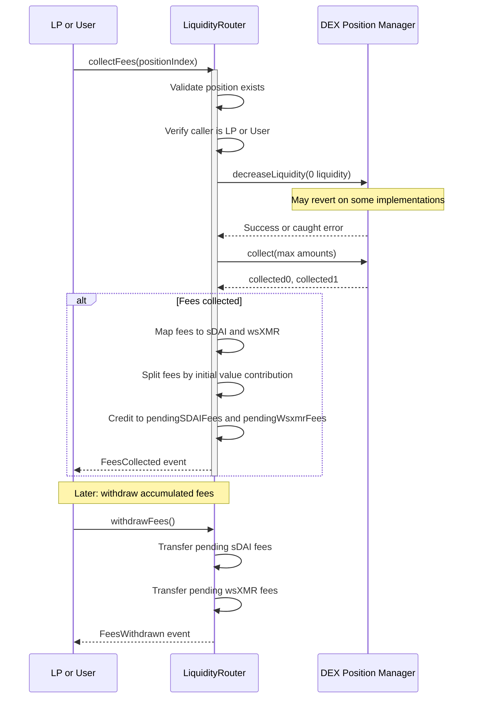
```mermaid
sequenceDiagram
    participant Caller as LP or User
    participant Router as LiquidityRouter
    participant DEX as DEX Position Manager

    Caller->>Router: collectFees(positionIndex)
    activate Router
    
    Router->>Router: Validate position exists
    Router->>Router: Verify caller is LP or User
    
    Router->>DEX: decreaseLiquidity(0 liquidity)
    Note over DEX: May revert on some implementations
    DEX-->>Router: Success or caught error
    
    Router->>DEX: collect(max amounts)
    DEX-->>Router: collected0, collected1
    
    alt Fees collected
        Router->>Router: Map fees to sDAI and wsXMR
        Router->>Router: Split fees by initial value contribution
        Router->>Router: Credit to pendingSDAIFees and pendingWsxmrFees
        Router-->>Caller: FeesCollected event
    end
    
    deactivate Router

    Note over Caller,Router: Later: withdraw accumulated fees
    Caller->>Router: withdrawFees()
    Router->>Router: Transfer pending sDAI fees
    Router->>Router: Transfer pending wsXMR fees
    Router-->>Caller: FeesWithdrawn event
```

---

## Mint Flow (XMR → wsXMR)

Complete atomic swap flow for minting wsXMR backed by XMR.

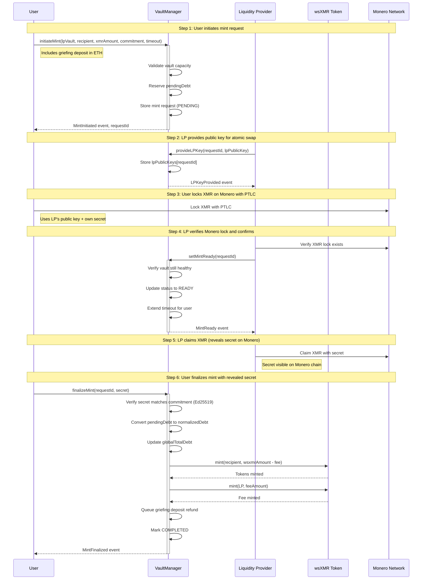
```mermaid
sequenceDiagram
    participant User
    participant VM as VaultManager
    participant LP as Liquidity Provider
    participant Token as wsXMR Token
    participant Monero as Monero Network

    Note over User,Monero: Step 1: User initiates mint request
    User->>VM: initiateMint(lpVault, recipient, xmrAmount, commitment, timeout)
    activate VM
    Note right of User: Includes griefing deposit in ETH
    VM->>VM: Validate vault capacity
    VM->>VM: Reserve pendingDebt
    VM->>VM: Store mint request (PENDING)
    VM-->>User: MintInitiated event, requestId
    deactivate VM

    Note over User,Monero: Step 2: LP provides public key for atomic swap
    LP->>VM: provideLPKey(requestId, lpPublicKey)
    VM->>VM: Store lpPublicKeys[requestId]
    VM-->>LP: LPKeyProvided event

    Note over User,Monero: Step 3: User locks XMR on Monero with PTLC
    User->>Monero: Lock XMR with PTLC
    Note right of User: Uses LP's public key + own secret

    Note over User,Monero: Step 4: LP verifies Monero lock and confirms
    LP->>Monero: Verify XMR lock exists
    LP->>VM: setMintReady(requestId)
    activate VM
    VM->>VM: Verify vault still healthy
    VM->>VM: Update status to READY
    VM->>VM: Extend timeout for user
    VM-->>LP: MintReady event
    deactivate VM

    Note over User,Monero: Step 5: LP claims XMR (reveals secret on Monero)
    LP->>Monero: Claim XMR with secret
    Note right of LP: Secret visible on Monero chain

    Note over User,Monero: Step 6: User finalizes mint with revealed secret
    User->>VM: finalizeMint(requestId, secret)
    activate VM
    VM->>VM: Verify secret matches commitment (Ed25519)
    VM->>VM: Convert pendingDebt to normalizedDebt
    VM->>VM: Update globalTotalDebt
    VM->>Token: mint(recipient, wsxmrAmount - fee)
    Token-->>VM: Tokens minted
    VM->>Token: mint(LP, feeAmount)
    Token-->>VM: Fee minted
    VM->>VM: Queue griefing deposit refund
    VM->>VM: Mark COMPLETED
    VM-->>User: MintFinalized event
    deactivate VM
```

### Mint Cancellation Scenarios

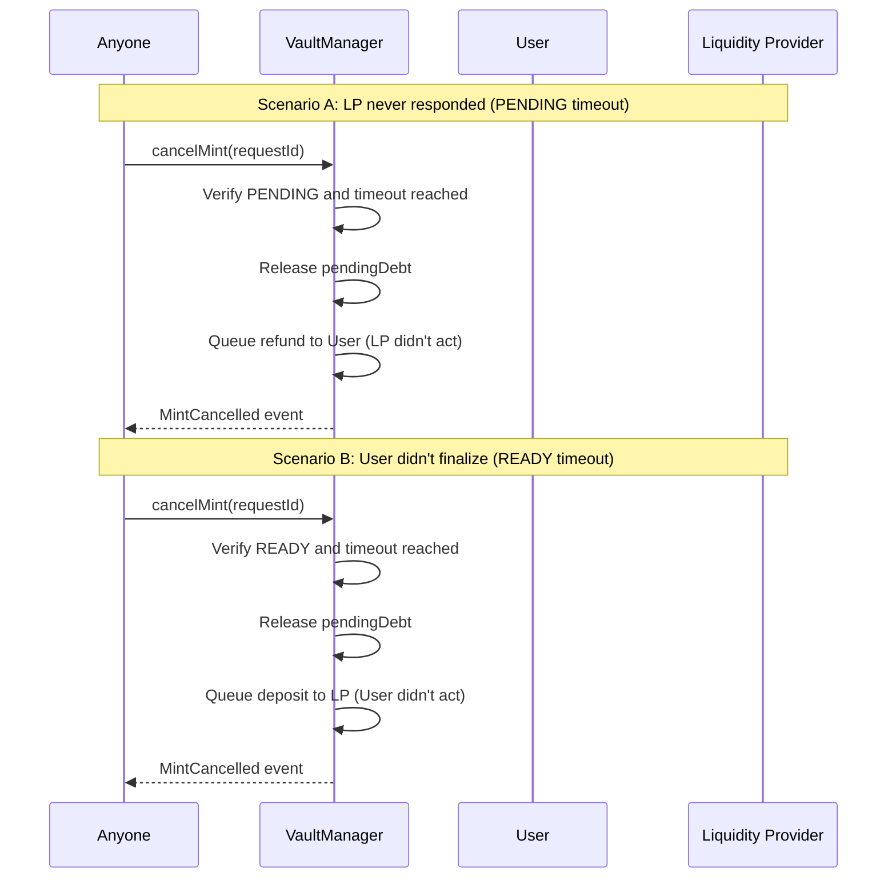
```mermaid
sequenceDiagram
    participant Anyone
    participant VM as VaultManager
    participant User
    participant LP as Liquidity Provider

    Note over Anyone,LP: Scenario A: LP never responded (PENDING timeout)
    Anyone->>VM: cancelMint(requestId)
    VM->>VM: Verify PENDING and timeout reached
    VM->>VM: Release pendingDebt
    VM->>VM: Queue refund to User (LP didn't act)
    VM-->>Anyone: MintCancelled event

    Note over Anyone,LP: Scenario B: User didn't finalize (READY timeout)
    Anyone->>VM: cancelMint(requestId)
    VM->>VM: Verify READY and timeout reached
    VM->>VM: Release pendingDebt
    VM->>VM: Queue deposit to LP (User didn't act)
    VM-->>Anyone: MintCancelled event
```

---

## Burn Flow (wsXMR → XMR)

Complete atomic swap flow for burning wsXMR to receive XMR.

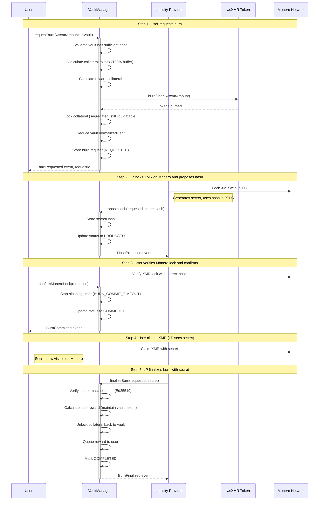
```mermaid
sequenceDiagram
    participant User
    participant VM as VaultManager
    participant LP as Liquidity Provider
    participant Token as wsXMR Token
    participant Monero as Monero Network

    Note over User,Monero: Step 1: User requests burn
    User->>VM: requestBurn(wsxmrAmount, lpVault)
    activate VM
    VM->>VM: Validate vault has sufficient debt
    VM->>VM: Calculate collateral to lock (130% buffer)
    VM->>VM: Calculate reward collateral
    VM->>Token: burn(user, wsxmrAmount)
    Token-->>VM: Tokens burned
    VM->>VM: Lock collateral (segregated, still liquidatable)
    VM->>VM: Reduce vault normalizedDebt
    VM->>VM: Store burn request (REQUESTED)
    VM-->>User: BurnRequested event, requestId
    deactivate VM

    Note over User,Monero: Step 2: LP locks XMR on Monero and proposes hash
    LP->>Monero: Lock XMR with PTLC
    Note right of LP: Generates secret, uses hash in PTLC
    LP->>VM: proposeHash(requestId, secretHash)
    activate VM
    VM->>VM: Store secretHash
    VM->>VM: Update status to PROPOSED
    VM-->>LP: HashProposed event
    deactivate VM

    Note over User,Monero: Step 3: User verifies Monero lock and confirms
    User->>Monero: Verify XMR lock with correct hash
    User->>VM: confirmMoneroLock(requestId)
    activate VM
    VM->>VM: Start slashing timer (BURN_COMMIT_TIMEOUT)
    VM->>VM: Update status to COMMITTED
    VM-->>User: BurnCommitted event
    deactivate VM

    Note over User,Monero: Step 4: User claims XMR (LP sees secret)
    User->>Monero: Claim XMR with secret
    Note right of User: Secret now visible on Monero

    Note over User,Monero: Step 5: LP finalizes burn with secret
    LP->>VM: finalizeBurn(requestId, secret)
    activate VM
    VM->>VM: Verify secret matches hash (Ed25519)
    VM->>VM: Calculate safe reward (maintain vault health)
    VM->>VM: Unlock collateral back to vault
    VM->>VM: Queue reward to user
    VM->>VM: Mark COMPLETED
    VM-->>LP: BurnFinalized event
    deactivate VM
```

### Burn Failure Scenarios

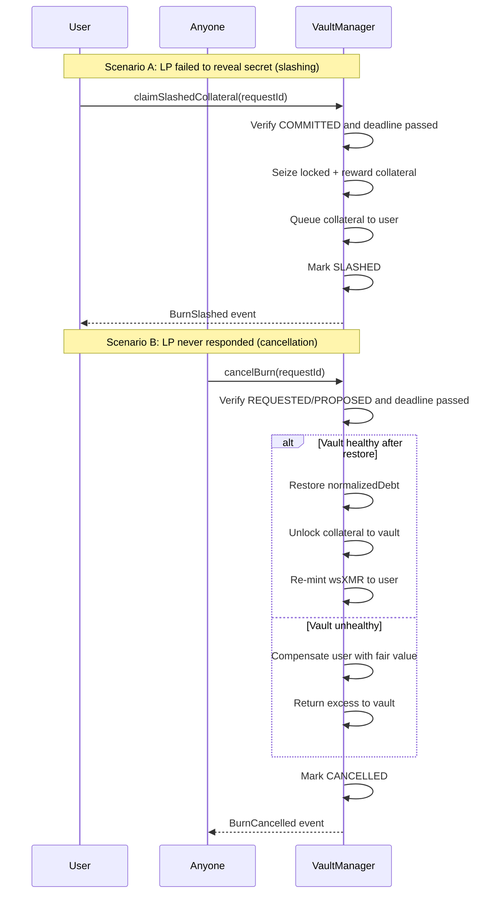
```mermaid
sequenceDiagram
    participant User
    participant Anyone
    participant VM as VaultManager

    Note over User,VM: Scenario A: LP failed to reveal secret (slashing)
    User->>VM: claimSlashedCollateral(requestId)
    VM->>VM: Verify COMMITTED and deadline passed
    VM->>VM: Seize locked + reward collateral
    VM->>VM: Queue collateral to user
    VM->>VM: Mark SLASHED
    VM-->>User: BurnSlashed event

    Note over User,VM: Scenario B: LP never responded (cancellation)
    Anyone->>VM: cancelBurn(requestId)
    VM->>VM: Verify REQUESTED/PROPOSED and deadline passed
    alt Vault healthy after restore
        VM->>VM: Restore normalizedDebt
        VM->>VM: Unlock collateral to vault
        VM->>VM: Re-mint wsXMR to user
    else Vault unhealthy
        VM->>VM: Compensate user with fair value
        VM->>VM: Return excess to vault
    end
    VM->>VM: Mark CANCELLED
    VM-->>Anyone: BurnCancelled event
```

---

## Liquidation Flow

Liquidating an undercollateralized vault.

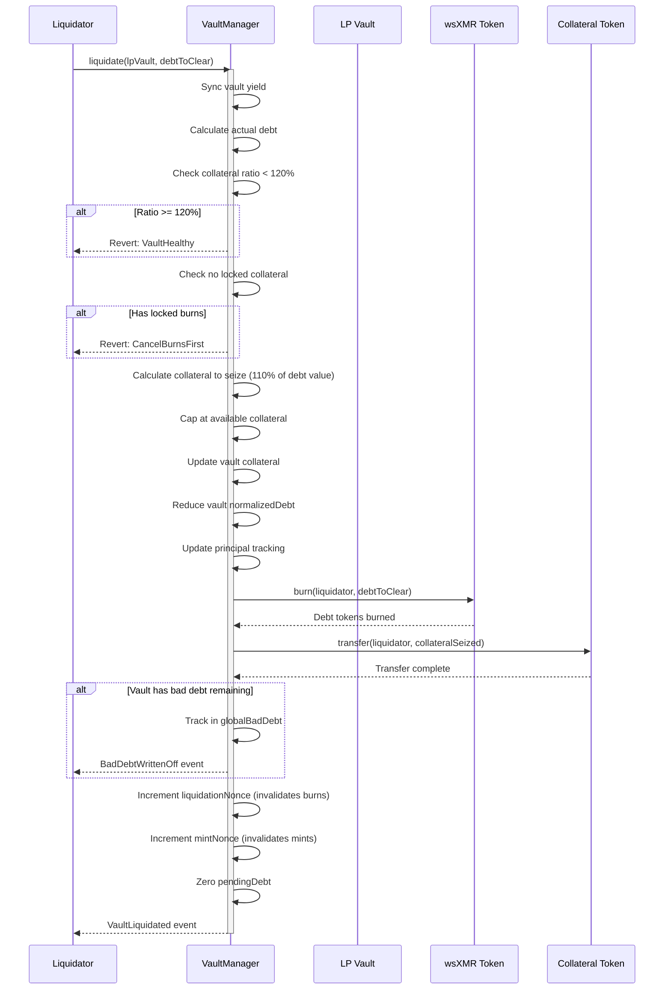
```mermaid
sequenceDiagram
    participant Liquidator
    participant VM as VaultManager
    participant Vault as LP Vault
    participant Token as wsXMR Token
    participant Collateral as Collateral Token

    Liquidator->>VM: liquidate(lpVault, debtToClear)
    activate VM
    
    VM->>VM: Sync vault yield
    VM->>VM: Calculate actual debt
    
    VM->>VM: Check collateral ratio < 120%
    alt Ratio >= 120%
        VM-->>Liquidator: Revert: VaultHealthy
    end
    
    VM->>VM: Check no locked collateral
    alt Has locked burns
        VM-->>Liquidator: Revert: CancelBurnsFirst
    end
    
    VM->>VM: Calculate collateral to seize (110% of debt value)
    VM->>VM: Cap at available collateral
    
    VM->>VM: Update vault collateral
    VM->>VM: Reduce vault normalizedDebt
    VM->>VM: Update principal tracking
    
    VM->>Token: burn(liquidator, debtToClear)
    Token-->>VM: Debt tokens burned
    
    VM->>Collateral: transfer(liquidator, collateralSeized)
    Collateral-->>VM: Transfer complete
    
    alt Vault has bad debt remaining
        VM->>VM: Track in globalBadDebt
        VM-->>Liquidator: BadDebtWrittenOff event
    end
    
    VM->>VM: Increment liquidationNonce (invalidates burns)
    VM->>VM: Increment mintNonce (invalidates mints)
    VM->>VM: Zero pendingDebt
    
    VM-->>Liquidator: VaultLiquidated event
    deactivate VM
```

---

## Buy-and-Burn Mechanism

Automated yield-funded buy-and-burn to reduce system debt.

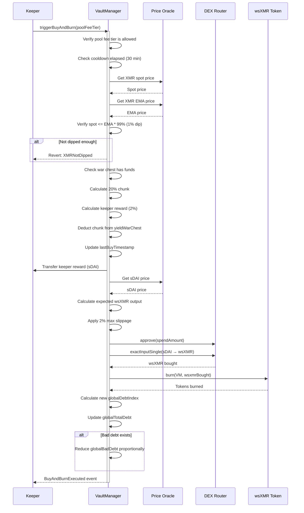
```mermaid
sequenceDiagram
    participant Keeper
    participant VM as VaultManager
    participant Oracle as Price Oracle
    participant DEX as DEX Router
    participant Token as wsXMR Token

    Keeper->>VM: triggerBuyAndBurn(poolFeeTier)
    activate VM
    
    VM->>VM: Verify pool fee tier is allowed
    VM->>VM: Check cooldown elapsed (30 min)
    
    VM->>Oracle: Get XMR spot price
    Oracle-->>VM: Spot price
    VM->>Oracle: Get XMR EMA price
    Oracle-->>VM: EMA price
    
    VM->>VM: Verify spot <= EMA * 99% (1% dip)
    alt Not dipped enough
        VM-->>Keeper: Revert: XMRNotDipped
    end
    
    VM->>VM: Check war chest has funds
    VM->>VM: Calculate 20% chunk
    VM->>VM: Calculate keeper reward (2%)
    
    VM->>VM: Deduct chunk from yieldWarChest
    VM->>VM: Update lastBuyTimestamp
    
    VM->>Keeper: Transfer keeper reward (sDAI)
    
    VM->>Oracle: Get sDAI price
    Oracle-->>VM: sDAI price
    VM->>VM: Calculate expected wsXMR output
    VM->>VM: Apply 2% max slippage
    
    VM->>DEX: approve(spendAmount)
    VM->>DEX: exactInputSingle(sDAI → wsXMR)
    DEX-->>VM: wsXMR bought
    
    VM->>Token: burn(VM, wsxmrBought)
    Token-->>VM: Tokens burned
    
    VM->>VM: Calculate new globalDebtIndex
    VM->>VM: Update globalTotalDebt
    
    alt Bad debt exists
        VM->>VM: Reduce globalBadDebt proportionally
    end
    
    VM-->>Keeper: BuyAndBurnExecuted event
    deactivate VM
```

---

## Withdrawal Flows

### User wsXMR Withdrawal

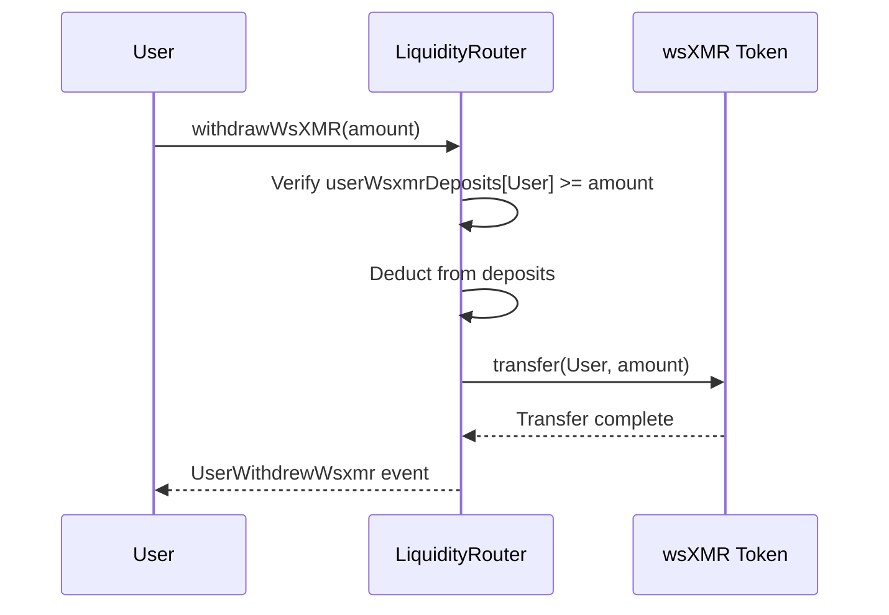
```mermaid
sequenceDiagram
    participant User
    participant Router as LiquidityRouter
    participant Token as wsXMR Token

    User->>Router: withdrawWsXMR(amount)
    Router->>Router: Verify userWsxmrDeposits[User] >= amount
    Router->>Router: Deduct from deposits
    Router->>Token: transfer(User, amount)
    Token-->>Router: Transfer complete
    Router-->>User: UserWithdrewWsxmr event
```

### LP sDAI Withdrawal

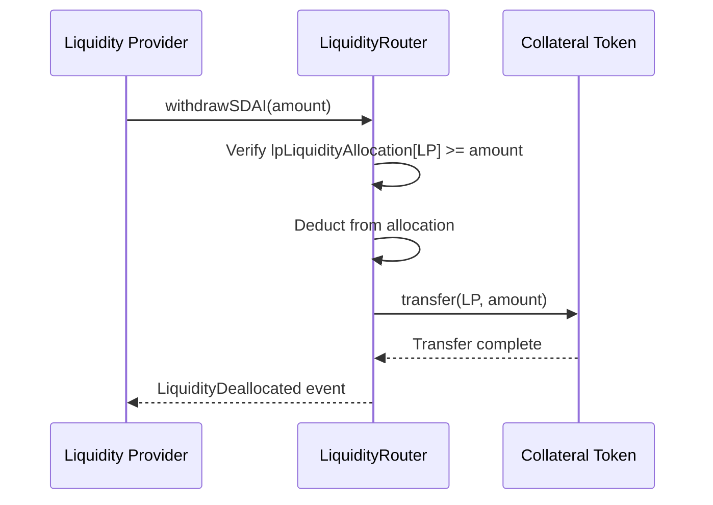
```mermaid
sequenceDiagram
    participant LP as Liquidity Provider
    participant Router as LiquidityRouter
    participant Collateral as Collateral Token

    LP->>Router: withdrawSDAI(amount)
    Router->>Router: Verify lpLiquidityAllocation[LP] >= amount
    Router->>Router: Deduct from allocation
    Router->>Collateral: transfer(LP, amount)
    Collateral-->>Router: Transfer complete
    Router-->>LP: LiquidityDeallocated event
```

### ETH Refund Withdrawal

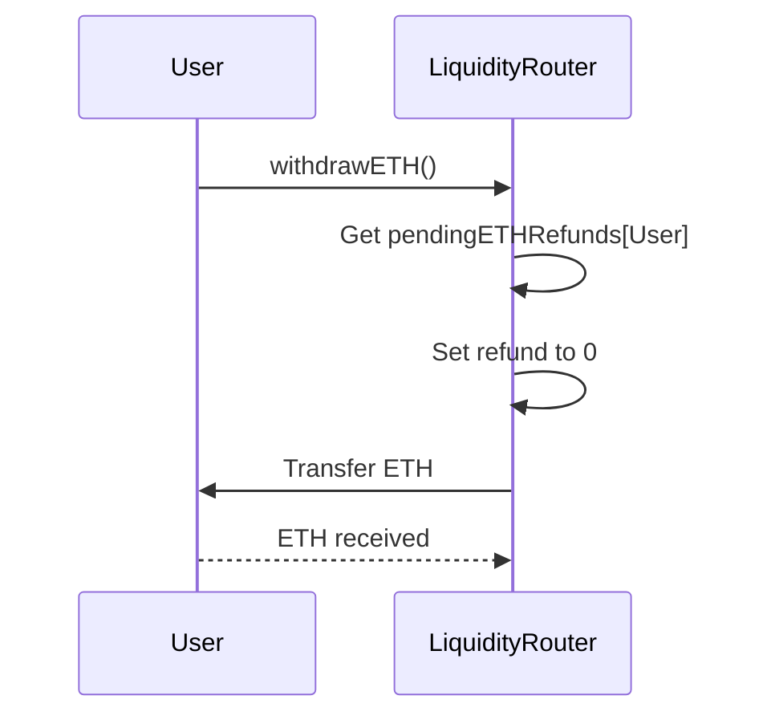
```mermaid
sequenceDiagram
    participant User
    participant Router as LiquidityRouter

    User->>Router: withdrawETH()
    Router->>Router: Get pendingETHRefunds[User]
    Router->>Router: Set refund to 0
    Router->>User: Transfer ETH
    User-->>Router: ETH received
```

### Pending Returns Withdrawal (VaultManager)

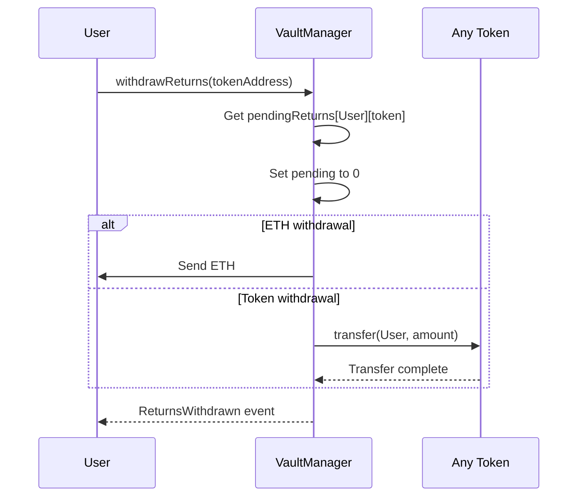
```mermaid
sequenceDiagram
    participant User
    participant VM as VaultManager
    participant Token as Any Token

    User->>VM: withdrawReturns(tokenAddress)
    VM->>VM: Get pendingReturns[User][token]
    VM->>VM: Set pending to 0
    alt ETH withdrawal
        VM->>User: Send ETH
    else Token withdrawal
        VM->>Token: transfer(User, amount)
        Token-->>VM: Transfer complete
    end
    VM-->>User: ReturnsWithdrawn event
```
