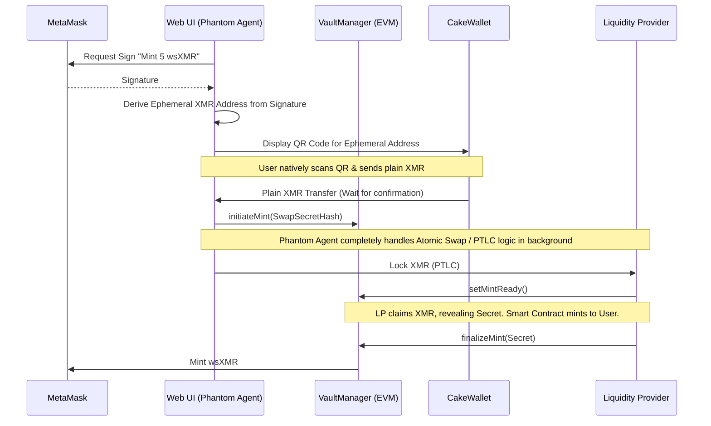
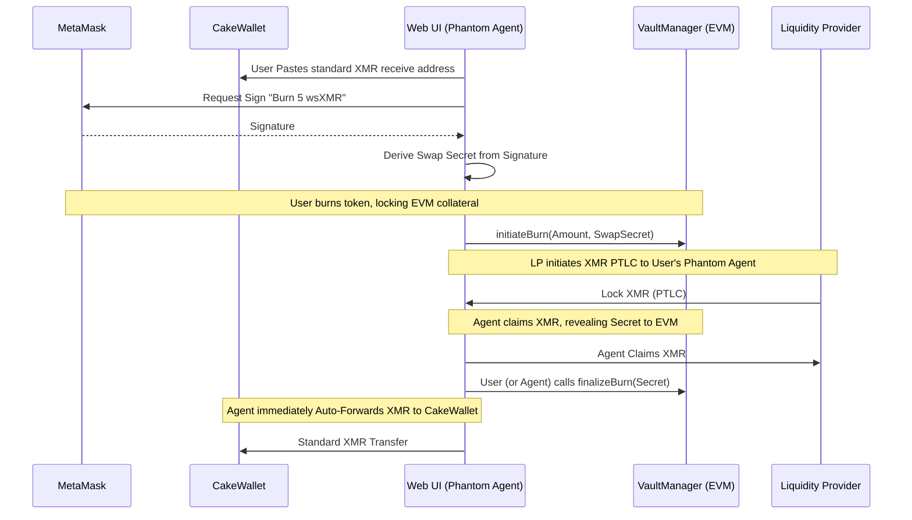

To achieve a seamless Web UI where the user only interacts with their native Monero wallet (like CakeWallet) for basic sends/receives, you must completely abstract the atomic swap cryptography away from the user.

The most elegant way to solve this is by using a **Deterministic Ephemeral Browser Wallet**.

Instead of asking CakeWallet to understand smart contracts, your Web UI compiles a lightweight Monero implementation (WASM) that runs directly in the user's browser tab. This "Phantom Node" acts as a personal, temporary trading agent for the user.

Here is exactly how this architecture works for both Minting and Burning without the user ever seeing a seed phrase.

## Core Concept: The Phantom Browser Agent

The Web UI asks the user to sign a standard MetaMask message. The hash of this signature is 32 bytes, which is exactly the length needed to generate a secure Monero private spend key.

Because the MetaMask signature is deterministic, **the user's MetaMask acts as the master key for the temporary Monero wallet**. If the user closes the tab, they just reconnect MetaMask, sign the same message, and the Web UI perfectly reconstructs the temporary Monero wallet holding their funds.

### 1. Minting Flow (CakeWallet XMR $\rightarrow$ MetaMask wsXMR)

The user's goal is to deposit XMR and receive the EVM tokens.



**User Experience:**
1. Connect MetaMask to`wrapsynth.com` and click "Mint".
2. Sign a MetaMask popup.
3. A standard Monero QR code appears on screen.
4. User scans it with CakeWallet, hits send, and walks away. The Web UI handles the rest and the`wsXMR` appears in their MetaMask.

### 2. Burning Flow (MetaMask wsXMR $\rightarrow$ CakeWallet XMR)

The user's goal is to destroy wsXMR and receive pure XMR to their existing CakeWallet.



**User Experience:**
1. Paste their CakeWallet receive address into the Web UI.
2. Sign a MetaMask transaction to initiate the burn.
3. The Web UI executes the swap, receives the Monero-side atomic funds, and automatically constructs a standard XMR transfer directly into the user's CakeWallet.

## Deriving the Ephemeral Wallet (Implementation)

Here is the TypeScript logic demonstrating how to link the Web UI's Monero agent to the user's MetaMask without generating new seed phrases.

```typescript
import { ethers } from "ethers";
// Fictitious webassembly monero library (e.g., monero-javascript)
import { createWalletFromSeed } from "monerolib-wasm"; 

async function initializePhantomAgent(provider: ethers.providers.Web3Provider, action: string, amount: string) {
    const signer = provider.getSigner();
    const evmAddress = await signer.getAddress();
    
    // 1. Create a deterministic message tied to this specific action
    // By including the EVM address, action, and amount, the payload is unique
    const authMessage = `
        Wrapsynth Phantom Agent Authorization
        -----------------------------------
        Action: ${action}
        Amount: ${amount} XMR
        Wallet: ${evmAddress}
        
        Only sign this on wrapsynth.com!
    `.trim();

    // 2. User signs the message in MetaMask
    const signature = await signer.signMessage(authMessage);

    // 3. Hash the signature to create a deterministic 32-byte seed
    const seedHex = ethers.utils.keccak256(signature);
    const seedBytes = ethers.utils.arrayify(seedHex);

    // 4. Instantiate the in-browser Monero WASM wallet using this seed
    // The user's MetaMask is effectively the hardware wallet backing this agent!
    const phantomWallet = await createWalletFromSeed("mainnet", seedBytes);
    const ephemeralAddress = await phantomWallet.getPrimaryAddress();

    return {
        phantomWallet,
        ephemeralAddress,
        swapSecret: seedHex
    };
}
```

## Critical UX & Safety Considerations

To make this browser-agent pattern robust, you need to handle asynchronous events and edge cases efficiently in your Web UI:

1. **The Refresh / Disconnect Fallback**: Because Monero blocks take ~2 minutes, users *will* close the tab or refresh. When they return, prompt them with: *"Pending Mint Detected. Sign to Resume."* Once they sign via MetaMask, the exact same seed is generated mathematically, the WASM wallet re-syncs, finds the XMR they sent from CakeWallet, and automatically finishes the protocol logic.
2. **Refund Button**: If the user sends XMR to the QR code, but the LP goes offline or the swap fails, the XMR is sitting in the Phantom Wallet. Your UI must have a "Cancel & Refund" button that simply asks the user for their CakeWallet address, and uses the Phantom Wallet to construct a standard XMR transfer back to them.
3. **Double Spends / Dust**: Ensure the QR code requested via`monero:URI` formatting enforces the exact required XMR amount to prevent users from sending incorrectly sized manual inputs.
