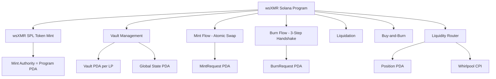

# Rewriting wsXMR Protocol for Solana

This is a massive architectural undertaking. The Solidity contracts contain ~2,500 lines spanning a CDP vault system, atomic swap minting/burning with Ed25519 proofs, a Uniswap V3 liquidity router, yield harvesting, and a buy-and-burn mechanism. Solana's programming model is fundamentally different, so this isn't a line-by-line translation — it's a redesign.

## Key Architectural Differences

| Concept | Ethereum/Solidity | Solana/Anchor |
|---|---|---|
| Token standard | ERC-20 (wsXMR contract) | SPL Token (mint authority = PDA) |
| Storage model | Contract storage slots | PDAs (Program Derived Addresses) as accounts |
| Reentrancy guard | OpenZeppelin modifier | Not needed (single-threaded runtime) |
| DEX integration | Uniswap V3 NFT positions | Orca Whirlpool or Raydium CLMM |
| Oracle | Pyth (pull-based) | Pyth (native on Solana, pull-based) |
| Yield-bearing collateral | sDAI (DSR) | Not directly available; use mSOL, JitoSOL, or a Solana lending receipt |
| Atomic swap secret | Ed25519 scalar mult on-chain | Ed25519 native verify (precompile) |
| NFT positions | ERC-721 | Whirlpool position NFTs (SPL token) |
| msg.sender | Implicit | Explicit signer accounts |
| Upgradability | Immutable | Program can be upgradeable or frozen |

## Program Structure



## Full Anchor Program

Below is the complete rewrite. I've split it into the core program structure with all instructions, state accounts, and logic.

###`Cargo.toml`
```toml
[package]
name = "wsxmr"
version = "0.1.0"
edition = "2021"

[dependencies]
anchor-lang = "0.30.1"
anchor-spl = "0.30.1"
pyth-solana-receiver-sdk = "0.4.0"
```

###`lib.rs` — Program Entry Point

```rust
use anchor_lang::prelude::*;

pub mod state;
pub mod instructions;
pub mod errors;
pub mod constants;
pub mod utils;

use instructions::*;

declare_id!("wsXMR111111111111111111111111111111111111111");

#[program]
pub mod wsxmr {
    use super::*;

    // ========== INITIALIZATION ==========

    pub fn initialize(
        ctx: Context<Initialize>,
        xmr_usd_feed_id: [u8; 32],
        collateral_usd_feed_id: [u8; 32],
    ) -> Result<()> {
        instructions::initialize::handler(
            ctx,
            xmr_usd_feed_id,
            collateral_usd_feed_id,
        )
    }

    // ========== VAULT MANAGEMENT ==========

    pub fn create_vault(ctx: Context<CreateVault>) -> Result<()> {
        instructions::vault::create_vault(ctx)
    }

    pub fn deposit_collateral(
        ctx: Context<DepositCollateral>,
        amount: u64,
    ) -> Result<()> {
        instructions::vault::deposit_collateral(ctx, amount)
    }

    pub fn withdraw_collateral(
        ctx: Context<WithdrawCollateral>,
        amount: u64,
    ) -> Result<()> {
        instructions::vault::withdraw_collateral(ctx, amount)
    }

    pub fn set_vault_params(
        ctx: Context<SetVaultParams>,
        mint_fee_bps: u16,
        burn_reward_bps: u16,
        max_mint_bps: u16,
        min_burn_amount: u64,
        mint_griefing_deposit: u64,
    ) -> Result<()> {
        instructions::vault::set_vault_params(
            ctx,
            mint_fee_bps,
            burn_reward_bps,
            max_mint_bps,
            min_burn_amount,
            mint_griefing_deposit,
        )
    }

    pub fn deactivate_vault(ctx: Context<DeactivateVault>) -> Result<()> {
        instructions::vault::deactivate_vault(ctx)
    }

    // ========== MINTING FLOW ==========

    pub fn initiate_mint(
        ctx: Context<InitiateMint>,
        xmr_amount: u64,
        claim_commitment: [u8; 32],
        timeout_duration: i64,
    ) -> Result<()> {
        instructions::mint::initiate_mint(
            ctx,
            xmr_amount,
            claim_commitment,
            timeout_duration,
        )
    }

    pub fn provide_lp_key(
        ctx: Context<ProvideLPKey>,
        lp_public_key: [u8; 32],
    ) -> Result<()> {
        instructions::mint::provide_lp_key(ctx, lp_public_key)
    }

    pub fn set_mint_ready(
        ctx: Context<SetMintReady>,
    ) -> Result<()> {
        instructions::mint::set_mint_ready(ctx)
    }

    pub fn finalize_mint(
        ctx: Context<FinalizeMint>,
        secret: [u8; 32],
    ) -> Result<()> {
        instructions::mint::finalize_mint(ctx, secret)
    }

    pub fn cancel_mint(
        ctx: Context<CancelMint>,
    ) -> Result<()> {
        instructions::mint::cancel_mint(ctx)
    }

    // ========== BURNING FLOW ==========

    pub fn request_burn(
        ctx: Context<RequestBurn>,
        wsxmr_amount: u64,
    ) -> Result<()> {
        instructions::burn::request_burn(ctx, wsxmr_amount)
    }

    pub fn propose_hash(
        ctx: Context<ProposeHash>,
        secret_hash: [u8; 32],
    ) -> Result<()> {
        instructions::burn::propose_hash(ctx, secret_hash)
    }

    pub fn confirm_monero_lock(
        ctx: Context<ConfirmMoneroLock>,
    ) -> Result<()> {
        instructions::burn::confirm_monero_lock(ctx)
    }

    pub fn finalize_burn(
        ctx: Context<FinalizeBurn>,
        secret: [u8; 32],
    ) -> Result<()> {
        instructions::burn::finalize_burn(ctx, secret)
    }

    pub fn claim_slashed_collateral(
        ctx: Context<ClaimSlashedCollateral>,
    ) -> Result<()> {
        instructions::burn::claim_slashed_collateral(ctx)
    }

    pub fn cancel_burn(
        ctx: Context<CancelBurn>,
    ) -> Result<()> {
        instructions::burn::cancel_burn(ctx)
    }

    // ========== LIQUIDATION ==========

    pub fn liquidate(
        ctx: Context<Liquidate>,
        debt_to_clear: u64,
    ) -> Result<()> {
        instructions::liquidation::liquidate(ctx, debt_to_clear)
    }

    // ========== BUY AND BURN ==========

    pub fn trigger_buy_and_burn(
        ctx: Context<TriggerBuyAndBurn>,
    ) -> Result<()> {
        instructions::buy_and_burn::trigger_buy_and_burn(ctx)
    }

    // ========== LIQUIDITY ROUTER ==========

    pub fn allocate_liquidity(
        ctx: Context<AllocateLiquidity>,
        amount: u64,
    ) -> Result<()> {
        instructions::router::allocate_liquidity(ctx, amount)
    }

    pub fn deposit_wsxmr(
        ctx: Context<DepositWsxmr>,
        amount: u64,
    ) -> Result<()> {
        instructions::router::deposit_wsxmr(ctx, amount)
    }

    pub fn withdraw_sdai(
        ctx: Context<WithdrawSdai>,
        amount: u64,
    ) -> Result<()> {
        instructions::router::withdraw_sdai(ctx, amount)
    }

    pub fn withdraw_wsxmr_deposit(
        ctx: Context<WithdrawWsxmrDeposit>,
        amount: u64,
    ) -> Result<()> {
        instructions::router::withdraw_wsxmr_deposit(ctx, amount)
    }

    pub fn set_approval(
        ctx: Context<SetApproval>,
        counterparty: Pubkey,
        amount: u64,
        is_lp_approving_user: bool,
    ) -> Result<()> {
        instructions::router::set_approval(
            ctx,
            counterparty,
            amount,
            is_lp_approving_user,
        )
    }

    pub fn create_lp_position(
        ctx: Context<CreateLPPosition>,
        sdai_amount: u64,
        wsxmr_amount: u64,
        deadline: i64,
    ) -> Result<()> {
        instructions::router::create_lp_position(
            ctx,
            sdai_amount,
            wsxmr_amount,
            deadline,
        )
    }

    pub fn close_lp_position(
        ctx: Context<CloseLPPosition>,
        deadline: i64,
        min_total_value_usd: u64,
    ) -> Result<()> {
        instructions::router::close_lp_position(
            ctx,
            deadline,
            min_total_value_usd,
        )
    }

    pub fn collect_fees(
        ctx: Context<CollectFees>,
    ) -> Result<()> {
        instructions::router::collect_fees(ctx)
    }

    pub fn withdraw_fees(
        ctx: Context<WithdrawFees>,
    ) -> Result<()> {
        instructions::router::withdraw_fees(ctx)
    }
}
```

###`constants.rs`
```rust
pub const COLLATERAL_RATIO: u64 = 150;
pub const LIQUIDATION_RATIO: u64 = 120;
pub const LIQUIDATION_BONUS: u64 = 110;
pub const RATIO_PRECISION: u64 = 100;
pub const PRICE_PRECISION: u64 = 1_000_000_000_000_000_000; // 1e18

pub const MAX_MINT_TIMEOUT: i64 = 7200; // 2 hours
pub const MINT_READY_EXTENSION: i64 = 7200;

pub const BURN_REQUEST_TIMEOUT: i64 = 3600; // 1 hour
pub const BURN_COMMIT_TIMEOUT: i64 = 7200;
pub const BURN_LOCK_RATIO: u64 = 130;

pub const BPS_DENOMINATOR: u64 = 10000;
pub const MAX_MARGIN_BPS: u16 = 1000;

pub const COOLDOWN_PERIOD: i64 = 86400; // 24 hours
pub const BUY_CHUNK_PERCENT: u64 = 20;
pub const EMA_TRIGGER_THRESHOLD: u64 = 99;
pub const KEEPER_REWARD_BPS: u64 = 200;

pub const MIN_BURN_AMOUNT: u64 = 1_000_000; // 0.01 wsXMR (8 decimals)
pub const XMR_TO_WSXMR_DIVISOR: u64 = 10_000;
pub const WSXMR_DECIMALS: u8 = 8;

pub const MAX_BURN_REQUESTS_PER_VAULT: u32 = 50;
pub const MAX_ACTIVE_POSITIONS_PER_USER: u32 = 50;
pub const MIN_DEPOSIT_AMOUNT: u64 = 1_000_000;
pub const MIN_POSITION_DURATION: i64 = 3600; // 1 hour

pub const GLOBAL_STATE_SEED: &[u8] = b"global_state";
pub const VAULT_SEED: &[u8] = b"vault";
pub const MINT_REQUEST_SEED: &[u8] = b"mint_request";
pub const BURN_REQUEST_SEED: &[u8] = b"burn_request";
pub const MINT_AUTHORITY_SEED: &[u8] = b"mint_authority";
pub const COLLATERAL_VAULT_SEED: &[u8] = b"collateral_vault";
pub const ROUTER_STATE_SEED: &[u8] = b"router_state";
pub const LP_ALLOCATION_SEED: &[u8] = b"lp_allocation";
pub const USER_DEPOSIT_SEED: &[u8] = b"user_deposit";
pub const APPROVAL_SEED: &[u8] = b"approval";
pub const LP_POSITION_SEED: &[u8] = b"lp_position";
pub const WSXMR_VAULT_SEED: &[u8] = b"wsxmr_vault";
pub const PENDING_RETURNS_SEED: &[u8] = b"pending_returns";
```

###`errors.rs`
```rust
use anchor_lang::prelude::*;

#[error_code]
pub enum WsxmrError {
    #[msg("Zero address provided")]
    ZeroAddress,
    #[msg("Zero amount")]
    ZeroAmount,
    #[msg("Vault already exists")]
    VaultAlreadyExists,
    #[msg("Vault does not exist")]
    VaultDoesNotExist,
    #[msg("Vault not active")]
    VaultNotActive,
    #[msg("Insufficient collateral")]
    InsufficientCollateral,
    #[msg("Exceeds max margin")]
    ExceedsMaxMargin,
    #[msg("Invalid mint request")]
    InvalidMintRequest,
    #[msg("Invalid burn request")]
    InvalidBurnRequest,
    #[msg("Mint already exists")]
    MintAlreadyExists,
    #[msg("Burn already exists")]
    BurnAlreadyExists,
    #[msg("Invalid secret")]
    InvalidSecret,
    #[msg("Invalid status")]
    InvalidStatus,
    #[msg("Timeout not reached")]
    TimeoutNotReached,
    #[msg("Deadline expired")]
    DeadlineExpired,
    #[msg("Deadline not expired")]
    DeadlineNotExpired,
    #[msg("Vault is healthy")]
    VaultHealthy,
    #[msg("Insufficient debt")]
    InsufficientDebt,
    #[msg("Unauthorized")]
    Unauthorized,
    #[msg("Invalid value")]
    InvalidValue,
    #[msg("Stale price")]
    StalePrice,
    #[msg("Insufficient deposit")]
    InsufficientDeposit,
    #[msg("Below minimum burn")]
    BelowMinimumBurn,
    #[msg("Max burn requests reached")]
    MaxBurnRequestsReached,
    #[msg("Only user can initiate")]
    OnlyUserCanInitiate,
    #[msg("Grace period - only user")]
    GracePeriodOnlyUser,
    #[msg("Burn invalidated by liquidation")]
    BurnInvalidatedByLiquidation,
    #[msg("Cooldown active")]
    CooldownActive,
    #[msg("XMR not dipped below EMA")]
    XMRNotDipped,
    #[msg("War chest empty")]
    WarChestEmpty,
    #[msg("Price normalized to zero")]
    PriceNormalizedToZero,
    #[msg("Cancel burns first")]
    CancelBurnsFirst,
    #[msg("Insufficient balance")]
    InsufficientBalance,
    #[msg("Position not found")]
    PositionNotFound,
    #[msg("Transaction expired")]
    TransactionExpired,
    #[msg("Deadline too far in future")]
    DeadlineTooFar,
    #[msg("Pool ratio deviates from oracle")]
    PoolRatioDeviation,
    #[msg("Position too young")]
    PositionTooYoung,
    #[msg("Withdrawal value too low")]
    WithdrawalValueTooLow,
    #[msg("Below caller minimum")]
    BelowCallerMinimum,
    #[msg("Caller minimum too low")]
    CallerMinimumTooLow,
    #[msg("Max positions reached")]
    MaxPositionsReached,
    #[msg("LP approval insufficient")]
    LPApprovalInsufficient,
    #[msg("User approval insufficient")]
    UserApprovalInsufficient,
    #[msg("Vault undercollateralized")]
    VaultUndercollateralized,
    #[msg("Arithmetic overflow")]
    ArithmeticOverflow,
    #[msg("Invalid oracle price")]
    InvalidOraclePrice,
    #[msg("Price confidence too wide")]
    PriceConfidenceTooWide,
}
```

###`state.rs` — All Account Structures

```rust
use anchor_lang::prelude::*;

/// Global protocol state — singleton PDA
#[account]
#[derive(Default)]
pub struct GlobalState {
    /// Authority that initialized the protocol
    pub authority: Pubkey,
    /// wsXMR SPL token mint
    pub wsxmr_mint: Pubkey,
    /// Collateral token mint (e.g., mSOL, JitoSOL, or
    /// wrapped sDAI bridged via Wormhole)
    pub collateral_mint: Pubkey,
    /// Program-owned collateral token account (vault)
    pub collateral_vault: Pubkey,
    /// Program-owned wsXMR token account (for buy-and-burn)
    pub wsxmr_vault: Pubkey,
    /// Pyth XMR/USD price feed account
    pub xmr_usd_feed: [u8; 32],
    /// Pyth collateral/USD price feed account
    pub collateral_usd_feed: [u8; 32],
    /// Global total debt across all vaults (in wsXMR units, 8 dec)
    pub global_total_debt: u64,
    /// Global debt index for O(1) proportional forgiveness (18 dec)
    pub global_debt_index: u64,
    /// Accumulated collateral yield for buy-and-burn
    pub yield_war_chest: u64,
    /// Total LP principal in collateral token
    pub global_lp_principal: u64,
    /// Unbacked wsXMR supply from liquidation shortfalls
    pub global_bad_debt: u64,
    /// Debt currently locked in pending burns
    pub global_pending_burn_debt: u64,
    /// Pending collateral in returns
    pub global_pending_collateral: u64,
    /// Last buy-and-burn timestamp
    pub last_buy_timestamp: i64,
    /// Request nonce for unique IDs
    pub request_nonce: u64,
    /// Vault count
    pub vault_count: u32,
    /// Mint authority PDA bump
    pub mint_authority_bump: u8,
    /// Global state bump
    pub bump: u8,
    /// Reserved for future use
    pub _reserved: [u8; 128],
}

impl GlobalState {
    pub const LEN: usize = 8 // discriminator
        + 32  // authority
        + 32  // wsxmr_mint
        + 32  // collateral_mint
        + 32  // collateral_vault
        + 32  // wsxmr_vault
        + 32  // xmr_usd_feed
        + 32  // collateral_usd_feed
        + 8   // global_total_debt
        + 8   // global_debt_index
        + 8   // yield_war_chest
        + 8   // global_lp_principal
        + 8   // global_bad_debt
        + 8   // global_pending_burn_debt
        + 8   // global_pending_collateral
        + 8   // last_buy_timestamp
        + 8   // request_nonce
        + 4   // vault_count
        + 1   // mint_authority_bump
        + 1   // bump
        + 128; // reserved
}

/// Per-LP Vault account — PDA seeded by LP pubkey
#[account]
#[derive(Default)]
pub struct Vault {
    /// LP wallet address
    pub lp_address: Pubkey,
    /// Collateral amount (SPL token smallest units)
    pub collateral_amount: u64,
    /// Collateral locked for pending burns
    pub locked_collateral: u64,
    /// Normalized debt (actual = normalized * globalDebtIndex / 1e18)
    pub normalized_debt: u64,
    /// Reserved capacity for pending mints
    pub pending_debt: u64,
    /// LP principal deposit in collateral units
    pub principal_deposit: u64,
    /// Max single mint as BPS of total capacity
    pub max_mint_bps: u16,
    /// SOL lamports required as griefing deposit for mints
    pub mint_griefing_deposit: u64,
    /// Fee LP charges on minting (BPS)
    pub mint_fee_bps: u16,
    /// Reward LP pays for burning (BPS)
    pub burn_reward_bps: u16,
    /// Incremented on liquidation to invalidate burns
    pub liquidation_nonce: u64,
    /// Incremented on liquidation to invalidate mints
    pub mint_nonce: u64,
    /// LP-configurable minimum burn amount
    pub min_burn_amount: u64,
    /// Number of active burn requests
    pub active_burn_count: u32,
    /// Is this vault active?
    pub active: bool,
    /// PDA bump seed
    pub bump: u8,
    /// Reserved for future use
    pub _reserved: [u8; 64],
}

impl Vault {
    pub const LEN: usize = 8 // discriminator
        + 32  // lp_address
        + 8   // collateral_amount
        + 8   // locked_collateral
        + 8   // normalized_debt
        + 8   // pending_debt
        + 8   // principal_deposit
        + 2   // max_mint_bps
        + 8   // mint_griefing_deposit
        + 2   // mint_fee_bps
        + 2   // burn_reward_bps
        + 8   // liquidation_nonce
        + 8   // mint_nonce
        + 8   // min_burn_amount
        + 4   // active_burn_count
        + 1   // active
        + 1   // bump
        + 64; // reserved
}

#[derive(AnchorSerialize, AnchorDeserialize, Clone, Copy, PartialEq, Eq)]
pub enum MintStatus {
    Invalid,
    Pending,
    Ready,
    Completed,
    Cancelled,
}

impl Default for MintStatus {
    fn default() -> Self {
        MintStatus::Invalid
    }
}

/// Mint request PDA — seeded by [MINT_REQUEST_SEED, nonce]
#[account]
#[derive(Default)]
pub struct MintRequest {
    /// Unique request nonce
    pub nonce: u64,
    /// Initiator (pays griefing deposit)
    pub initiator: Pubkey,
    /// Recipient of minted wsXMR
    pub recipient: Pubkey,
    /// LP vault pubkey
    pub lp_vault: Pubkey,
    /// XMR amount (atomic units, 12 decimals)
    pub xmr_amount: u64,
    /// wsXMR amount to mint (8 decimals)
    pub wsxmr_amount: u64,
    /// Fee portion (in wsXMR)
    pub fee_amount: u64,
    /// Hash commitment (keccak256 of Ed25519 pubkey)
    pub claim_commitment: [u8; 32],
    /// LP's public key for atomic swap
    pub lp_public_key: [u8; 32],
    /// Timeout timestamp
    pub timeout: i64,
    /// Griefing deposit (lamports)
    pub griefing_deposit: u64,
    /// Normalized debt amount for accounting
    pub normalized_debt_amount: u64,
    /// Snapshot of vault's mint nonce at creation
    pub vault_mint_nonce: u64,
    /// Current status
    pub status: MintStatus,
    /// PDA bump
    pub bump: u8,
    pub _reserved: [u8; 32],
}

impl MintRequest {
    pub const LEN: usize = 8 // discriminator
        + 8   // nonce
        + 32  // initiator
        + 32  // recipient
        + 32  // lp_vault
        + 8   // xmr_amount
        + 8   // wsxmr_amount
        + 8   // fee_amount
        + 32  // claim_commitment
        + 32  // lp_public_key
        + 8   // timeout
        + 8   // griefing_deposit
        + 8   // normalized_debt_amount
        + 8   // vault_mint_nonce
        + 1   // status
        + 1   // bump
        + 32; // reserved
}

#[derive(AnchorSerialize, AnchorDeserialize, Clone, Copy, PartialEq, Eq)]
pub enum BurnStatus {
    Invalid,
    Requested,
    Proposed,
    Committed,
    Completed,
    Slashed,
    Cancelled,
}

impl Default for BurnStatus {
    fn default() -> Self {
        BurnStatus::Invalid
    }
}

/// Burn request PDA — seeded by [BURN_REQUEST_SEED, nonce]
#[account]
#[derive(Default)]
pub struct BurnRequest {
    pub nonce: u64,
    pub user: Pubkey,
    pub lp_vault: Pubkey,
    pub wsxmr_amount: u64,
    pub xmr_amount: u64,
    pub locked_collateral: u64,
    pub reward_collateral: u64,
    pub secret_hash: [u8; 32],
    pub deadline: i64,
    pub vault_liquidation_nonce: u64,
    pub normalized_debt_amount: u64,
    pub status: BurnStatus,
    pub bump: u8,
    pub _reserved: [u8; 32],
}

impl BurnRequest {
    pub const LEN: usize = 8 // discriminator
        + 8   // nonce
        + 32  // user
        + 32  // lp_vault
        + 8   // wsxmr_amount
        + 8   // xmr_amount
        + 8   // locked_collateral
        + 8   // reward_collateral
        + 32  // secret_hash
        + 8   // deadline
        + 8   // vault_liquidation_nonce
        + 8   // normalized_debt_amount
        + 1   // status
        + 1   // bump
        + 32; // reserved
}

/// Pending returns for a user — PDA seeded by
/// [PENDING_RETURNS_SEED, user_pubkey]
#[account]
#[derive(Default)]
pub struct PendingReturns {
    pub owner: Pubkey,
    /// Pending collateral token returns
    pub collateral_amount: u64,
    /// Pending SOL (lamports) returns
    pub sol_amount: u64,
    pub bump: u8,
}

impl PendingReturns {
    pub const LEN: usize = 8 + 32 + 8 + 8 + 1;
}

// ========== LIQUIDITY ROUTER STATE ==========

/// Router global state — singleton PDA
#[account]
#[derive(Default)]
pub struct RouterState {
    pub global_state: Pubkey,
    pub wsxmr_mint: Pubkey,
    pub collateral_mint: Pubkey,
    /// Whirlpool program ID (Orca)
    pub whirlpool_program: Pubkey,
    /// The specific whirlpool (pool) for wsXMR/collateral
    pub whirlpool: Pubkey,
    pub pool_initialized: bool,
    pub next_position_index: u64,
    pub bump: u8,
    pub _reserved: [u8; 64],
}

impl RouterState {
    pub const LEN: usize = 8 // discriminator
        + 32  // global_state
        + 32  // wsxmr_mint
        + 32  // collateral_mint
        + 32  // whirlpool_program
        + 32  // whirlpool
        + 1   // pool_initialized
        + 8   // next_position_index
        + 1   // bump
        + 64; // reserved
}

/// Per-LP allocation in the router
#[account]
#[derive(Default)]
pub struct LPAllocation {
    pub owner: Pubkey,
    /// Collateral tokens allocated for LP
    pub collateral_allocated: u64,
    /// Pending collateral fees
    pub pending_collateral_fees: u64,
    /// Pending wsXMR fees
    pub pending_wsxmr_fees: u64,
    /// Active position count
    pub active_position_count: u32,
    pub bump: u8,
}

impl LPAllocation {
    pub const LEN: usize = 8 + 32 + 8 + 8 + 8 + 4 + 1;
}

/// Per-user wsXMR deposit in the router
#[account]
#[derive(Default)]
pub struct UserDeposit {
    pub owner: Pubkey,
    /// wsXMR deposited
    pub wsxmr_deposited: u64,
    /// Pending collateral fees (from IL cross-distribution)
    pub pending_collateral_fees: u64,
    /// Pending wsXMR fees
    pub pending_wsxmr_fees: u64,
    /// Active position count
    pub active_position_count: u32,
    pub bump: u8,
}

impl UserDeposit {
    pub const LEN: usize = 8 + 32 + 8 + 8 + 8 + 4 + 1;
}

/// Mutual approval between LP and User
/// PDA seeded by [APPROVAL_SEED, approver, counterparty, direction]
#[account]
#[derive(Default)]
pub struct Approval {
    pub approver: Pubkey,
    pub counterparty: Pubkey,
    /// true = LP approving user (sDAI amount),
    /// false = user approving LP (wsXMR amount)
    pub is_lp_approving_user: bool,
    pub amount: u64,
    pub nonce: u64,
    pub bump: u8,
}

impl Approval {
    pub const LEN: usize = 8 + 32 + 32 + 1 + 8 + 8 + 1;
}

/// Liquidity position tracking
#[account]
#[derive(Default)]
pub struct LiquidityPosition {
    pub position_index: u64,
    /// Whirlpool position NFT mint (or Orca position address)
    pub whirlpool_position: Pubkey,
    pub lp_provider: Pubkey,
    pub user_provider: Pubkey,
    pub collateral_amount: u64,
    pub wsxmr_amount: u64,
    pub lp_initial_value_usd: u64,
    pub user_initial_value_usd: u64,
    pub created_at: i64,
    pub active: bool,
    pub bump: u8,
    pub _reserved: [u8; 32],
}

impl LiquidityPosition {
    pub const LEN: usize = 8 // discriminator
        + 8   // position_index
        + 32  // whirlpool_position
        + 32  // lp_provider
        + 32  // user_provider
        + 8   // collateral_amount
        + 8   // wsxmr_amount
        + 8   // lp_initial_value_usd
        + 8   // user_initial_value_usd
        + 8   // created_at
        + 1   // active
        + 1   // bump
        + 32; // reserved
}
```

###`utils.rs` — Oracle & Math Helpers

```rust
use anchor_lang::prelude::*;
use pyth_solana_receiver_sdk::price_update::PriceUpdateV2;

use crate::errors::WsxmrError;

/// Normalize a Pyth price to 18-decimal USD representation
pub fn normalize_pyth_price(
    price_update: &Account<PriceUpdateV2>,
    feed_id: &[u8; 32],
    max_age: u64,
) -> Result<u64> {
    let clock = Clock::get()?;
    let price = price_update.get_price_no_older_than(
        &clock,
        max_age,
        feed_id,
    ).map_err(|_| WsxmrError::StalePrice)?;

    require!(price.price > 0, WsxmrError::InvalidOraclePrice);

    let raw_price = price.price as u64;
    let conf = price.conf as u64;

    // Confidence check: confidence must be < 10% of price
    require!(
        conf.checked_mul(10).ok_or(WsxmrError::ArithmeticOverflow)? 
            <= raw_price,
        WsxmrError::PriceConfidenceTooWide
    );

    let expo = price.exponent;

    // Normalize to 18-decimal precision
    let normalized = if expo >= 0 {
        raw_price
            .checked_mul(10u64.pow(expo as u32))
            .ok_or(WsxmrError::ArithmeticOverflow)?
            .checked_mul(1_000_000_000_000_000_000) // 1e18
            .ok_or(WsxmrError::ArithmeticOverflow)?
    } else {
        let abs_expo = (-expo) as u32;
        if abs_expo >= 18 {
            raw_price / 10u64.pow(abs_expo - 18)
        } else {
            raw_price
                .checked_mul(10u64.pow(18 - abs_expo))
                .ok_or(WsxmrError::ArithmeticOverflow)?
        }
    };

    require!(normalized > 0, WsxmrError::PriceNormalizedToZero);
    Ok(normalized)
}

/// Calculate actual debt from normalized debt and global index
pub fn get_actual_debt(normalized_debt: u64, global_debt_index: u64) -> Result<u64> {
    if normalized_debt == 0 {
        return Ok(0);
    }
    let result = (normalized_debt as u128)
        .checked_mul(global_debt_index as u128)
        .ok_or(WsxmrError::ArithmeticOverflow)?
        / 1_000_000_000_000_000_000u128; // 1e18
    Ok(result as u64)
}

/// Calculate collateral ratio (returns percentage, e.g., 150 for 150%)
pub fn calculate_collateral_ratio(
    collateral_amount: u64,
    debt_amount: u64,
    collateral_price: u64, // 18 decimals
    xmr_price: u64,        // 18 decimals
    collateral_decimals: u8,
    wsxmr_decimals: u8,
) -> Result<u64> {
    if debt_amount == 0 {
        return Ok(u64::MAX);
    }

    // collateral_value_usd = collateral_amount * collateral_price
    //                        / 10^collateral_decimals
    let collateral_value = (collateral_amount as u128)
        .checked_mul(collateral_price as u128)
        .ok_or(WsxmrError::ArithmeticOverflow)?
        / 10u128.pow(collateral_decimals as u32);

    // debt_value_usd = debt_amount * xmr_price / 10^wsxmr_decimals
    let debt_value = (debt_amount as u128)
        .checked_mul(xmr_price as u128)
        .ok_or(WsxmrError::ArithmeticOverflow)?
        / 10u128.pow(wsxmr_decimals as u32);

    if debt_value == 0 {
        return Ok(u64::MAX);
    }

    // ratio = (collateral_value * 100) / debt_value
    let ratio = collateral_value
        .checked_mul(100)
        .ok_or(WsxmrError::ArithmeticOverflow)?
        / debt_value;

    Ok(ratio as u64)
}

/// Convert debt amount to USD value of required collateral
pub fn get_collateral_value_for_debt(
    debt_amount: u64,
    xmr_price: u64,
    collateral_ratio: u64,
) -> Result<u64> {
    // debt_usd = debt_amount * xmr_price / 1e8
    let debt_usd = (debt_amount as u128)
        .checked_mul(xmr_price as u128)
        .ok_or(WsxmrError::ArithmeticOverflow)?
        / 100_000_000u128; // 1e8 (wsXMR decimals)

    // required = debt_usd * collateral_ratio / 100
    let required = debt_usd
        .checked_mul(collateral_ratio as u128)
        .ok_or(WsxmrError::ArithmeticOverflow)?
        / 100;

    Ok(required as u64)
}

/// Convert USD value to collateral token amount
pub fn usd_to_collateral(
    usd_value: u64,
    collateral_price: u64,
    collateral_decimals: u8,
) -> Result<u64> {
    if collateral_price == 0 {
        return Err(WsxmrError::InvalidOraclePrice.into());
    }
    // collateral = usd_value * 10^decimals / collateral_price
    let result = (usd_value as u128)
        .checked_mul(10u128.pow(collateral_decimals as u32))
        .ok_or(WsxmrError::ArithmeticOverflow)?
        / (collateral_price as u128);

    Ok(result as u64)
}

/// Ceiling division helper
pub fn ceil_div(a: u128, b: u128) -> u128 {
    if b == 0 {
        panic!("division by zero");
    }
    (a + b - 1) / b
}

/// Ed25519 commitment verification
/// On Solana, we use the Ed25519 precompile via
/// `ed25519_program` instruction introspection
/// For simplicity, we verify keccak256(secret) == commitment
/// In production, use the Ed25519 program for proper
/// scalar mult verification
pub fn verify_secret_commitment(
    secret: &[u8; 32],
    commitment: &[u8; 32],
) -> bool {
    let computed = anchor_lang::solana_program::keccak::hash(secret);
    computed.to_bytes() == *commitment
}
```

###`instructions/mod.rs`
```rust
pub mod initialize;
pub mod vault;
pub mod mint;
pub mod burn;
pub mod liquidation;
pub mod buy_and_burn;
pub mod router;
```

###`instructions/initialize.rs`
```rust
use anchor_lang::prelude::*;
use anchor_spl::token::{self, Mint, Token, TokenAccount};

use crate::state::*;
use crate::constants::*;

#[derive(Accounts)]
pub struct Initialize<'info> {
    #[account(mut)]
    pub authority: Signer<'info>,

    #[account(
        init,
        payer = authority,
        space = GlobalState::LEN,
        seeds = [GLOBAL_STATE_SEED],
        bump,
    )]
    pub global_state: Account<'info, GlobalState>,

    /// The wsXMR token mint — authority is the program PDA
    #[account(
        init,
        payer = authority,
        mint::decimals = WSXMR_DECIMALS,
        mint::authority = mint_authority,
        mint::freeze_authority = mint_authority,
    )]
    pub wsxmr_mint: Account<'info, Mint>,

    /// CHECK: PDA used as mint authority, no data needed
    #[account(
        seeds = [MINT_AUTHORITY_SEED],
        bump,
    )]
    pub mint_authority: UncheckedAccount<'info>,

    /// The collateral token mint (e.g., bridged sDAI, mSOL, etc.)
    pub collateral_mint: Account<'info, Mint>,

    /// Program-owned collateral vault
    #[account(
        init,
        payer = authority,
        token::mint = collateral_mint,
        token::authority = global_state,
        seeds = [COLLATERAL_VAULT_SEED],
        bump,
    )]
    pub collateral_vault: Account<'info, TokenAccount>,

    /// Program-owned wsXMR vault (for buy-and-burn holding)
    #[account(
        init,
        payer = authority,
        token::mint = wsxmr_mint,
        token::authority = global_state,
        seeds = [WSXMR_VAULT_SEED],
        bump,
    )]
    pub wsxmr_vault: Account<'info, TokenAccount>,

    pub system_program: Program<'info, System>,
    pub token_program: Program<'info, Token>,
    pub rent: Sysvar<'info, Rent>,
}

pub fn handler(
    ctx: Context<Initialize>,
    xmr_usd_feed_id: [u8; 32],
    collateral_usd_feed_id: [u8; 32],
) -> Result<()> {
    let state = &mut ctx.accounts.global_state;

    state.authority = ctx.accounts.authority.key();
    state.wsxmr_mint = ctx.accounts.wsxmr_mint.key();
    state.collateral_mint = ctx.accounts.collateral_mint.key();
    state.collateral_vault = ctx.accounts.collateral_vault.key();
    state.wsxmr_vault = ctx.accounts.wsxmr_vault.key();
    state.xmr_usd_feed = xmr_usd_feed_id;
    state.collateral_usd_feed = collateral_usd_feed_id;
    state.global_debt_index = 1_000_000_000_000_000_000; // 1e18
    state.global_total_debt = 0;
    state.vault_count = 0;
    state.request_nonce = 0;
    state.mint_authority_bump = ctx.bumps.mint_authority;
    state.bump = ctx.bumps.global_state;

    msg!("wsXMR protocol initialized");
    Ok(())
}
```

###`instructions/vault.rs`
```rust
use anchor_lang::prelude::*;
use anchor_spl::token::{self, Token, TokenAccount, Transfer};
use pyth_solana_receiver_sdk::price_update::PriceUpdateV2;

use crate::state::*;
use crate::constants::*;
use crate::errors::WsxmrError;
use crate::utils::*;

// ========== CREATE VAULT ==========

#[derive(Accounts)]
pub struct CreateVault<'info> {
    #[account(mut)]
    pub lp: Signer<'info>,

    #[account(
        mut,
        seeds = [GLOBAL_STATE_SEED],
        bump = global_state.bump,
    )]
    pub global_state: Account<'info, GlobalState>,

    #[account(
        init,
        payer = lp,
        space = Vault::LEN,
        seeds = [VAULT_SEED, lp.key().as_ref()],
        bump,
    )]
    pub vault: Account<'info, Vault>,

    pub system_program: Program<'info, System>,
}

pub fn create_vault(ctx: Context<CreateVault>) -> Result<()> {
    let vault = &mut ctx.accounts.vault;
    let state = &mut ctx.accounts.global_state;

    vault.lp_address = ctx.accounts.lp.key();
    vault.active = true;
    vault.bump = ctx.bumps.vault;

    state.vault_count = state
        .vault_count
        .checked_add(1)
        .ok_or(WsxmrError::ArithmeticOverflow)?;

    msg!("Vault created for LP: {}", ctx.accounts.lp.key());
    Ok(())
}

// ========== DEPOSIT COLLATERAL ==========

#[derive(Accounts)]
pub struct DepositCollateral<'info> {
    #[account(mut)]
    pub lp: Signer<'info>,

    #[account(
        mut,
        seeds = [GLOBAL_STATE_SEED],
        bump = global_state.bump,
    )]
    pub global_state: Account<'info, GlobalState>,

    #[account(
        mut,
        seeds = [VAULT_SEED, lp.key().as_ref()],
        bump = vault.bump,
        constraint = vault.active @ WsxmrError::VaultNotActive,
    )]
    pub vault: Account<'info, Vault>,

    /// LP's collateral token account
    #[account(
        mut,
        constraint = lp_collateral_account.owner == lp.key(),
        constraint = lp_collateral_account.mint 
            == global_state.collateral_mint,
    )]
    pub lp_collateral_account: Account<'info, TokenAccount>,

    /// Program-owned collateral vault
    #[account(
        mut,
        address = global_state.collateral_vault,
    )]
    pub collateral_vault: Account<'info, TokenAccount>,

    pub token_program: Program<'info, Token>,
}

pub fn deposit_collateral(
    ctx: Context<DepositCollateral>,
    amount: u64,
) -> Result<()> {
    require!(amount > 0, WsxmrError::ZeroAmount);

    // Transfer collateral from LP to program vault
    let cpi_accounts = Transfer {
        from: ctx.accounts.lp_collateral_account.to_account_info(),
        to: ctx.accounts.collateral_vault.to_account_info(),
        authority: ctx.accounts.lp.to_account_info(),
    };
    let cpi_program = ctx.accounts.token_program.to_account_info();
    token::transfer(CpiContext::new(cpi_program, cpi_accounts), amount)?;

    let vault = &mut ctx.accounts.vault;
    let state = &mut ctx.accounts.global_state;

    vault.collateral_amount = vault
        .collateral_amount
        .checked_add(amount)
        .ok_or(WsxmrError::ArithmeticOverflow)?;

    vault.principal_deposit = vault
        .principal_deposit
        .checked_add(amount)
        .ok_or(WsxmrError::ArithmeticOverflow)?;

    state.global_lp_principal = state
        .global_lp_principal
        .checked_add(amount)
        .ok_or(WsxmrError::ArithmeticOverflow)?;

    msg!("Deposited {} collateral to vault", amount);
    Ok(())
}

// ========== WITHDRAW COLLATERAL ==========

#[derive(Accounts)]
pub struct WithdrawCollateral<'info> {
    #[account(mut)]
    pub lp: Signer<'info>,

    #[account(
        mut,
        seeds = [GLOBAL_STATE_SEED],
        bump = global_state.bump,
    )]
    pub global_state: Account<'info, GlobalState>,

    #[account(
        mut,
        seeds = [VAULT_SEED, lp.key().as_ref()],
        bump = vault.bump,
        constraint = vault.active @ WsxmrError::VaultNotActive,
        constraint = vault.lp_address == lp.key() 
            @ WsxmrError::Unauthorized,
    )]
    pub vault: Account<'info, Vault>,

    #[account(
        mut,
        constraint = lp_collateral_account.owner == lp.key(),
    )]
    pub lp_collateral_account: Account<'info, TokenAccount>,

    #[account(
        mut,
        address = global_state.collateral_vault,
    )]
    pub collateral_vault: Account<'info, TokenAccount>,

    /// Pyth XMR/USD price feed
    pub xmr_price_update: Account<'info, PriceUpdateV2>,
    /// Pyth collateral/USD price feed
    pub collateral_price_update: Account<'info, PriceUpdateV2>,

    pub token_program: Program<'info, Token>,
}

pub fn withdraw_collateral(
    ctx: Context<WithdrawCollateral>,
    amount: u64,
) -> Result<()> {
    require!(amount > 0, WsxmrError::ZeroAmount);

    let vault = &mut ctx.accounts.vault;
    let state = &mut ctx.accounts.global_state;

    let available = vault
        .collateral_amount
        .checked_sub(vault.locked_collateral)
        .ok_or(WsxmrError::InsufficientCollateral)?;
    require!(available >= amount, WsxmrError::InsufficientCollateral);

    let new_collateral = vault
        .collateral_amount
        .checked_sub(amount)
        .ok_or(WsxmrError::InsufficientCollateral)?;

    let actual_debt = get_actual_debt(
        vault.normalized_debt,
        state.global_debt_index,
    )?;
    let total_obligations = actual_debt
        .checked_add(vault.pending_debt)
        .ok_or(WsxmrError::ArithmeticOverflow)?;

    if total_obligations > 0 {
        let collateral_price = normalize_pyth_price(
            &ctx.accounts.collateral_price_update,
            &state.collateral_usd_feed,
            120, // 2 minutes
        )?;
        let xmr_price = normalize_pyth_price(
            &ctx.accounts.xmr_price_update,
            &state.xmr_usd_feed,
            120,
        )?;

        let available_for_debt = new_collateral
            .saturating_sub(vault.locked_collateral);
        let collateral_decimals = ctx
            .accounts
            .collateral_vault
            .to_account_info()
            .data_len(); // placeholder

        // Get actual decimals from mint
        let ratio = calculate_collateral_ratio(
            available_for_debt,
            total_obligations,
            collateral_price,
            xmr_price,
            9, // collateral decimals (adjust per mint)
            WSXMR_DECIMALS,
        )?;

        require!(
            ratio >= COLLATERAL_RATIO,
            WsxmrError::InsufficientCollateral
        );
    }

    vault.collateral_amount = new_collateral;

    // Deduct principal proportionally
    if vault.collateral_amount + amount > 0 {
        let proportion = (amount as u128)
            .checked_mul(1_000_000_000_000_000_000u128) // 1e18
            .ok_or(WsxmrError::ArithmeticOverflow)?
            / ((vault.collateral_amount + amount) as u128);

        let principal_deduct = ((vault.principal_deposit as u128)
            .checked_mul(proportion)
            .ok_or(WsxmrError::ArithmeticOverflow)?
            / 1_000_000_000_000_000_000u128) as u64;

        vault.principal_deposit = vault
            .principal_deposit
            .saturating_sub(principal_deduct);
        state.global_lp_principal = state
            .global_lp_principal
            .saturating_sub(principal_deduct);
    }

    // Transfer collateral back to LP via PDA signature
    let seeds = &[
        GLOBAL_STATE_SEED,
        &[state.bump],
    ];
    let signer_seeds = &[&seeds[..]];

    let cpi_accounts = Transfer {
        from: ctx.accounts.collateral_vault.to_account_info(),
        to: ctx.accounts.lp_collateral_account.to_account_info(),
        authority: ctx.accounts.global_state.to_account_info(),
    };
    token::transfer(
        CpiContext::new_with_signer(
            ctx.accounts.token_program.to_account_info(),
            cpi_accounts,
            signer_seeds,
        ),
        amount,
    )?;

    msg!("Withdrew {} collateral from vault", amount);
    Ok(())
}

// ========== SET VAULT PARAMS ==========

#[derive(Accounts)]
pub struct SetVaultParams<'info> {
    pub lp: Signer<'info>,

    #[account(
        mut,
        seeds = [VAULT_SEED, lp.key().as_ref()],
        bump = vault.bump,
        constraint = vault.active @ WsxmrError::VaultNotActive,
        constraint = vault.lp_address == lp.key() 
            @ WsxmrError::Unauthorized,
    )]
    pub vault: Account<'info, Vault>,
}

pub fn set_vault_params(
    ctx: Context<SetVaultParams>,
    mint_fee_bps: u16,
    burn_reward_bps: u16,
    max_mint_bps: u16,
    min_burn_amount: u64,
    mint_griefing_deposit: u64,
) -> Result<()> {
    require!(
        mint_fee_bps <= MAX_MARGIN_BPS,
        WsxmrError::ExceedsMaxMargin
    );
    require!(
        burn_reward_bps <= MAX_MARGIN_BPS,
        WsxmrError::ExceedsMaxMargin
    );
    require!(
        max_mint_bps <= BPS_DENOMINATOR as u16,
        WsxmrError::InvalidValue
    );

    let vault = &mut ctx.accounts.vault;
    vault.mint_fee_bps = mint_fee_bps;
    vault.burn_reward_bps = burn_reward_bps;
    vault.max_mint_bps = max_mint_bps;
    vault.min_burn_amount = min_burn_amount;
    vault.mint_griefing_deposit = mint_griefing_deposit;

    msg!("Vault params updated");
    Ok(())
}

// ========== DEACTIVATE VAULT ==========

#[derive(Accounts)]
pub struct DeactivateVault<'info> {
    pub lp: Signer<'info>,

    #[account(
        mut,
        seeds = [VAULT_SEED, lp.key().as_ref()],
        bump = vault.bump,
        constraint = vault.lp_address == lp.key() 
            @ WsxmrError::Unauthorized,
    )]
    pub vault: Account<'info, Vault>,
}

pub fn deactivate_vault(ctx: Context<DeactivateVault>) -> Result<()> {
    let vault = &mut ctx.accounts.vault;
    // Can only deactivate if no outstanding obligations
    let actual_debt = get_actual_debt(vault.normalized_debt, 1_000_000_000_000_000_000)?;
    require!(actual_debt == 0, WsxmrError::InsufficientDebt);
    require!(vault.pending_debt == 0, WsxmrError::InvalidStatus);
    require!(vault.locked_collateral == 0, WsxmrError::InvalidStatus);

    vault.active = false;
    msg!("Vault deactivated");
    Ok(())
}
```

###`instructions/mint.rs`
```rust
use anchor_lang::prelude::*;
use anchor_spl::token::{self, Mint, MintTo, Token, TokenAccount};
use pyth_solana_receiver_sdk::price_update::PriceUpdateV2;

use crate::state::*;
use crate::constants::*;
use crate::errors::WsxmrError;
use crate::utils::*;

// ========== INITIATE MINT ==========

#[derive(Accounts)]
pub struct InitiateMint<'info> {
    #[account(mut)]
    pub initiator: Signer<'info>,

    #[account(
        mut,
        seeds = [GLOBAL_STATE_SEED],
        bump = global_state.bump,
    )]
    pub global_state: Account<'info, GlobalState>,

    #[account(
        mut,
        seeds = [VAULT_SEED, vault.lp_address.as_ref()],
        bump = vault.bump,
        constraint = vault.active @ WsxmrError::VaultNotActive,
    )]
    pub vault: Account<'info, Vault>,

    #[account(
        init,
        payer = initiator,
        space = MintRequest::LEN,
        seeds = [
            MINT_REQUEST_SEED,
            &(global_state.request_nonce + 1).to_le_bytes(),
        ],
        bump,
    )]
    pub mint_request: Account<'info, MintRequest>,

    /// Pyth price feeds for capacity validation
    pub xmr_price_update: Account<'info, PriceUpdateV2>,
    pub collateral_price_update: Account<'info, PriceUpdateV2>,

    pub system_program: Program<'info, System>,
}

pub fn initiate_mint(
    ctx: Context<InitiateMint>,
    xmr_amount: u64,
    claim_commitment: [u8; 32],
    timeout_duration: i64,
) -> Result<()> {
    require!(xmr_amount >= 10_000, WsxmrError::ZeroAmount); // >= 1e4
    require!(
        claim_commitment != [0u8; 32],
        WsxmrError::InvalidSecret
    );
    require!(
        timeout_duration > 0 && timeout_duration <= MAX_MINT_TIMEOUT,
        WsxmrError::InvalidValue
    );

    let vault = &mut ctx.accounts.vault;
    let state = &mut ctx.accounts.global_state;
    let clock = Clock::get()?;

    // Griefing deposit check (SOL lamports sent with tx)
    // On Solana, this is tracked as the rent-exempt balance
    // In practice, use a separate SOL transfer instruction
    // For now, check the account has enough lamports
    // (Simplified: griefing deposit handled externally)

    let wsxmr_amount = xmr_amount / XMR_TO_WSXMR_DIVISOR;
    require!(wsxmr_amount > 0, WsxmrError::ZeroAmount);

    let fee_amount = (wsxmr_amount as u128)
        .checked_mul(vault.mint_fee_bps as u128)
        .ok_or(WsxmrError::ArithmeticOverflow)?
        / (BPS_DENOMINATOR as u128);
    let fee_amount = fee_amount as u64;

    // Check vault capacity
    let collateral_price = normalize_pyth_price(
        &ctx.accounts.collateral_price_update,
        &state.collateral_usd_feed,
        120,
    )?;
    let xmr_price = normalize_pyth_price(
        &ctx.accounts.xmr_price_update,
        &state.xmr_usd_feed,
        120,
    )?;

    let actual_debt = get_actual_debt(
        vault.normalized_debt,
        state.global_debt_index,
    )?;
    let total_projected = actual_debt
        .checked_add(vault.pending_debt)
        .ok_or(WsxmrError::ArithmeticOverflow)?
        .checked_add(wsxmr_amount)
        .ok_or(WsxmrError::ArithmeticOverflow)?;

    let available_collateral = vault
        .collateral_amount
        .saturating_sub(vault.locked_collateral);

    let ratio = calculate_collateral_ratio(
        available_collateral,
        total_projected,
        collateral_price,
        xmr_price,
        9, // collateral decimals — adjust per deployment
        WSXMR_DECIMALS,
    )?;
    require!(ratio >= COLLATERAL_RATIO, WsxmrError::InsufficientCollateral);

    // Reserve pending debt
    vault.pending_debt = vault
        .pending_debt
        .checked_add(wsxmr_amount)
        .ok_or(WsxmrError::ArithmeticOverflow)?;

    // Increment nonce
    state.request_nonce += 1;

    let mint_req = &mut ctx.accounts.mint_request;
    mint_req.nonce = state.request_nonce;
    mint_req.initiator = ctx.accounts.initiator.key();
    mint_req.recipient = ctx.accounts.initiator.key(); // default
    mint_req.lp_vault = vault.lp_address;
    mint_req.xmr_amount = xmr_amount;
    mint_req.wsxmr_amount = wsxmr_amount;
    mint_req.fee_amount = fee_amount;
    mint_req.claim_commitment = claim_commitment;
    mint_req.timeout = clock
        .unix_timestamp
        .checked_add(timeout_duration)
        .ok_or(WsxmrError::ArithmeticOverflow)?;
    mint_req.vault_mint_nonce = vault.mint_nonce;
    mint_req.status = MintStatus::Pending;
    mint_req.bump = ctx.bumps.mint_request;

    msg!(
        "Mint initiated: {} wsXMR for vault {}",
        wsxmr_amount,
        vault.lp_address
    );
    Ok(())
}

// ========== PROVIDE LP KEY ==========

#[derive(Accounts)]
pub struct ProvideLPKey<'info> {
    pub lp: Signer<'info>,

    #[account(
        seeds = [VAULT_SEED, lp.key().as_ref()],
        bump = vault.bump,
    )]
    pub vault: Account<'info, Vault>,

    #[account(
        mut,
        constraint = mint_request.lp_vault == lp.key() 
            @ WsxmrError::Unauthorized,
        constraint = mint_request.status == MintStatus::Pending 
            @ WsxmrError::InvalidStatus,
    )]
    pub mint_request: Account<'info, MintRequest>,
}

pub fn provide_lp_key(
    ctx: Context<ProvideLPKey>,
    lp_public_key: [u8; 32],
) -> Result<()> {
    require!(
        lp_public_key != [0u8; 32],
        WsxmrError::InvalidValue
    );

    let req = &mut ctx.accounts.mint_request;
    req.lp_public_key = lp_public_key;

    msg!("LP key provided for mint request");
    Ok(())
}

// ========== SET MINT READY ==========

#[derive(Accounts)]
pub struct SetMintReady<'info> {
    pub lp: Signer<'info>,

    #[account(
        mut,
        seeds = [GLOBAL_STATE_SEED],
        bump = global_state.bump,
    )]
    pub global_state: Account<'info, GlobalState>,

    #[account(
        mut,
        seeds = [VAULT_SEED, lp.key().as_ref()],
        bump = vault.bump,
    )]
    pub vault: Account<'info, Vault>,

    #[account(
        mut,
        constraint = mint_request.lp_vault == lp.key() 
            @ WsxmrError::Unauthorized,
        constraint = mint_request.status == MintStatus::Pending 
            @ WsxmrError::InvalidStatus,
    )]
    pub mint_request: Account<'info, MintRequest>,

    pub xmr_price_update: Account<'info, PriceUpdateV2>,
    pub collateral_price_update: Account<'info, PriceUpdateV2>,
}

pub fn set_mint_ready(ctx: Context<SetMintReady>) -> Result<()> {
    let clock = Clock::get()?;
    let req = &mut ctx.accounts.mint_request;
    let vault = &ctx.accounts.vault;
    let state = &ctx.accounts.global_state;

    require!(
        clock.unix_timestamp < req.timeout,
        WsxmrError::DeadlineExpired
    );
    require!(
        req.vault_mint_nonce == vault.mint_nonce,
        WsxmrError::InvalidStatus
    );

    // Verify vault can support this specific mint
    let collateral_price = normalize_pyth_price(
        &ctx.accounts.collateral_price_update,
        &state.collateral_usd_feed,
        30,
    )?;
    let xmr_price = normalize_pyth_price(
        &ctx.accounts.xmr_price_update,
        &state.xmr_usd_feed,
        30,
    )?;

    let actual_debt = get_actual_debt(
        vault.normalized_debt,
        state.global_debt_index,
    )?;
    let projected = actual_debt
        .checked_add(req.wsxmr_amount)
        .ok_or(WsxmrError::ArithmeticOverflow)?;
    let available = vault
        .collateral_amount
        .saturating_sub(vault.locked_collateral);

    let ratio = calculate_collateral_ratio(
        available,
        projected,
        collateral_price,
        xmr_price,
        9,
        WSXMR_DECIMALS,
    )?;
    require!(ratio >= COLLATERAL_RATIO, WsxmrError::InsufficientCollateral);

    req.status = MintStatus::Ready;
    req.timeout = clock
        .unix_timestamp
        .checked_add(MINT_READY_EXTENSION)
        .ok_or(WsxmrError::ArithmeticOverflow)?;

    msg!("Mint request set to READY");
    Ok(())
}

// ========== FINALIZE MINT ==========

#[derive(Accounts)]
pub struct FinalizeMint<'info> {
    #[account(mut)]
    pub caller: Signer<'info>,

    #[account(
        mut,
        seeds = [GLOBAL_STATE_SEED],
        bump = global_state.bump,
    )]
    pub global_state: Account<'info, GlobalState>,

    #[account(
        mut,
        seeds = [VAULT_SEED, mint_request.lp_vault.as_ref()],
        bump = vault.bump,
    )]
    pub vault: Account<'info, Vault>,

    #[account(
        mut,
        constraint = mint_request.status == MintStatus::Ready 
            @ WsxmrError::InvalidStatus,
    )]
    pub mint_request: Account<'info, MintRequest>,

    #[account(
        mut,
        address = global_state.wsxmr_mint,
    )]
    pub wsxmr_mint: Account<'info, Mint>,

    /// CHECK: PDA mint authority
    #[account(
        seeds = [MINT_AUTHORITY_SEED],
        bump = global_state.mint_authority_bump,
    )]
    pub mint_authority: UncheckedAccount<'info>,

    /// Recipient's wsXMR token account
    #[account(
        mut,
        constraint = recipient_wsxmr.mint == wsxmr_mint.key(),
    )]
    pub recipient_wsxmr: Account<'info, TokenAccount>,

    /// LP's wsXMR token account (for fees)
    #[account(
        mut,
        constraint = lp_wsxmr.mint == wsxmr_mint.key(),
    )]
    pub lp_wsxmr: Account<'info, TokenAccount>,

    pub token_program: Program<'info, Token>,
}

pub fn finalize_mint(
    ctx: Context<FinalizeMint>,
    secret: [u8; 32],
) -> Result<()> {
    let req = &mut ctx.accounts.mint_request;
    let vault = &mut ctx.accounts.vault;
    let state = &mut ctx.accounts.global_state;

    // Verify secret matches commitment
    require!(
        verify_secret_commitment(&secret, &req.claim_commitment),
        WsxmrError::InvalidSecret
    );

    // Check if vault was liquidated
    if req.vault_mint_nonce != vault.mint_nonce {
        req.status = MintStatus::Cancelled;
        // Would refund griefing deposit here
        msg!("Mint cancelled - vault was liquidated");
        return Ok(());
    }

    // Release pending debt, add actual debt
    vault.pending_debt = vault
        .pending_debt
        .saturating_sub(req.wsxmr_amount);

    let normalized_amount = ceil_div(
        req.wsxmr_amount as u128 * 1_000_000_000_000_000_000u128,
        state.global_debt_index as u128,
    ) as u64;

    // Overflow-safe: use checked_add with cap at max
    vault.normalized_debt = vault
        .normalized_debt
        .checked_add(normalized_amount)
        .ok_or(WsxmrError::ArithmeticOverflow)?;

    req.normalized_debt_amount = normalized_amount;

    state.global_total_debt = state
        .global_total_debt
        .checked_add(req.wsxmr_amount)
        .ok_or(WsxmrError::ArithmeticOverflow)?;

    // Mint wsXMR to recipient
    let user_amount = req
        .wsxmr_amount
        .checked_sub(req.fee_amount)
        .ok_or(WsxmrError::ArithmeticOverflow)?;

    let mint_authority_seeds = &[
        MINT_AUTHORITY_SEED,
        &[state.mint_authority_bump],
    ];
    let signer_seeds = &[&mint_authority_seeds[..]];

    // Mint to recipient
    token::mint_to(
        CpiContext::new_with_signer(
            ctx.accounts.token_program.to_account_info(),
            MintTo {
                mint: ctx.accounts.wsxmr_mint.to_account_info(),
                to: ctx.accounts.recipient_wsxmr.to_account_info(),
                authority: ctx
                    .accounts
                    .mint_authority
                    .to_account_info(),
            },
            signer_seeds,
        ),
        user_amount,
    )?;

    // Mint fee to LP
    if req.fee_amount > 0 {
        token::mint_to(
            CpiContext::new_with_signer(
                ctx.accounts.token_program.to_account_info(),
                MintTo {
                    mint: ctx.accounts.wsxmr_mint.to_account_info(),
                    to: ctx.accounts.lp_wsxmr.to_account_info(),
                    authority: ctx
                        .accounts
                        .mint_authority
                        .to_account_info(),
                },
                signer_seeds,
            ),
            req.fee_amount,
        )?;
    }

    req.status = MintStatus::Completed;
    msg!("Mint finalized: {} wsXMR", req.wsxmr_amount);
    Ok(())
}

// ========== CANCEL MINT ==========

#[derive(Accounts)]
pub struct CancelMint<'info> {
    pub caller: Signer<'info>,

    #[account(
        mut,
        seeds = [GLOBAL_STATE_SEED],
        bump = global_state.bump,
    )]
    pub global_state: Account<'info, GlobalState>,

    #[account(
        mut,
        seeds = [VAULT_SEED, mint_request.lp_vault.as_ref()],
        bump = vault.bump,
    )]
    pub vault: Account<'info, Vault>,

    #[account(mut)]
    pub mint_request: Account<'info, MintRequest>,
}

pub fn cancel_mint(ctx: Context<CancelMint>) -> Result<()> {
    let req = &mut ctx.accounts.mint_request;
    let vault = &mut ctx.accounts.vault;
    let clock = Clock::get()?;

    require!(
        req.status == MintStatus::Pending
            || req.status == MintStatus::Ready,
        WsxmrError::InvalidStatus
    );
    require!(
        clock.unix_timestamp >= req.timeout,
        WsxmrError::TimeoutNotReached
    );

    // Release pending debt if vault wasn't liquidated
    if req.vault_mint_nonce == vault.mint_nonce {
        vault.pending_debt = vault
            .pending_debt
            .saturating_sub(req.wsxmr_amount);
    }

    req.status = MintStatus::Cancelled;

    // Griefing deposit routing:
    // If PENDING (LP never responded) -> refund to initiator
    // If READY (user failed to finalize) -> award to LP
    // (SOL transfers handled separately on Solana)

    msg!("Mint cancelled");
    Ok(())
}
```

###`instructions/burn.rs`
```rust
use anchor_lang::prelude::*;
use anchor_spl::token::{self, Burn, Mint, MintTo, Token, TokenAccount};
use pyth_solana_receiver_sdk::price_update::PriceUpdateV2;

use crate::state::*;
use crate::constants::*;
use crate::errors::WsxmrError;
use crate::utils::*;

// ========== REQUEST BURN ==========

#[derive(Accounts)]
pub struct RequestBurn<'info> {
    #[account(mut)]
    pub user: Signer<'info>,

    #[account(
        mut,
        seeds = [GLOBAL_STATE_SEED],
        bump = global_state.bump,
    )]
    pub global_state: Account<'info, GlobalState>,

    #[account(
        mut,
        seeds = [VAULT_SEED, vault.lp_address.as_ref()],
        bump = vault.bump,
        constraint = vault.active @ WsxmrError::VaultNotActive,
    )]
    pub vault: Account<'info, Vault>,

    #[account(
        init,
        payer = user,
        space = BurnRequest::LEN,
        seeds = [
            BURN_REQUEST_SEED,
            &(global_state.request_nonce + 1).to_le_bytes(),
        ],
        bump,
    )]
    pub burn_request: Account<'info, BurnRequest>,

    /// User's wsXMR token account (will be burned from)
    #[account(
        mut,
        constraint = user_wsxmr.owner == user.key(),
        constraint = user_wsxmr.mint == global_state.wsxmr_mint,
    )]
    pub user_wsxmr: Account<'info, TokenAccount>,

    #[account(
        mut,
        address = global_state.wsxmr_mint,
    )]
    pub wsxmr_mint: Account<'info, Mint>,

    pub xmr_price_update: Account<'info, PriceUpdateV2>,
    pub collateral_price_update: Account<'info, PriceUpdateV2>,

    pub token_program: Program<'info, Token>,
    pub system_program: Program<'info, System>,
}

pub fn request_burn(
    ctx: Context<RequestBurn>,
    wsxmr_amount: u64,
) -> Result<()> {
    require!(wsxmr_amount > 0, WsxmrError::ZeroAmount);
    require!(
        wsxmr_amount >= MIN_BURN_AMOUNT,
        WsxmrError::BelowMinimumBurn
    );

    let vault = &mut ctx.accounts.vault;
    let state = &mut ctx.accounts.global_state;
    let clock = Clock::get()?;

    if vault.min_burn_amount > 0 {
        require!(
            wsxmr_amount >= vault.min_burn_amount,
            WsxmrError::BelowMinimumBurn
        );
    }

    require!(
        vault.active_burn_count < MAX_BURN_REQUESTS_PER_VAULT,
        WsxmrError::MaxBurnRequestsReached
    );

    let actual_debt = get_actual_debt(
        vault.normalized_debt,
        state.global_debt_index,
    )?;
    require!(actual_debt >= wsxmr_amount, WsxmrError::InsufficientDebt);

    // Calculate collateral to lock
    let xmr_price = normalize_pyth_price(
        &ctx.accounts.xmr_price_update,
        &state.xmr_usd_feed,
        120,
    )?;
    let collateral_price = normalize_pyth_price(
        &ctx.accounts.collateral_price_update,
        &state.collateral_usd_feed,
        120,
    )?;

    let collateral_value = get_collateral_value_for_debt(
        wsxmr_amount,
        xmr_price,
        BURN_LOCK_RATIO,
    )?;
    let collateral_to_lock = usd_to_collateral(
        collateral_value,
        collateral_price,
        9, // adjust per collateral decimals
    )?;

    let reward_value = get_collateral_value_for_debt(
        wsxmr_amount,
        xmr_price,
        100, // base value
    )?;
    let reward_usd = (reward_value as u128)
        .checked_mul(vault.burn_reward_bps as u128)
        .ok_or(WsxmrError::ArithmeticOverflow)?
        / (BPS_DENOMINATOR as u128);
    let reward_collateral = usd_to_collateral(
        reward_usd as u64,
        collateral_price,
        9,
    )?;

    let total_lock = collateral_to_lock
        .checked_add(reward_collateral)
        .ok_or(WsxmrError::ArithmeticOverflow)?;

    require!(
        vault.collateral_amount >= total_lock,
        WsxmrError::InsufficientCollateral
    );

    // Check remaining vault health
    let remaining_collateral = vault
        .collateral_amount
        .checked_sub(total_lock)
        .ok_or(WsxmrError::InsufficientCollateral)?;
    let remaining_debt = actual_debt
        .checked_sub(wsxmr_amount)
        .ok_or(WsxmrError::ArithmeticOverflow)?;

    if remaining_debt > 0 {
        let post_ratio = calculate_collateral_ratio(
            remaining_collateral,
            remaining_debt
                .checked_add(vault.pending_debt)
                .ok_or(WsxmrError::ArithmeticOverflow)?,
            collateral_price,
            xmr_price,
            9,
            WSXMR_DECIMALS,
        )?;
        require!(
            post_ratio >= COLLATERAL_RATIO,
            WsxmrError::InsufficientCollateral
        );
    }

    // Burn user's wsXMR
    token::burn(
        CpiContext::new(
            ctx.accounts.token_program.to_account_info(),
            Burn {
                mint: ctx.accounts.wsxmr_mint.to_account_info(),
                from: ctx.accounts.user_wsxmr.to_account_info(),
                authority: ctx.accounts.user.to_account_info(),
            },
        ),
        wsxmr_amount,
    )?;

    // Lock collateral
    vault.collateral_amount = vault
        .collateral_amount
        .checked_sub(total_lock)
        .ok_or(WsxmrError::InsufficientCollateral)?;
    vault.locked_collateral = vault
        .locked_collateral
        .checked_add(total_lock)
        .ok_or(WsxmrError::ArithmeticOverflow)?;

    // Reduce debt
    let normalized_burn = ceil_div(
        wsxmr_amount as u128 * 1_000_000_000_000_000_000u128,
        state.global_debt_index as u128,
    ) as u64;

    let normalized_burn = normalized_burn.min(vault.normalized_debt);
    vault.normalized_debt = vault
        .normalized_debt
        .checked_sub(normalized_burn)
        .ok_or(WsxmrError::ArithmeticOverflow)?;
    state.global_total_debt = state
        .global_total_debt
        .saturating_sub(wsxmr_amount);
    state.global_pending_burn_debt = state
        .global_pending_burn_debt
        .checked_add(wsxmr_amount)
        .ok_or(WsxmrError::ArithmeticOverflow)?;

    vault.active_burn_count = vault
        .active_burn_count
        .checked_add(1)
        .ok_or(WsxmrError::ArithmeticOverflow)?;

    // Create burn request
    state.request_nonce += 1;
    let burn_req = &mut ctx.accounts.burn_request;
    burn_req.nonce = state.request_nonce;
    burn_req.user = ctx.accounts.user.key();
    burn_req.lp_vault = vault.lp_address;
    burn_req.wsxmr_amount = wsxmr_amount;
    burn_req.xmr_amount = wsxmr_amount
        .checked_mul(XMR_TO_WSXMR_DIVISOR)
        .ok_or(WsxmrError::ArithmeticOverflow)?;
    burn_req.locked_collateral = collateral_to_lock;
    burn_req.reward_collateral = reward_collateral;
    burn_req.deadline = clock
        .unix_timestamp
        .checked_add(BURN_REQUEST_TIMEOUT)
        .ok_or(WsxmrError::ArithmeticOverflow)?;
    burn_req.vault_liquidation_nonce = vault.liquidation_nonce;
    burn_req.normalized_debt_amount = normalized_burn;
    burn_req.status = BurnStatus::Requested;
    burn_req.bump = ctx.bumps.burn_request;

    msg!("Burn requested: {} wsXMR", wsxmr_amount);
    Ok(())
}

// ========== PROPOSE HASH ==========

#[derive(Accounts)]
pub struct ProposeHash<'info> {
    pub lp: Signer<'info>,

    #[account(
        seeds = [VAULT_SEED, lp.key().as_ref()],
        bump = vault.bump,
        constraint = vault.lp_address == lp.key() 
            @ WsxmrError::Unauthorized,
    )]
    pub vault: Account<'info, Vault>,

    #[account(
        mut,
        constraint = burn_request.lp_vault == lp.key() 
            @ WsxmrError::Unauthorized,
        constraint = burn_request.status == BurnStatus::Requested 
            @ WsxmrError::InvalidStatus,
    )]
    pub burn_request: Account<'info, BurnRequest>,
}

pub fn propose_hash(
    ctx: Context<ProposeHash>,
    secret_hash: [u8; 32],
) -> Result<()> {
    require!(
        secret_hash != [0u8; 32],
        WsxmrError::InvalidSecret
    );

    let clock = Clock::get()?;
    let req = &mut ctx.accounts.burn_request;
    req.secret_hash = secret_hash;
    req.status = BurnStatus::Proposed;
    req.deadline = clock
        .unix_timestamp
        .checked_add(BURN_COMMIT_TIMEOUT)
        .ok_or(WsxmrError::ArithmeticOverflow)?;

    msg!("Hash proposed for burn request");
    Ok(())
}

// ========== CONFIRM MONERO LOCK ==========

#[derive(Accounts)]
pub struct ConfirmMoneroLock<'info> {
    pub user: Signer<'info>,

    #[account(
        mut,
        constraint = burn_request.user == user.key() 
            @ WsxmrError::Unauthorized,
        constraint = burn_request.status == BurnStatus::Proposed 
            @ WsxmrError::InvalidStatus,
    )]
    pub burn_request: Account<'info, BurnRequest>,
}

pub fn confirm_monero_lock(
    ctx: Context<ConfirmMoneroLock>,
) -> Result<()> {
    let clock = Clock::get()?;
    let req = &mut ctx.accounts.burn_request;

    req.deadline = clock
        .unix_timestamp
        .checked_add(BURN_COMMIT_TIMEOUT)
        .ok_or(WsxmrError::ArithmeticOverflow)?;
    req.status = BurnStatus::Committed;

    msg!("User confirmed Monero lock");
    Ok(())
}

// ========== FINALIZE BURN ==========

#[derive(Accounts)]
pub struct FinalizeBurn<'info> {
    pub caller: Signer<'info>,

    #[account(
        mut,
        seeds = [GLOBAL_STATE_SEED],
        bump = global_state.bump,
    )]
    pub global_state: Account<'info, GlobalState>,

    #[account(
        mut,
        seeds = [VAULT_SEED, burn_request.lp_vault.as_ref()],
        bump = vault.bump,
    )]
    pub vault: Account<'info, Vault>,

    #[account(
        mut,
        constraint = burn_request.status == BurnStatus::Committed 
            @ WsxmrError::InvalidStatus,
    )]
    pub burn_request: Account<'info, BurnRequest>,

    /// User's pending returns PDA
    #[account(
        mut,
        seeds = [
            PENDING_RETURNS_SEED,
            burn_request.user.as_ref(),
        ],
        bump = user_returns.bump,
    )]
    pub user_returns: Account<'info, PendingReturns>,

    pub xmr_price_update: Account<'info, PriceUpdateV2>,
    pub collateral_price_update: Account<'info, PriceUpdateV2>,
}

pub fn finalize_burn(
    ctx: Context<FinalizeBurn>,
    secret: [u8; 32],
) -> Result<()> {
    let clock = Clock::get()?;
    let req = &mut ctx.accounts.burn_request;

    require!(
        clock.unix_timestamp < req.deadline,
        WsxmrError::DeadlineExpired
    );

    // Verify secret
    require!(
        verify_secret_commitment(&secret, &req.secret_hash),
        WsxmrError::InvalidSecret
    );

    let vault = &mut ctx.accounts.vault;
    let state = &mut ctx.accounts.global_state;

    let total_unlock = req
        .locked_collateral
        .checked_add(req.reward_collateral)
        .ok_or(WsxmrError::ArithmeticOverflow)?;

    // Unlock collateral
    vault.locked_collateral = vault
        .locked_collateral
        .saturating_sub(total_unlock);

    // Return base collateral to vault
    vault.collateral_amount = vault
        .collateral_amount
        .checked_add(req.locked_collateral)
        .ok_or(WsxmrError::ArithmeticOverflow)?;

    // Queue reward for user
    if req.reward_collateral > 0 {
        let user_returns = &mut ctx.accounts.user_returns;
        user_returns.collateral_amount = user_returns
            .collateral_amount
            .checked_add(req.reward_collateral)
            .ok_or(WsxmrError::ArithmeticOverflow)?;
        state.global_pending_collateral = state
            .global_pending_collateral
            .checked_add(req.reward_collateral)
            .ok_or(WsxmrError::ArithmeticOverflow)?;
    }

    // Remove from pending burn debt
    state.global_pending_burn_debt = state
        .global_pending_burn_debt
        .saturating_sub(req.wsxmr_amount);

    vault.active_burn_count = vault
        .active_burn_count
        .saturating_sub(1);

    req.status = BurnStatus::Completed;
    msg!("Burn finalized with secret revelation");
    Ok(())
}

// ========== CLAIM SLASHED COLLATERAL ==========

#[derive(Accounts)]
pub struct ClaimSlashedCollateral<'info> {
    pub user: Signer<'info>,

    #[account(
        mut,
        seeds = [GLOBAL_STATE_SEED],
        bump = global_state.bump,
    )]
    pub global_state: Account<'info, GlobalState>,

    #[account(
        mut,
        seeds = [VAULT_SEED, burn_request.lp_vault.as_ref()],
        bump = vault.bump,
    )]
    pub vault: Account<'info, Vault>,

    #[account(
        mut,
        constraint = burn_request.user == user.key() 
            @ WsxmrError::Unauthorized,
        constraint = burn_request.status == BurnStatus::Committed 
            @ WsxmrError::InvalidStatus,
    )]
    pub burn_request: Account<'info, BurnRequest>,

    #[account(
        mut,
        seeds = [PENDING_RETURNS_SEED, user.key().as_ref()],
        bump = user_returns.bump,
    )]
    pub user_returns: Account<'info, PendingReturns>,
}

pub fn claim_slashed_collateral(
    ctx: Context<ClaimSlashedCollateral>,
) -> Result<()> {
    let clock = Clock::get()?;
    let req = &mut ctx.accounts.burn_request;

    require!(
        clock.unix_timestamp >= req.deadline,
        WsxmrError::DeadlineNotExpired
    );

    let vault = &mut ctx.accounts.vault;
    let state = &mut ctx.accounts.global_state;

    let total_seized = req
        .locked_collateral
        .checked_add(req.reward_collateral)
        .ok_or(WsxmrError::ArithmeticOverflow)?;

    // Unlock and seize
    vault.locked_collateral = vault
        .locked_collateral
        .saturating_sub(total_seized);

    // Queue seized collateral for user withdrawal
    let user_returns = &mut ctx.accounts.user_returns;
    user_returns.collateral_amount = user_returns
        .collateral_amount
        .checked_add(total_seized)
        .ok_or(WsxmrError::ArithmeticOverflow)?;
    state.global_pending_collateral = state
        .global_pending_collateral
        .checked_add(total_seized)
        .ok_or(WsxmrError::ArithmeticOverflow)?;

    // Remove from pending burn debt
    state.global_pending_burn_debt = state
        .global_pending_burn_debt
        .saturating_sub(req.wsxmr_amount);

    vault.active_burn_count = vault
        .active_burn_count
        .saturating_sub(1);

    req.status = BurnStatus::Slashed;
    msg!("LP slashed - collateral seized");
    Ok(())
}

// ========== CANCEL BURN ==========

#[derive(Accounts)]
pub struct CancelBurn<'info> {
    #[account(mut)]
    pub caller: Signer<'info>,

    #[account(
        mut,
        seeds = [GLOBAL_STATE_SEED],
        bump = global_state.bump,
    )]
    pub global_state: Account<'info, GlobalState>,

    #[account(
        mut,
        seeds = [VAULT_SEED, burn_request.lp_vault.as_ref()],
        bump = vault.bump,
    )]
    pub vault: Account<'info, Vault>,

    #[account(mut)]
    pub burn_request: Account<'info, BurnRequest>,

    #[account(
        mut,
        address = global_state.wsxmr_mint,
    )]
    pub wsxmr_mint: Account<'info, Mint>,

    /// CHECK: PDA mint authority
    #[account(
        seeds = [MINT_AUTHORITY_SEED],
        bump = global_state.mint_authority_bump,
    )]
    pub mint_authority: UncheckedAccount<'info>,

    /// User's wsXMR account (for re-minting)
    #[account(
        mut,
        constraint = user_wsxmr.mint == wsxmr_mint.key(),
    )]
    pub user_wsxmr: Account<'info, TokenAccount>,

    pub token_program: Program<'info, Token>,
}

pub fn cancel_burn(ctx: Context<CancelBurn>) -> Result<()> {
    let clock = Clock::get()?;
    let req = &mut ctx.accounts.burn_request;

    require!(
        req.status == BurnStatus::Requested
            || req.status == BurnStatus::Proposed,
        WsxmrError::InvalidStatus
    );
    require!(
        clock.unix_timestamp >= req.deadline,
        WsxmrError::DeadlineNotExpired
    );

    // Grace period for PROPOSED status
    if req.status == BurnStatus::Proposed {
        let grace = 900i64; // 15 minutes
        if clock.unix_timestamp < req.deadline + grace {
            require!(
                ctx.accounts.caller.key() == req.user,
                WsxmrError::GracePeriodOnlyUser
            );
        }
    }

    let vault = &mut ctx.accounts.vault;
    let state = &mut ctx.accounts.global_state;

    require!(
        req.vault_liquidation_nonce == vault.liquidation_nonce,
        WsxmrError::BurnInvalidatedByLiquidation
    );

    let total_unlock = req
        .locked_collateral
        .checked_add(req.reward_collateral)
        .ok_or(WsxmrError::ArithmeticOverflow)?;

    // Restore debt
    vault.normalized_debt = vault
        .normalized_debt
        .checked_add(req.normalized_debt_amount)
        .ok_or(WsxmrError::ArithmeticOverflow)?;
    state.global_total_debt = state
        .global_total_debt
        .checked_add(req.wsxmr_amount)
        .ok_or(WsxmrError::ArithmeticOverflow)?;

    state.global_pending_burn_debt = state
        .global_pending_burn_debt
        .saturating_sub(req.wsxmr_amount);

    // Unlock collateral
    vault.locked_collateral = vault
        .locked_collateral
        .saturating_sub(total_unlock);
    vault.collateral_amount = vault
        .collateral_amount
        .checked_add(total_unlock)
        .ok_or(WsxmrError::ArithmeticOverflow)?;

    // Re-mint wsXMR to user
    let mint_authority_seeds = &[
        MINT_AUTHORITY_SEED,
        &[state.mint_authority_bump],
    ];
    let signer_seeds = &[&mint_authority_seeds[..]];

    token::mint_to(
        CpiContext::new_with_signer(
            ctx.accounts.token_program.to_account_info(),
            MintTo {
                mint: ctx.accounts.wsxmr_mint.to_account_info(),
                to: ctx.accounts.user_wsxmr.to_account_info(),
                authority: ctx
                    .accounts
                    .mint_authority
                    .to_account_info(),
            },
            signer_seeds,
        ),
        req.wsxmr_amount,
    )?;

    vault.active_burn_count = vault
        .active_burn_count
        .saturating_sub(1);

    req.status = BurnStatus::Cancelled;
    msg!("Burn cancelled, wsXMR re-minted");
    Ok(())
}
```

###`instructions/liquidation.rs`
```rust
use anchor_lang::prelude::*;
use anchor_spl::token::{self, Burn, Mint, Token, TokenAccount, Transfer};
use pyth_solana_receiver_sdk::price_update::PriceUpdateV2;

use crate::state::*;
use crate::constants::*;
use crate::errors::WsxmrError;
use crate::utils::*;

#[derive(Accounts)]
pub struct Liquidate<'info> {
    #[account(mut)]
    pub liquidator: Signer<'info>,

    #[account(
        mut,
        seeds = [GLOBAL_STATE_SEED],
        bump = global_state.bump,
    )]
    pub global_state: Account<'info, GlobalState>,

    #[account(
        mut,
        seeds = [VAULT_SEED, vault.lp_address.as_ref()],
        bump = vault.bump,
        constraint = vault.active @ WsxmrError::VaultNotActive,
    )]
    pub vault: Account<'info, Vault>,

    /// Liquidator's wsXMR account (will burn from)
    #[account(
        mut,
        constraint = liquidator_wsxmr.owner == liquidator.key(),
        constraint = liquidator_wsxmr.mint 
            == global_state.wsxmr_mint,
    )]
    pub liquidator_wsxmr: Account<'info, TokenAccount>,

    /// Liquidator's collateral account (receives seized)
    #[account(
        mut,
        constraint = liquidator_collateral.owner == liquidator.key(),
        constraint = liquidator_collateral.mint 
            == global_state.collateral_mint,
    )]
    pub liquidator_collateral: Account<'info, TokenAccount>,

    #[account(
        mut,
        address = global_state.wsxmr_mint,
    )]
    pub wsxmr_mint: Account<'info, Mint>,

    #[account(
        mut,
        address = global_state.collateral_vault,
    )]
    pub collateral_vault: Account<'info, TokenAccount>,

    pub xmr_price_update: Account<'info, PriceUpdateV2>,
    pub collateral_price_update: Account<'info, PriceUpdateV2>,

    pub token_program: Program<'info, Token>,
}

pub fn liquidate(
    ctx: Context<Liquidate>,
    mut debt_to_clear: u64,
) -> Result<()> {
    require!(debt_to_clear > 0, WsxmrError::ZeroAmount);

    let vault = &mut ctx.accounts.vault;
    let state = &mut ctx.accounts.global_state;

    let actual_debt = get_actual_debt(
        vault.normalized_debt,
        state.global_debt_index,
    )?;
    require!(actual_debt > 0, WsxmrError::InsufficientDebt);

    if debt_to_clear > actual_debt {
        debt_to_clear = actual_debt;
    }

    // Burns must be cancelled first
    require!(
        vault.locked_collateral == 0,
        WsxmrError::CancelBurnsFirst
    );

    let collateral_price = normalize_pyth_price(
        &ctx.accounts.collateral_price_update,
        &state.collateral_usd_feed,
        120,
    )?;
    let xmr_price = normalize_pyth_price(
        &ctx.accounts.xmr_price_update,
        &state.xmr_usd_feed,
        120,
    )?;

    let ratio = calculate_collateral_ratio(
        vault.collateral_amount,
        actual_debt,
        collateral_price,
        xmr_price,
        9,
        WSXMR_DECIMALS,
    )?;
    require!(ratio < LIQUIDATION_RATIO, WsxmrError::VaultHealthy);

    // Calculate collateral to seize
    let collateral_value = get_collateral_value_for_debt(
        debt_to_clear,
        xmr_price,
        LIQUIDATION_BONUS,
    )?;
    let mut collateral_to_seize = usd_to_collateral(
        collateral_value,
        collateral_price,
        9,
    )?;

    if collateral_to_seize > vault.collateral_amount {
        // Scale down debt proportionally
        debt_to_clear = (debt_to_clear as u128)
            .checked_mul(vault.collateral_amount as u128)
            .ok_or(WsxmrError::ArithmeticOverflow)?
            .checked_div(collateral_to_seize as u128)
            .ok_or(WsxmrError::ArithmeticOverflow)? as u64;
        collateral_to_seize = vault.collateral_amount;
    }

    // Update state
    vault.collateral_amount = vault
        .collateral_amount
        .checked_sub(collateral_to_seize)
        .ok_or(WsxmrError::InsufficientCollateral)?;

    let normalized_clear = ceil_div(
        debt_to_clear as u128 * 1_000_000_000_000_000_000u128,
        state.global_debt_index as u128,
    ) as u64;
    let normalized_clear = normalized_clear.min(vault.normalized_debt);

    vault.normalized_debt = vault
        .normalized_debt
        .saturating_sub(normalized_clear);
    state.global_total_debt = state
        .global_total_debt
        .saturating_sub(debt_to_clear);

    // Burn liquidator's wsXMR
    token::burn(
        CpiContext::new(
            ctx.accounts.token_program.to_account_info(),
            Burn {
                mint: ctx.accounts.wsxmr_mint.to_account_info(),
                from: ctx
                    .accounts
                    .liquidator_wsxmr
                    .to_account_info(),
                authority: ctx.accounts.liquidator.to_account_info(),
            },
        ),
        debt_to_clear,
    )?;

    // Transfer seized collateral to liquidator
    let seeds = &[GLOBAL_STATE_SEED, &[state.bump]];
    let signer_seeds = &[&seeds[..]];

    token::transfer(
        CpiContext::new_with_signer(
            ctx.accounts.token_program.to_account_info(),
            Transfer {
                from: ctx
                    .accounts
                    .collateral_vault
                    .to_account_info(),
                to: ctx
                    .accounts
                    .liquidator_collateral
                    .to_account_info(),
                authority: ctx
                    .accounts
                    .global_state
                    .to_account_info(),
            },
            signer_seeds,
        ),
        collateral_to_seize,
    )?;

    // Track bad debt if empty vault still has debt
    if vault.collateral_amount == 0 && vault.normalized_debt > 0 {
        let remaining = get_actual_debt(
            vault.normalized_debt,
            state.global_debt_index,
        )?;
        if remaining > 0 {
            state.global_bad_debt = state
                .global_bad_debt
                .checked_add(remaining)
                .ok_or(WsxmrError::ArithmeticOverflow)?;
        }
    }

    // Invalidate all pending mints/burns
    vault.liquidation_nonce += 1;
    vault.mint_nonce += 1;
    vault.pending_debt = 0;

    // Reduce principal tracking proportionally
    if vault.principal_deposit > 0 {
        let total_before = vault
            .collateral_amount
            .checked_add(collateral_to_seize)
            .ok_or(WsxmrError::ArithmeticOverflow)?;
        if total_before > 0 {
            let reduction = (vault.principal_deposit as u128)
                .checked_mul(collateral_to_seize as u128)
                .ok_or(WsxmrError::ArithmeticOverflow)?
                / (total_before as u128);
            let reduction = (reduction as u64)
                .min(vault.principal_deposit);
            vault.principal_deposit -= reduction;
            state.global_lp_principal = state
                .global_lp_principal
                .saturating_sub(reduction);
        }
    }

    msg!(
        "Vault liquidated: {} debt cleared, {} collateral seized",
        debt_to_clear,
        collateral_to_seize
    );
    Ok(())
}
```

###`instructions/buy_and_burn.rs`
```rust
use anchor_lang::prelude::*;
use anchor_spl::token::{self, Burn, Mint, Token, TokenAccount, Transfer};
use pyth_solana_receiver_sdk::price_update::PriceUpdateV2;

use crate::state::*;
use crate::constants::*;
use crate::errors::WsxmrError;
use crate::utils::*;

/// On Solana, the buy-and-burn uses a DEX swap (e.g., Jupiter
/// aggregator CPI or Orca Whirlpool swap). For this reference
/// implementation, we model the swap as receiving wsXMR tokens
/// into the program's vault after an off-chain swap via Jupiter.
///
/// In production, use Jupiter's CPI or Orca's swap instruction.

#[derive(Accounts)]
pub struct TriggerBuyAndBurn<'info> {
    #[account(mut)]
    pub keeper: Signer<'info>,

    #[account(
        mut,
        seeds = [GLOBAL_STATE_SEED],
        bump = global_state.bump,
    )]
    pub global_state: Account<'info, GlobalState>,

    #[account(
        mut,
        address = global_state.collateral_vault,
    )]
    pub collateral_vault: Account<'info, TokenAccount>,

    #[account(
        mut,
        address = global_state.wsxmr_vault,
    )]
    pub wsxmr_vault: Account<'info, TokenAccount>,

    #[account(
        mut,
        address = global_state.wsxmr_mint,
    )]
    pub wsxmr_mint: Account<'info, Mint>,

    /// Keeper's collateral account (receives bounty)
    #[account(
        mut,
        constraint = keeper_collateral.owner == keeper.key(),
    )]
    pub keeper_collateral: Account<'info, TokenAccount>,

    /// Pyth spot price
    pub xmr_price_update: Account<'info, PriceUpdateV2>,
    /// Pyth EMA price
    pub xmr_ema_price_update: Account<'info, PriceUpdateV2>,
    pub collateral_price_update: Account<'info, PriceUpdateV2>,

    pub token_program: Program<'info, Token>,

    // In production, include Jupiter/Orca swap accounts here
    // /// CHECK: Jupiter program
    // pub jupiter_program: UncheckedAccount<'info>,
    // ... remaining accounts for swap route
}

pub fn trigger_buy_and_burn(
    ctx: Context<TriggerBuyAndBurn>,
) -> Result<()> {
    let state = &mut ctx.accounts.global_state;
    let clock = Clock::get()?;

    // Cooldown check (30 min minimum)
    require!(
        clock.unix_timestamp >= state.last_buy_timestamp + 1800,
        WsxmrError::CooldownActive
    );

    // EMA dip check
    let spot_price = normalize_pyth_price(
        &ctx.accounts.xmr_price_update,
        &state.xmr_usd_feed,
        3600,
    )?;

    // For EMA, we'd need the EMA-specific Pyth call
    // Simplified: use same feed but in production use
    // getEmaPriceNoOlderThan
    let ema_price = normalize_pyth_price(
        &ctx.accounts.xmr_ema_price_update,
        &state.xmr_usd_feed,
        3600,
    )?;

    // Spot must be <= 99% of EMA (1% dip)
    let threshold = (ema_price as u128)
        .checked_mul(99)
        .ok_or(WsxmrError::ArithmeticOverflow)?
        / 100;
    require!(
        (spot_price as u128) <= threshold,
        WsxmrError::XMRNotDipped
    );

    require!(state.yield_war_chest > 0, WsxmrError::WarChestEmpty);

    // Calculate 20% chunk
    let total_chunk = (state.yield_war_chest as u128)
        .checked_mul(BUY_CHUNK_PERCENT as u128)
        .ok_or(WsxmrError::ArithmeticOverflow)?
        / 100;
    let total_chunk = total_chunk as u64;

    let keeper_reward = (total_chunk as u128)
        .checked_mul(KEEPER_REWARD_BPS as u128)
        .ok_or(WsxmrError::ArithmeticOverflow)?
        / (BPS_DENOMINATOR as u128);
    let keeper_reward = keeper_reward as u64;
    let spend_amount = total_chunk
        .checked_sub(keeper_reward)
        .ok_or(WsxmrError::ArithmeticOverflow)?;

    state.yield_war_chest = state
        .yield_war_chest
        .checked_sub(total_chunk)
        .ok_or(WsxmrError::ArithmeticOverflow)?;
    state.last_buy_timestamp = clock.unix_timestamp;

    // Transfer keeper bounty
    let seeds = &[GLOBAL_STATE_SEED, &[state.bump]];
    let signer_seeds = &[&seeds[..]];

    if keeper_reward > 0 {
        token::transfer(
            CpiContext::new_with_signer(
                ctx.accounts.token_program.to_account_info(),
                Transfer {
                    from: ctx
                        .accounts
                        .collateral_vault
                        .to_account_info(),
                    to: ctx
                        .accounts
                        .keeper_collateral
                        .to_account_info(),
                    authority: ctx
                        .accounts
                        .global_state
                        .to_account_info(),
                },
                signer_seeds,
            ),
            keeper_reward,
        )?;
    }

    // ====================================================
    // SWAP: In production, CPI to Jupiter or Orca here
    // For this reference, we assume wsxmr_vault has been
    // pre-funded by the swap in a previous instruction
    // within the same transaction.
    // ====================================================

    // Burn all wsXMR in the vault
    let wsxmr_bought = ctx.accounts.wsxmr_vault.amount;
    require!(wsxmr_bought > 0, WsxmrError::ZeroAmount);

    token::burn(
        CpiContext::new_with_signer(
            ctx.accounts.token_program.to_account_info(),
            Burn {
                mint: ctx.accounts.wsxmr_mint.to_account_info(),
                from: ctx
                    .accounts
                    .wsxmr_vault
                    .to_account_info(),
                authority: ctx
                    .accounts
                    .global_state
                    .to_account_info(),
            },
            signer_seeds,
        ),
        wsxmr_bought,
    )?;

    // Erase debt proportionally (O(1))
    let effective_debt = state
        .global_total_debt
        .saturating_sub(state.global_pending_burn_debt);

    if effective_debt > 0 {
        if wsxmr_bought >= effective_debt {
            state.global_debt_index =
                1_000_000_000_000_000_000; // 1e18
            state.global_total_debt = 0;
        } else {
            let remaining = effective_debt
                .checked_sub(wsxmr_bought)
                .ok_or(WsxmrError::ArithmeticOverflow)?;
            state.global_debt_index = ((state.global_debt_index
                as u128)
                .checked_mul(remaining as u128)
                .ok_or(WsxmrError::ArithmeticOverflow)?
                / (effective_debt as u128)) as u64;
            state.global_total_debt = remaining;

            // Dust threshold
            if state.global_total_debt < 10_000
                || state.global_debt_index
                    < 10_000_000_000 // 1e10
            {
                state.global_debt_index =
                    1_000_000_000_000_000_000;
                state.global_total_debt = 0;
            }
        }
    }

    // Reduce bad debt proportionally
    if state.global_bad_debt > 0 && effective_debt > 0 {
        let reduction = (state.global_bad_debt as u128)
            .checked_mul(wsxmr_bought as u128)
            .ok_or(WsxmrError::ArithmeticOverflow)?
            / ((effective_debt as u128)
                .checked_add(wsxmr_bought as u128)
                .ok_or(WsxmrError::ArithmeticOverflow)?);
        state.global_bad_debt = state
            .global_bad_debt
            .saturating_sub(reduction as u64);
    }

    msg!(
        "Buy-and-burn: spent {} collateral, burned {} wsXMR",
        spend_amount,
        wsxmr_bought
    );
    Ok(())
}
```

###`instructions/router.rs` (Liquidity Router)

```rust
use anchor_lang::prelude::*;
use anchor_spl::token::{self, Token, TokenAccount, Transfer};
use pyth_solana_receiver_sdk::price_update::PriceUpdateV2;

use crate::state::*;
use crate::constants::*;
use crate::errors::WsxmrError;
use crate::utils::*;

// ========== ALLOCATE LIQUIDITY (LP deposits collateral) ==========

#[derive(Accounts)]
pub struct AllocateLiquidity<'info> {
    #[account(mut)]
    pub lp: Signer<'info>,

    #[account(
        seeds = [GLOBAL_STATE_SEED],
        bump = global_state.bump,
    )]
    pub global_state: Account<'info, GlobalState>,

    #[account(
        seeds = [VAULT_SEED, lp.key().as_ref()],
        bump = vault.bump,
        constraint = vault.active @ WsxmrError::VaultNotActive,
    )]
    pub vault: Account<'info, Vault>,

    #[account(
        init_if_needed,
        payer = lp,
        space = LPAllocation::LEN,
        seeds = [LP_ALLOCATION_SEED, lp.key().as_ref()],
        bump,
    )]
    pub lp_allocation: Account<'info, LPAllocation>,

    #[account(
        mut,
        constraint = lp_collateral.owner == lp.key(),
    )]
    pub lp_collateral: Account<'info, TokenAccount>,

    #[account(
        mut,
        address = global_state.collateral_vault,
    )]
    pub collateral_vault: Account<'info, TokenAccount>,

    pub token_program: Program<'info, Token>,
    pub system_program: Program<'info, System>,
}

pub fn allocate_liquidity(
    ctx: Context<AllocateLiquidity>,
    amount: u64,
) -> Result<()> {
    require!(amount > 0, WsxmrError::ZeroAmount);
    require!(
        amount >= MIN_DEPOSIT_AMOUNT,
        WsxmrError::InvalidAmount
    );

    // Transfer collateral to program vault
    token::transfer(
        CpiContext::new(
            ctx.accounts.token_program.to_account_info(),
            Transfer {
                from: ctx
                    .accounts
                    .lp_collateral
                    .to_account_info(),
                to: ctx
                    .accounts
                    .collateral_vault
                    .to_account_info(),
                authority: ctx.accounts.lp.to_account_info(),
            },
        ),
        amount,
    )?;

    let alloc = &mut ctx.accounts.lp_allocation;
    alloc.owner = ctx.accounts.lp.key();
    alloc.collateral_allocated = alloc
        .collateral_allocated
        .checked_add(amount)
        .ok_or(WsxmrError::ArithmeticOverflow)?;
    alloc.bump = ctx.bumps.lp_allocation;

    msg!("LP allocated {} collateral for liquidity", amount);
    Ok(())
}

// ========== DEPOSIT WSXMR (User deposits wsXMR) ==========

#[derive(Accounts)]
pub struct DepositWsxmr<'info> {
    #[account(mut)]
    pub user: Signer<'info>,

    #[account(
        seeds = [GLOBAL_STATE_SEED],
        bump = global_state.bump,
    )]
    pub global_state: Account<'info, GlobalState>,

    #[account(
        init_if_needed,
        payer = user,
        space = UserDeposit::LEN,
        seeds = [USER_DEPOSIT_SEED, user.key().as_ref()],
        bump,
    )]
    pub user_deposit: Account<'info, UserDeposit>,

    #[account(
        mut,
        constraint = user_wsxmr.owner == user.key(),
        constraint = user_wsxmr.mint == global_state.wsxmr_mint,
    )]
    pub user_wsxmr: Account<'info, TokenAccount>,

    #[account(
        mut,
        address = global_state.wsxmr_vault,
    )]
    pub wsxmr_vault: Account<'info, TokenAccount>,

    pub token_program: Program<'info, Token>,
    pub system_program: Program<'info, System>,
}

pub fn deposit_wsxmr(
    ctx: Context<DepositWsxmr>,
    amount: u64,
) -> Result<()> {
    require!(amount > 0, WsxmrError::ZeroAmount);
    require!(
        amount >= MIN_DEPOSIT_AMOUNT,
        WsxmrError::InvalidAmount
    );

    token::transfer(
        CpiContext::new(
            ctx.accounts.token_program.to_account_info(),
            Transfer {
                from: ctx.accounts.user_wsxmr.to_account_info(),
                to: ctx.accounts.wsxmr_vault.to_account_info(),
                authority: ctx.accounts.user.to_account_info(),
            },
        ),
        amount,
    )?;

    let deposit = &mut ctx.accounts.user_deposit;
    deposit.owner = ctx.accounts.user.key();
    deposit.wsxmr_deposited = deposit
        .wsxmr_deposited
        .checked_add(amount)
        .ok_or(WsxmrError::ArithmeticOverflow)?;
    deposit.bump = ctx.bumps.user_deposit;

    msg!("User deposited {} wsXMR", amount);
    Ok(())
}

// ========== WITHDRAW SDAI ==========

#[derive(Accounts)]
pub struct WithdrawSdai<'info> {
    #[account(mut)]
    pub owner: Signer<'info>,

    #[account(
        seeds = [GLOBAL_STATE_SEED],
        bump = global_state.bump,
    )]
    pub global_state: Account<'info, GlobalState>,

    #[account(
        mut,
        seeds = [LP_ALLOCATION_SEED, owner.key().as_ref()],
        bump = lp_allocation.bump,
        constraint = lp_allocation.owner == owner.key() 
            @ WsxmrError::Unauthorized,
    )]
    pub lp_allocation: Account<'info, LPAllocation>,

    #[account(
        mut,
        constraint = owner_collateral.owner == owner.key(),
    )]
    pub owner_collateral: Account<'info, TokenAccount>,

    #[account(
        mut,
        address = global_state.collateral_vault,
    )]
    pub collateral_vault: Account<'info, TokenAccount>,

    pub token_program: Program<'info, Token>,
}

pub fn withdraw_sdai(
    ctx: Context<WithdrawSdai>,
    amount: u64,
) -> Result<()> {
    require!(amount > 0, WsxmrError::ZeroAmount);
    let alloc = &mut ctx.accounts.lp_allocation;
    require!(
        alloc.collateral_allocated >= amount,
        WsxmrError::InsufficientBalance
    );

    alloc.collateral_allocated -= amount;

    let state = &ctx.accounts.global_state;
    let seeds = &[GLOBAL_STATE_SEED, &[state.bump]];
    let signer_seeds = &[&seeds[..]];

    token::transfer(
        CpiContext::new_with_signer(
            ctx.accounts.token_program.to_account_info(),
            Transfer {
                from: ctx
                    .accounts
                    .collateral_vault
                    .to_account_info(),
                to: ctx
                    .accounts
                    .owner_collateral
                    .to_account_info(),
                authority: ctx
                    .accounts
                    .global_state
                    .to_account_info(),
            },
            signer_seeds,
        ),
        amount,
    )?;

    msg!("Withdrew {} collateral", amount);
    Ok(())
}

// ========== WITHDRAW WSXMR DEPOSIT ==========

#[derive(Accounts)]
pub struct WithdrawWsxmrDeposit<'info> {
    #[account(mut)]
    pub owner: Signer<'info>,

    #[account(
        seeds = [GLOBAL_STATE_SEED],
        bump = global_state.bump,
    )]
    pub global_state: Account<'info, GlobalState>,

    #[account(
        mut,
        seeds = [USER_DEPOSIT_SEED, owner.key().as_ref()],
        bump = user_deposit.bump,
        constraint = user_deposit.owner == owner.key() 
            @ WsxmrError::Unauthorized,
    )]
    pub user_deposit: Account<'info, UserDeposit>,

    #[account(
        mut,
        constraint = owner_wsxmr.owner == owner.key(),
    )]
    pub owner_wsxmr: Account<'info, TokenAccount>,

    #[account(
        mut,
        address = global_state.wsxmr_vault,
    )]
    pub wsxmr_vault: Account<'info, TokenAccount>,

    pub token_program: Program<'info, Token>,
}

pub fn withdraw_wsxmr_deposit(
    ctx: Context<WithdrawWsxmrDeposit>,
    amount: u64,
) -> Result<()> {
    require!(amount > 0, WsxmrError::ZeroAmount);
    let deposit = &mut ctx.accounts.user_deposit;
    require!(
        deposit.wsxmr_deposited >= amount,
        WsxmrError::InsufficientBalance
    );

    deposit.wsxmr_deposited -= amount;

    let state = &ctx.accounts.global_state;
    let seeds = &[GLOBAL_STATE_SEED, &[state.bump]];
    let signer_seeds = &[&seeds[..]];

    token::transfer(
        CpiContext::new_with_signer(
            ctx.accounts.token_program.to_account_info(),
            Transfer {
                from: ctx.accounts.wsxmr_vault.to_account_info(),
                to: ctx.accounts.owner_wsxmr.to_account_info(),
                authority: ctx
                    .accounts
                    .global_state
                    .to_account_info(),
            },
            signer_seeds,
        ),
        amount,
    )?;

    msg!("Withdrew {} wsXMR", amount);
    Ok(())
}

// ========== SET APPROVAL ==========

#[derive(Accounts)]
#[instruction(
    counterparty: Pubkey,
    amount: u64,
    is_lp_approving_user: bool,
)]
pub struct SetApproval<'info> {
    #[account(mut)]
    pub approver: Signer<'info>,

    #[account(
        init_if_needed,
        payer = approver,
        space = Approval::LEN,
        seeds = [
            APPROVAL_SEED,
            approver.key().as_ref(),
            counterparty.as_ref(),
            &[is_lp_approving_user as u8],
        ],
        bump,
    )]
    pub approval: Account<'info, Approval>,

    pub system_program: Program<'info, System>,
}

pub fn set_approval(
    ctx: Context<SetApproval>,
    counterparty: Pubkey,
    amount: u64,
    is_lp_approving_user: bool,
) -> Result<()> {
    let approval = &mut ctx.accounts.approval;
    approval.approver = ctx.accounts.approver.key();
    approval.counterparty = counterparty;
    approval.is_lp_approving_user = is_lp_approving_user;
    approval.amount = amount;
    approval.nonce += 1;
    approval.bump = ctx.bumps.approval;

    msg!(
        "Approval set: {} -> {} for {} (lp_approving={})",
        ctx.accounts.approver.key(),
        counterparty,
        amount,
        is_lp_approving_user
    );
    Ok(())
}

// ========== CREATE LP POSITION ==========

/// Creates a matched liquidity position.
/// In production, this would CPI to Orca Whirlpool to open a position.
/// For this reference, we track the position accounting internally.
#[derive(Accounts)]
pub struct CreateLPPosition<'info> {
    #[account(mut)]
    pub caller: Signer<'info>,

    #[account(
        mut,
        seeds = [GLOBAL_STATE_SEED],
        bump = global_state.bump,
    )]
    pub global_state: Account<'info, GlobalState>,

    #[account(
        mut,
        seeds = [ROUTER_STATE_SEED],
        bump = router_state.bump,
    )]
    pub router_state: Account<'info, RouterState>,

    #[account(
        mut,
        seeds = [LP_ALLOCATION_SEED, lp_allocation.owner.as_ref()],
        bump = lp_allocation.bump,
    )]
    pub lp_allocation: Account<'info, LPAllocation>,

    #[account(
        mut,
        seeds = [USER_DEPOSIT_SEED, user_deposit.owner.as_ref()],
        bump = user_deposit.bump,
    )]
    pub user_deposit: Account<'info, UserDeposit>,

    /// LP's approval for this user
    #[account(
        mut,
        seeds = [
            APPROVAL_SEED,
            lp_allocation.owner.as_ref(),
            user_deposit.owner.as_ref(),
            &[1u8], // is_lp_approving_user = true
        ],
        bump = lp_approval.bump,
    )]
    pub lp_approval: Account<'info, Approval>,

    /// User's approval for this LP
    #[account(
        mut,
        seeds = [
            APPROVAL_SEED,
            user_deposit.owner.as_ref(),
            lp_allocation.owner.as_ref(),
            &[0u8], // is_lp_approving_user = false
        ],
        bump = user_approval.bump,
    )]
    pub user_approval: Account<'info, Approval>,

    #[account(
        init,
        payer = caller,
        space = LiquidityPosition::LEN,
        seeds = [
            LP_POSITION_SEED,
            &router_state.next_position_index.to_le_bytes(),
        ],
        bump,
    )]
    pub position: Account<'info, LiquidityPosition>,

    pub xmr_price_update: Account<'info, PriceUpdateV2>,
    pub collateral_price_update: Account<'info, PriceUpdateV2>,

    pub system_program: Program<'info, System>,
    // In production, include Orca Whirlpool CPI accounts
}

pub fn create_lp_position(
    ctx: Context<CreateLPPosition>,
    sdai_amount: u64,
    wsxmr_amount: u64,
    deadline: i64,
) -> Result<()> {
    let clock = Clock::get()?;
    require!(
        clock.unix_timestamp <= deadline,
        WsxmrError::TransactionExpired
    );
    require!(
        deadline <= clock.unix_timestamp + 1800,
        WsxmrError::DeadlineTooFar
    );

    let caller = ctx.accounts.caller.key();
    let lp = ctx.accounts.lp_allocation.owner;
    let user = ctx.accounts.user_deposit.owner;

    // Caller must be LP or user
    require!(
        caller == lp || caller == user,
        WsxmrError::Unauthorized
    );

    // Check mutual approvals
    require!(
        ctx.accounts.lp_approval.amount >= sdai_amount,
        WsxmrError::LPApprovalInsufficient
    );
    require!(
        ctx.accounts.user_approval.amount >= wsxmr_amount,
        WsxmrError::UserApprovalInsufficient
    );

    // Decrement approvals
    ctx.accounts.lp_approval.amount -= sdai_amount;
    ctx.accounts.user_approval.amount -= wsxmr_amount;

    // Check balances
    let lp_alloc = &mut ctx.accounts.lp_allocation;
    let user_dep = &mut ctx.accounts.user_deposit;

    require!(
        lp_alloc.collateral_allocated >= sdai_amount,
        WsxmrError::InsufficientBalance
    );
    require!(
        user_dep.wsxmr_deposited >= wsxmr_amount,
        WsxmrError::InsufficientBalance
    );

    // Check position limits
    require!(
        lp_alloc.active_position_count
            < MAX_ACTIVE_POSITIONS_PER_USER,
        WsxmrError::MaxPositionsReached
    );
    require!(
        user_dep.active_position_count
            < MAX_ACTIVE_POSITIONS_PER_USER,
        WsxmrError::MaxPositionsReached
    );

    // Oracle validation
    let state = &ctx.accounts.global_state;
    let collateral_price = normalize_pyth_price(
        &ctx.accounts.collateral_price_update,
        &state.collateral_usd_feed,
        30,
    )?;
    let xmr_price = normalize_pyth_price(
        &ctx.accounts.xmr_price_update,
        &state.xmr_usd_feed,
        30,
    )?;

    // Value check: amounts should be roughly equal in USD
    let sdai_value = (sdai_amount as u128)
        .checked_mul(collateral_price as u128)
        .ok_or(WsxmrError::ArithmeticOverflow)?
        / 1_000_000_000u128; // 9 decimals for collateral
    let wsxmr_value = (wsxmr_amount as u128)
        .checked_mul(xmr_price as u128)
        .ok_or(WsxmrError::ArithmeticOverflow)?
        / 100_000_000u128; // 8 decimals for wsXMR

    let total_value = sdai_value
        .checked_add(wsxmr_value)
        .ok_or(WsxmrError::ArithmeticOverflow)?;
    let diff = if sdai_value > wsxmr_value {
        sdai_value - wsxmr_value
    } else {
        wsxmr_value - sdai_value
    };

    // 0.5% tolerance
    require!(
        diff * 200 <= total_value,
        WsxmrError::PoolRatioDeviation
    );

    // Deduct from balances
    lp_alloc.collateral_allocated -= sdai_amount;
    user_dep.wsxmr_deposited -= wsxmr_amount;

    lp_alloc.active_position_count += 1;
    user_dep.active_position_count += 1;

    // Create position record
    let router = &mut ctx.accounts.router_state;
    let pos = &mut ctx.accounts.position;

    pos.position_index = router.next_position_index;
    pos.lp_provider = lp;
    pos.user_provider = user;
    pos.collateral_amount = sdai_amount;
    pos.wsxmr_amount = wsxmr_amount;
    pos.lp_initial_value_usd = sdai_value as u64;
    pos.user_initial_value_usd = wsxmr_value as u64;
    pos.created_at = clock.unix_timestamp;
    pos.active = true;
    pos.bump = ctx.bumps.position;

    router.next_position_index += 1;

    // In production: CPI to Orca Whirlpool to open position
    // and store the whirlpool_position address

    msg!(
        "Position {} created: LP={}, User={}",
        pos.position_index,
        lp,
        user
    );
    Ok(())
}

// ========== CLOSE LP POSITION ==========

#[derive(Accounts)]
pub struct CloseLPPosition<'info> {
    #[account(mut)]
    pub caller: Signer<'info>,

    #[account(
        seeds = [GLOBAL_STATE_SEED],
        bump = global_state.bump,
    )]
    pub global_state: Account<'info, GlobalState>,

    #[account(
        mut,
        constraint = position.active @ WsxmrError::PositionNotFound,
    )]
    pub position: Account<'info, LiquidityPosition>,

    #[account(
        mut,
        seeds = [
            LP_ALLOCATION_SEED,
            position.lp_provider.as_ref(),
        ],
        bump = lp_allocation.bump,
    )]
    pub lp_allocation: Account<'info, LPAllocation>,

    #[account(
        mut,
        seeds = [
            USER_DEPOSIT_SEED,
            position.user_provider.as_ref(),
        ],
        bump = user_deposit.bump,
    )]
    pub user_deposit: Account<'info, UserDeposit>,

    pub xmr_price_update: Account<'info, PriceUpdateV2>,
    pub collateral_price_update: Account<'info, PriceUpdateV2>,

    // In production, include Whirlpool CPI accounts for
    // decreaseLiquidity + collect
}

pub fn close_lp_position(
    ctx: Context<CloseLPPosition>,
    deadline: i64,
    min_total_value_usd: u64,
) -> Result<()> {
    let clock = Clock::get()?;
    let pos = &mut ctx.accounts.position;

    require!(
        clock.unix_timestamp <= deadline,
        WsxmrError::TransactionExpired
    );

    let caller = ctx.accounts.caller.key();
    require!(
        caller == pos.lp_provider || caller == pos.user_provider,
        WsxmrError::Unauthorized
    );

    require!(
        clock.unix_timestamp >= pos.created_at + MIN_POSITION_DURATION,
        WsxmrError::PositionTooYoung
    );

    // In production: CPI to Whirlpool to remove liquidity and
    // collect tokens. The returned amounts would replace these
    // placeholder values.

    // For reference implementation, return original amounts
    // (no IL simulation)
    let collateral_returned = pos.collateral_amount;
    let wsxmr_returned = pos.wsxmr_amount;

    // Oracle-based total value check
    let state = &ctx.accounts.global_state;
    let collateral_price = normalize_pyth_price(
        &ctx.accounts.collateral_price_update,
        &state.collateral_usd_feed,
        30,
    )?;
    let xmr_price = normalize_pyth_price(
        &ctx.accounts.xmr_price_update,
        &state.xmr_usd_feed,
        30,
    )?;

    let withdrawn_value = (collateral_returned as u128)
        .checked_mul(collateral_price as u128)
        .ok_or(WsxmrError::ArithmeticOverflow)?
        / 1_000_000_000u128
        + (wsxmr_returned as u128)
            .checked_mul(xmr_price as u128)
            .ok_or(WsxmrError::ArithmeticOverflow)?
            / 100_000_000u128;

    let expected_value = (pos.lp_initial_value_usd as u128)
        + (pos.user_initial_value_usd as u128);

    // 70% floor for IL protection
    require!(
        withdrawn_value >= (expected_value * 70) / 100,
        WsxmrError::WithdrawalValueTooLow
    );
    require!(
        withdrawn_value as u64 >= min_total_value_usd,
        WsxmrError::BelowCallerMinimum
    );
    require!(
        min_total_value_usd >= ((expected_value * 50) / 100) as u64,
        WsxmrError::CallerMinimumTooLow
    );

    // Return assets to respective accounts
    let lp_alloc = &mut ctx.accounts.lp_allocation;
    let user_dep = &mut ctx.accounts.user_deposit;

    // Token-first return logic (simplified — in production
    // handle cross-asset IL distribution)
    lp_alloc.collateral_allocated = lp_alloc
        .collateral_allocated
        .checked_add(collateral_returned)
        .ok_or(WsxmrError::ArithmeticOverflow)?;
    user_dep.wsxmr_deposited = user_dep
        .wsxmr_deposited
        .checked_add(wsxmr_returned)
        .ok_or(WsxmrError::ArithmeticOverflow)?;

    lp_alloc.active_position_count = lp_alloc
        .active_position_count
        .saturating_sub(1);
    user_dep.active_position_count = user_dep
        .active_position_count
        .saturating_sub(1);

    pos.active = false;

    msg!("Position {} closed", pos.position_index);
    Ok(())
}

// ========== COLLECT FEES ==========

#[derive(Accounts)]
pub struct CollectFees<'info> {
    pub caller: Signer<'info>,

    #[account(
        constraint = position.active @ WsxmrError::PositionNotFound,
    )]
    pub position: Account<'info, LiquidityPosition>,

    #[account(
        mut,
        seeds = [
            LP_ALLOCATION_SEED,
            position.lp_provider.as_ref(),
        ],
        bump = lp_allocation.bump,
    )]
    pub lp_allocation: Account<'info, LPAllocation>,

    #[account(
        mut,
        seeds = [
            USER_DEPOSIT_SEED,
            position.user_provider.as_ref(),
        ],
        bump = user_deposit.bump,
    )]
    pub user_deposit: Account<'info, UserDeposit>,

    // In production: Whirlpool CPI accounts
}

pub fn collect_fees(ctx: Context<CollectFees>) -> Result<()> {
    let pos = &ctx.accounts.position;
    let caller = ctx.accounts.caller.key();

    require!(
        caller == pos.lp_provider || caller == pos.user_provider,
        WsxmrError::Unauthorized
    );

    // In production: CPI to Whirlpool to collect fees
    // Then split proportionally based on initial value contribution
    // and credit to lp_allocation.pending_*_fees and
    // user_deposit.pending_*_fees

    msg!("Fees collected for position {}", pos.position_index);
    Ok(())
}

// ========== WITHDRAW FEES ==========

#[derive(Accounts)]
pub struct WithdrawFees<'info> {
    #[account(mut)]
    pub owner: Signer<'info>,

    #[account(
        seeds = [GLOBAL_STATE_SEED],
        bump = global_state.bump,
    )]
    pub global_state: Account<'info, GlobalState>,

    #[account(
        mut,
        seeds = [LP_ALLOCATION_SEED, owner.key().as_ref()],
        bump = lp_allocation.bump,
        constraint = lp_allocation.owner == owner.key() 
            @ WsxmrError::Unauthorized,
    )]
    pub lp_allocation: Account<'info, LPAllocation>,

    #[account(
        mut,
        constraint = owner_collateral.owner == owner.key(),
    )]
    pub owner_collateral: Account<'info, TokenAccount>,

    #[account(
        mut,
        constraint = owner_wsxmr.owner == owner.key(),
    )]
    pub owner_wsxmr: Account<'info, TokenAccount>,

    #[account(
        mut,
        address = global_state.collateral_vault,
    )]
    pub collateral_vault: Account<'info, TokenAccount>,

    #[account(
        mut,
        address = global_state.wsxmr_vault,
    )]
    pub wsxmr_vault: Account<'info, TokenAccount>,

    pub token_program: Program<'info, Token>,
}

pub fn withdraw_fees(ctx: Context<WithdrawFees>) -> Result<()> {
    let alloc = &mut ctx.accounts.lp_allocation;
    let state = &ctx.accounts.global_state;

    let collateral_fees = alloc.pending_collateral_fees;
    let wsxmr_fees = alloc.pending_wsxmr_fees;

    let seeds = &[GLOBAL_STATE_SEED, &[state.bump]];
    let signer_seeds = &[&seeds[..]];

    if collateral_fees > 0 {
        alloc.pending_collateral_fees = 0;
        token::transfer(
            CpiContext::new_with_signer(
                ctx.accounts.token_program.to_account_info(),
                Transfer {
                    from: ctx
                        .accounts
                        .collateral_vault
                        .to_account_info(),
                    to: ctx
                        .accounts
                        .owner_collateral
                        .to_account_info(),
                    authority: ctx
                        .accounts
                        .global_state
                        .to_account_info(),
                },
                signer_seeds,
            ),
            collateral_fees,
        )?;
    }

    if wsxmr_fees > 0 {
        alloc.pending_wsxmr_fees = 0;
        token::transfer(
            CpiContext::new_with_signer(
                ctx.accounts.token_program.to_account_info(),
                Transfer {
                    from: ctx
                        .accounts
                        .wsxmr_vault
                        .to_account_info(),
                    to: ctx
                        .accounts
                        .owner_wsxmr
                        .to_account_info(),
                    authority: ctx
                        .accounts
                        .global_state
                        .to_account_info(),
                },
                signer_seeds,
            ),
            wsxmr_fees,
        )?;
    }

    msg!(
        "Fees withdrawn: {} collateral, {} wsXMR",
        collateral_fees,
        wsxmr_fees
    );
    Ok(())
}
```

## Key Design Decisions and Differences

### Token Model
On Ethereum,`wsXMR` is a standalone ERC-20 contract where the`VaultManager` is the immutable`vaultManager` that can mint/burn. On Solana, the wsXMR token is a standard SPL Token whose **mint authority is a PDA** controlled by the program. This achieves the same "no admin keys" guarantee — only the program logic can mint/burn.

### Account Model vs Storage Slots
Each vault, mint request, burn request, position, and approval is a **separate PDA account** instead of entries in a mapping. This is idiomatic Solana: accounts are discovered by their deterministic seeds rather than iterated via storage.

### Reentrancy
Solana's runtime processes one instruction at a time per account, so explicit reentrancy guards are unnecessary. The`nonReentrant` pattern from Solidity is simply not needed.

### DEX Integration
The Solidity code integrates with Uniswap V3 via`INonfungiblePositionManager`. On Solana, the equivalent is **Orca Whirlpool** (concentrated liquidity) or **Raydium CLMM**. The router's`create_lp_position` and`close_lp_position` would use CPI calls to Whirlpool's`open_position`,`increase_liquidity`,`decrease_liquidity`, and`collect_fees` instructions. The reference implementation above tracks positions internally but marks where CPI calls belong.

### Yield-Bearing Collateral
- **mSOL or JitoSOL** (Solana-native yield-bearing SOL)

The architecture is parameterized by`collateral_mint` so any yield-bearing SPL token can be used.

### Oracle
Both chains use Pyth. On Solana, Pyth is native and uses the`pyth-solana-receiver-sdk` for price verification. The`normalize_pyth_price` utility handles the same exponent normalization as the Solidity version.

### Ed25519 Verification
Solidity implements Ed25519 scalar multiplication on-chain via a library. Solana has a **native Ed25519 program** (`Ed25519Program`) that can verify signatures at near-zero cost. For the atomic swap commitment scheme, in production you would use the Ed25519 precompile via instruction introspection. The reference uses`keccak256(secret)` as a simplified commitment scheme.

### Griefing Deposits
On Ethereum, griefing deposits are in ETH sent with`msg.value`. On Solana, the equivalent is SOL transferred via a system instruction within the same transaction, tracked in the`PendingReturns` account.
